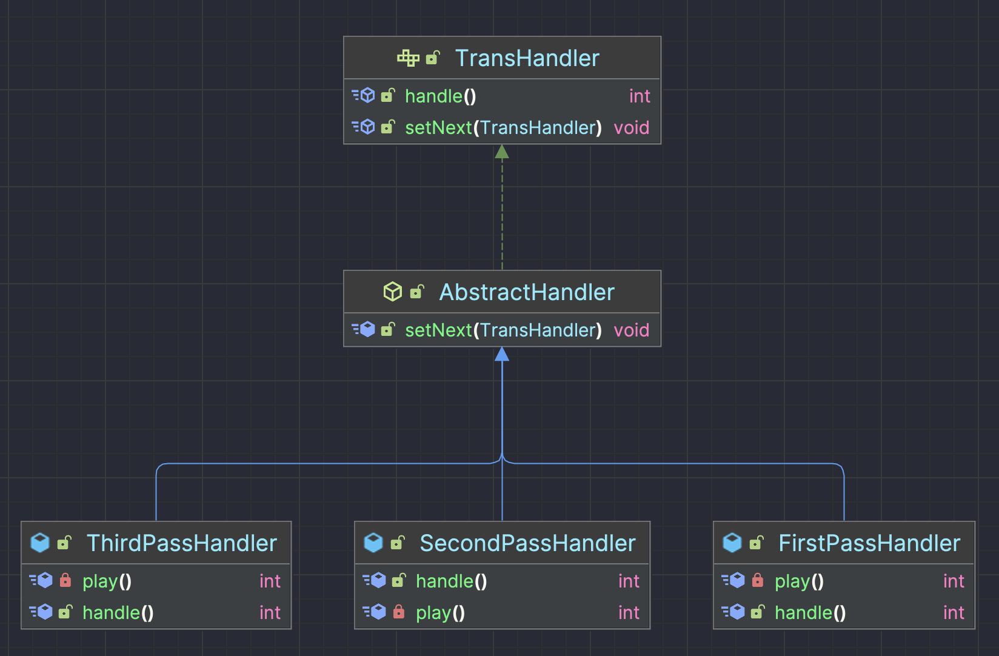

### 一、背景

---

有这样一个场景，假如你出差需要报销。你的报销单审批人依次是：项目经理、科室主任、部门负责人、财务负责人。当然你不需要知道每个审批人的姓名、电话号码、办公地址等信息。你不需要自己一个一个的去找这些审批人审批。

常用的解决方式是你发起一个审批需求，你的项目经理审批后提交给科室主任，科室主任审批后提交给部门负责人，部门负责人审批后提交给财务负责人审批。这样你只需要发起一个请求，后面的审批就不需要你操心了。


### 二、责任链模式

---

#### 2.1 意图

- 客户端发出一个请求，链上的对象都有机会来处理这一请求，而客户端不需要知道谁是具体的处理对象。
- 多个对象都有机会处理请求，从而避免了请求的发送者和接受者之间的耦合关系。
- 将这些对象连成一条链，并沿着这条链传递该请求，直到有对象处理它为止。其过程实际上是一个递归调用。

总结一下上面的几个概念：

- 有多个对象共同对一个任务进行处理。
- 这些对象使用链式存储结构，形成一个链，每个对象知道自己的下一个对象。
- 一个对象对任务进行处理，可以添加一些操作后将对象传递给下一个任务。也可以在此对象上结束任务的处理，并结束任务。
- 客户端负责组装链式结构，但是客户端不需要关心最终是谁来处理了任务。

#### 2.3 使用场景

- 多条件流程判断：权限控制
- ERP 系统流程审批：总经理、人事经理、项目经理
- Java 过滤器的底层实现 Filter

如果一个逻辑是按照一定的步骤进行的，而步骤之间存在复杂的逻辑计算，那么可以考虑使用责任链设计模式。或者说，当你的代码中出现这种情况的时候，你也可以考虑通过责任链设计模式来改进。

#### 2.4 基本使用结构

1. 抽象处理者（Handler）角色

   ```java
   public abstract class AbstractHandler {
     protected AbstractHandler next;
   
     public void setNext(AbstractHandler next) {
       this.next = next;
     }
   
     public abstract void  handlerRequest();
   }
   ```

2. 具体处理者（ConcreteHandler）角色

   ```java
   /**
    * 具体处理者A
    */
   public class ConcreteHandler_A extends AbstractHandler{
     public void handlerRequest() {
       if(this.next != null){
         this.next.handlerRequest();
       }
     }
   }
   
   /**
    * 具体处理者B
    */
   public class ConcreteHandler_B extends AbstractHandler{
     public void handlerRequest() {
       if(this.next != null){
         this.next.handlerRequest();
       }
     }
   }
   ```

3. 责任链客户端

   责任链客户端设置处理者链，并且返回第一个处理者：

   ```java
   public class HandlerClient {
     public static void main(String[] args) {
       AbstractHandler firstHandler = new HandlerClient().getFirstHandler();
       // 调用第一个处理者的handler方法
       firstHandler.handlerRequest();
     }
   
     /**
      * 设置责任链 并返回第一个处理者
      * @return
      */
     public AbstractHandler getFirstHandler(){
       AbstractHandler a = new ConcreteHandler_A();
       AbstractHandler b = new ConcreteHandler_B();
       a.setNext(b);
       return a;
     }
   }
   ```

   最上层是一个抽象类，抽象类持有自己的引用，其实是用来接收下一个处理者的。当然，大家也可以在抽象类的上层定义一个接口，这样扩展性在一定场景下会更优。

#### 2.5 优点

1. 动态组合，使请求者和接受者解耦。
1. 请求者和接受者松散耦合：请求者不需要知道接受者，也不需要知道如何处理。每个职责对象只负责自己的职责范围，其他的交给后继者。各个组件间完全解耦。
1. 动态组合职责：职责链模式会把功能分散到单独的职责对象中，然后在使用时动态的组合形成链，从而可以灵活的分配职责对象，也可以灵活的添加改变对象职责。

#### 2.6 缺点

1. 产生很多细粒度的对象：因为功能处理都分散到了单独的职责对象中，每个对象功能单一，要把整个流程处理完，需要很多的职责对象，会产生大量的细粒度职责对象。
1. 不一定能处理：每个职责对象都只负责自己的部分，这样就可以出现某个请求，即使把整个链走完，都没有职责对象处理它。这就需要提供默认处理，并且注意构造链的有效性。

#### 2.7 注意事项

在Java Web开发中，责任链模式有广泛应用，如过滤器链、拦截器等。


### 三、代码实现

---

#### 3.1 责任链中的第一关

```java
public class FirstPassHandler {

  /**
   * 第一关的下一关是 第二关
   */
  private SecondPassHandler secondPassHandler;

  public void setSecondPassHandler(SecondPassHandler secondPassHandler) {
    this.secondPassHandler = secondPassHandler;
  }

  /**
   * 本关卡游戏得分
   *
   * @return
   */
  private int play() {
    return 80;
  }

  public int handler() {
    System.out.println("第一关-->FirstPassHandler");
    if (play() >= 80) {
      //分数>=80 并且存在下一关才进入下一关
      if (this.secondPassHandler != null) {
        return this.secondPassHandler.handler();
      }
    }
    return 80;
  }
}
```

#### 3.2 责任链中的第二关

```java
public class SecondPassHandler {

  /**
   * 第二关的下一关是 第三关
   */
  private ThirdPassHandler thirdPassHandler;

  public void setThirdPassHandler(ThirdPassHandler thirdPassHandler) {
    this.thirdPassHandler = thirdPassHandler;
  }

  /**
   * 本关卡游戏得分
   *
   * @return
   */
  private int play() {
    return 90;
  }

  public int handler() {
    System.out.println("第二关-->SecondPassHandler");
    if (play() >= 90) {
      //分数>=90 并且存在下一关才进入下一关
      if (this.thirdPassHandler != null) {
        return this.thirdPassHandler.handler();
      }
    }
    return 90;
  }
}
```

#### 3.3 责任链中的第三关

```java
public class ThirdPassHandler {

  /**
   * 本关卡游戏得分
   *
   * @return
   */
  private int play() {
    return 95;
  }

  /**
   * 这是最后一关，因此没有下一关
   */
  public int handler() {
    System.out.println("第三关-->ThirdPassHandler，这是最后一关啦");
    return play();
  }
}
```

#### 3.4 责任链中的客户端

```java
public class HandlerClient {

  public static void main(String[] args) {
    //第一关
    FirstPassHandler firstPassHandler = new FirstPassHandler();
    //第二关
    SecondPassHandler secondPassHandler = new SecondPassHandler();
    //第三关
    ThirdPassHandler thirdPassHandler = new ThirdPassHandler();

    // 构建责任链
    // 第一关的下一关是第二关
    firstPassHandler.setSecondPassHandler(secondPassHandler);
    // 第二关的下一关是第三关
    secondPassHandler.setThirdPassHandler(thirdPassHandler);

    //开始调用第一关 每一个关卡是否进入下一关卡 在每个关卡中判断
    firstPassHandler.handler();
  }
}
```


### 四、优化改进

---

在上面的责任链中的客户端代码中，我们拿到第一个关卡，然后调用第一个关卡的 handler 方法，就可以让这一条链上的关卡都有机会被执行到。也就是说，在责任链设计模式中，我们只需要拿到链上的第一个处理者，那么链上的每个处理者都有机会处理相应的请求。

责任链设计模式和链表非常相似。

以上代码中，虽然我们将 3 个处理者（关卡）形成了一条链，但是代码扩展性非常不好，而且形成链很不方便。 首先，每个关卡中都有下一关的成员变量并且是不一样的，其次对应的 get、set 方法也不一样了，所以设置成为一条链很不方便。

下面我们就想办法来解决上面 2 个问题，**让每个关卡的下一关的引用是一样的**。这个时候就需要一点抽象的思维了。**在关卡之上抽象出来一个父类或者一个接口，然后每个具体的关卡继承或者实现**。

#### 4.1 优化——抽象出一个抽象类

```java
public abstract class AbstractHandler {

  /**
   * 下一关用当前抽象类来接受
   */
  protected AbstractHandler next;

  public void setNext(AbstractHandler next) {
    this.next = next;
  }

  public abstract int handler();
}
```

#### 4.2 优化——每个关卡实现抽象类

```java
/**
 * 第一关处理类，继承自AbstractHandler。
 * 该类负责处理第一关的逻辑，并根据得分决定是否需要进一步处理（即调用下一关的处理类）。
 */
public class FirstPassHandler extends AbstractHandler {

  /**
   * 模拟第一关的游戏玩法，并返回得分。
   *
   * @return 第一关的得分，固定为80。
   */
  private int play() {
    return 80;
  }

  /**
   * 处理第一关的逻辑。
   * 调用play方法获取得分。
   * 如果得分大于等于80，并且存在下一关的处理类，则将处理逻辑委托给下一关的处理类。
   * 否则，直接返回当前关的得分。
   *
   * @return 第一关的得分，或者如果存在下一关则为下一关的处理结果。
   */
  @Override
  public int handle() {
    System.out.println("第一关-->FirstPassHandler");
    int score = play();
    if (score >= 80) {
      //分数>=80 并且存在下一关才进入下一关
      if (this.next != null) {
        return this.next.handle();
      }
    }
    return score;
  }
}
```

```java
/**
 * 第二关处理类，继承自AbstractHandler，实现处理流程的具体逻辑。
 * 在这个类中，主要负责处理第二关的业务逻辑，并根据处理结果决定是否需要将请求传递给下一个处理器。
 */
public class SecondPassHandler extends AbstractHandler {

  /**
   * 执行第二关的玩乐操作，返回玩乐得分。
   *
   * @return 第二关的得分，这里固定返回90。
   */
  private int play() {
    return 90;
  }

  /**
   * 处理第二关的逻辑。
   * 调用play方法获取得分。
   * 如果得分大于等于90，并且存在下一关的处理类，则将处理逻辑委托给下一关的处理类。
   * 否则，直接返回当前关的得分。
   *
   * @return 第二关的得分，或者如果存在下一关则为下一关的处理结果。
   */
  @Override
  public int handle() {
    System.out.println("第二关-->SecondPassHandler");
    int score = play();
    if (score >= 90) {
      //分数>=90 并且存在下一关才进入下一关
      if (this.next != null) {
        return this.next.handle();
      }
    }
    return score;
  }
}

```

```java
/**
 * 第三关处理类，继承自AbstractHandler，实现处理逻辑。
 * 在这个类中，处理逻辑是给定分数95，并根据分数决定是否继续传递处理请求。
 */
public class ThirdPassHandler extends AbstractHandler {

  /**
   * 执行第三关的玩乐操作，返回玩乐得分。
   *
   * @return 第三关的得分，这里固定返回95。
   */
  private int play() {
    return 95;
  }

  /**
   * 处理请求的方法。
   * 如果当前关卡的分数大于等于95，并且存在下一个处理者，则将请求传递给下一个处理者。
   * 否则，返回当前关卡的分数。
   *
   * @return 处理结果，即关卡的分数。
   */
  @Override
  public int handle() {
    System.out.println("第三关-->ThirdPassHandler");
    int score = play();
    if (score >= 95) {
      //分数>=95 并且存在下一关才进入下一关
      if (this.next != null) {
        return this.next.handle();
      }
    }
    return score;
  }
}
```

#### 4.3 优化——配置责任链

```java
public class HandlerClient {

  public static void main(String[] args) {
    //第一关
    FirstPassHandler firstPassHandler = new FirstPassHandler();
    //第二关
    SecondPassHandler secondPassHandler = new SecondPassHandler();
    //第三关
    ThirdPassHandler thirdPassHandler = new ThirdPassHandler();

    //第一关的下一关是第二关
    firstPassHandler.setNext(secondPassHandler);
    //第二关的下一关是第三关
    secondPassHandler.setNext(thirdPassHandler);

    //说明：因为第三关是最后一关，因此没有下一关

    //从第一个关卡开始
    firstPassHandler.handler();
  }
}
```

#### 4.5 优化——抽象类上层定义一个接口

```java
/**
 * 处理传输请求的接口。
 * 实现这个接口的类将形成一个处理链，每个处理器负责特定类型的传输请求。
 * 使用链式处理的优点是可以在不中断处理链的情况下动态添加或移除处理节点。
 */
public interface TransHandler {

  /**
   * 设置下一个处理者。
   * 通过这种方式，处理器形成一个链式结构。
   *
   * @param next 接下来负责处理请求的处理器。
   */
  void setNext(TransHandler next);

  /**
   * 处理传输请求。
   * 具体的处理逻辑由实现这个接口的类来定义。
   *
   * @return 处理结果的代码。代码的具体含义由实现类自行定义。
   */
  int handle();
}
```

在抽象类中实现接口：

```java
/**
 * 抽象处理类，作为责任链模式中的节点。
 * 该类为处理请求的实体提供了一个抽象接口，具体的处理逻辑由其子类实现。
 * 节点之间通过next指针形成链式结构，以便请求在链中传递。
 */
public abstract class AbstractHandler implements TransHandler {

  /**
   * 下一个处理者，用于形成责任链。
   */
  protected TransHandler next;

  /**
   * 设置下一个处理者。
   * 通过该方法，可以动态地构建责任链。
   *
   * @param next 下一个处理者
   */
  @Override
  public void setNext(TransHandler next) {
    this.next = next;
  }
}
```

#### 4.6 继承关系图



改进之后的代码基本概括了责任链设计模式的使用，但是上述客户端的代码其实也是很繁琐的。

#### 4.7 优化

将责任链的构建过程抽象成一个方法，这样可以在不修改现有处理者类的情况下，灵活地添加、移除或重新排序处理者。

首先，定义一个辅助类或方法来负责构建责任链。这个方法可以根据配置或策略动态地创建处理者实例并组装它们。考虑到灵活性和扩展性，这里采用工厂模式的思想来演示如何实现这一过程。

```java
/**
 * 用于构建责任链。
 */
public class ChainBuilder {
  private final List<TransHandler> handlers;

  public ChainBuilder() {
    this.handlers = new ArrayList<>();
  }

  public ChainBuilder addHandler(TransHandler handler) {
    handlers.add(handler);
    // 支持链式调用来添加多个处理器
    return this;
  }

  public TransHandler build() {
    // 链接所有处理器
    for (int i = 0; i < handlers.size() - 1; i++) {
      handlers.get(i).setNext(handlers.get(i + 1));
    }
    // 返回链的第一个处理器
    return handlers.get(0);
  }
}
```


### 四、责任链模式和工厂模式的融合

---

#### 4.1 融合示例

假设正在设计一个支付处理系统，其中包含多种支付方式（如信用卡、支付宝、微信支付等），并且每种支付方式在支付成功后可能有一系列后续处理步骤（如发送支付成功通知、更新用户账户余额、记录交易日志等）。这些后续处理步骤可以根据业务需求灵活增减。

#### 4.2 步骤

1. **定义支付处理器接口** (`PaymentHandler`) 和一系列实现该接口的具体支付处理器（如 `CreditCardPaymentHandler`、`AlipayPaymentHandler` 等）。
2. **实现责任链**：让每个支付处理器持有对其下一个处理器的引用，如果当前处理器无法处理请求，则调用下一个处理器的处理方法。
3. **使用工厂模式创建处理器链**：创建一个支付处理器工厂 (`PaymentHandlerFactory`)，该工厂可以根据支付方式动态创建相应的支付处理器，并且可以配置处理链，即决定哪些处理器按照什么顺序链接起来。这样，当添加新的支付方式或处理步骤时，只需修改工厂的逻辑即可，无需改动现有代码。


