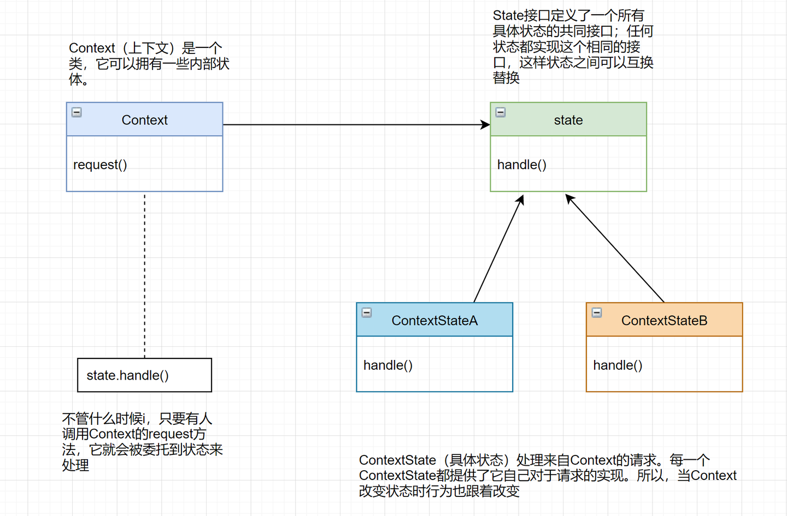

状态模式（State Pattern）是一种行为型设计模式，它允许一个对象在其内部状态改变时改变其行为，看起来像是改变了对象的类。状态模式**基于对象的状态来实现不同的行为**。



从上图可见，状态模式中共有3个角色：

1. **State（状态）**：定义一个接口或抽象类，以封装与Context的特定状态相关的行为。
2. **Context（上下文）**：维护一个对具体状态对象的引用，并将客户端的请求委托给当前状态对象处理。Context可以定义一个接口来与状态对象通信，以便状态对象能够改变Context的状态。
3. **ConcreteState（具体状态）**：实现State接口的具体状态类，负责处理Context的请求，并根据状态的变化来改变Context的行为。

```java
// 1. Context
public class Fan {
  private State state;

  public Fan() {
    // 初始状态为关闭状态
    state = new OffState();
  }

  public void setState(State state) {
    this.state = state;
  }

  public void turnOn() {
    state.turnOn(this);
  }

  public void turnOff() {
    state.turnOff(this);
  }

  public void increaseSpeed() {
    state.increaseSpeed(this);
  }

  public void decreaseSpeed() {
    state.decreaseSpeed(this);
  }
}

// 2. State
public interface State {
  void turnOn(Fan fan);

  void turnOff(Fan fan);

  void increaseSpeed(Fan fan);

  void decreaseSpeed(Fan fan);
}

// 3. Concrete States
public class OffState implements State {
  @Override
  public void turnOn(Fan fan) {
    System.out.println("Turning on the fan.");
    fan.setState(new LowSpeedState());
  }

  // 其他方法实现省略...
}

public class LowSpeedState implements State {
  @Override
  public void turnOff(Fan fan) {
    System.out.println("Turning off the fan.");
    fan.setState(new OffState());
  }

  @Override
  public void increaseSpeed(Fan fan) {
    System.out.println("Increasing fan speed to medium.");
    fan.setState(new MediumSpeedState());
  }

  // 其他方法实现省略...
}

public class MediumSpeedState implements State {
  @Override
  public void decreaseSpeed(Fan fan) {
    System.out.println("Decreasing fan speed to low.");
    fan.setState(new LowSpeedState());
  }

  // 其他方法实现省略...
}

```

通过状态模式，Fan对象可以根据其内部状态的改变来改变其行为，从而实现了不同的操作。例如，当Fan对象处于关闭状态时，调用`turnOn`方法会将其状态改变为低速状态，而在低速状态下，调用`increaseSpeed`方法会将其状态改变为中速状态。