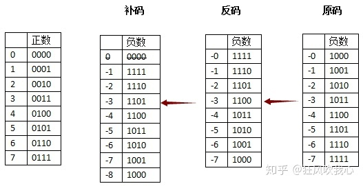

参考：

https://zhuanlan.zhihu.com/p/99082236

2^1^=1

2^1^=2

2^2^=4

2^3^=8

2^4^=16

2^5^=32

2^6^=64

2^7^=128

2^8^=256

2^9^=512

2^10^=1024

>各种数值在计算机中表示的形式称为**机器数**，采用二进制计数制 ，数的符号用0和1表示，小数点则隐含，表示不占位置。机器数对应的实际数值称为数的**真值**。
>
>机器数有无符号数和带符号数之分。
>
>- 无符号数表示正数，在机器数中没有符号位。对于无符号数，若约定小数点的位置在机器数的最低位之后，则是纯整数。
>- 对于带符号数，机器数的最高位是表示正、负的符号位，其余位则表示数值。
>
>为了便于运算，**带符号的机器数可采用`原码、反码和补码`等不同的编码方法**，机器数的这些编码方法称为码制。

### 一、进制的转换

---

#### 1.1 进制

| 进制        | 数码              | 基数 | 位权  |
| ----------- | ----------------- | ---- | ----- |
| 十进制(D)   | 0,1,2,3,5,6,7,8,9 | 10   | 10^k^ |
| 二进制(B)   | 0,1               | 2    | 2^k^  |
| 十六进制(H) | 0~9,A,B,C,D,E,F   | 16   | 16^k^ |

#### 1.2 按权展开法-R进制转十进制

使用按权展开法，其具体操作方式为：将R进制数的每一位数值用R^k^形式表示，即幂的底数是R，指数为K，K与该位和小数点之间的距离有关。(当该位位于小数点左边，k值是该位和小数点之间数码的个数，而当该位位于小数点右边，k值是负值，其绝对值是该位和小数点之间数码的个数加1)

例如二进制10100.01=10000+100+0.01=1x2^4^+1x2^2^+1x2^-2^=16+4+0.25=20.25

例如七进制604.01=6x7^2^+4x7^0^+1x7^-2^

#### 1.3 短除法-十进制转R进制

使用短除法（**除基取余法**）

1. 商为0为止
2. 余数从小往上记录

例如将94转换为二进制数（基数为2）。

2|94		余0

2|47			1

2|23			1

2|11			1

2|5			  1

2|2			  0

2|1			  1

​	0

得到结果 `1011110` 

94转16进制（基数为2）

16|94			余14=E

16|5					5

​	  0

得到结果 `5EH`

#### 1.4 减法

>十进制转二进制使用减法。

例如将94转换为二进制数。

小于且离94最近的乘幂为64（2^6^），

94-64=30，最近的是16（2^4^）

30-16=14，最近的是8（2^3^）

14-8=6，最近的是4（2^2^）

6-4=2，最近的是2(2^1^)

结束

| 位号 | 6    | 5    | 4    | 3    | 2    | 1    | 0    |
| ---- | ---- | ---- | ---- | ---- | ---- | ---- | ---- |
| 取值 | 1    | 0    | 1    | 1    | 1    | 1    | 0    |

1011110

#### 1.5 进制转换

> 二进制转八进制

| 八进制 | 0    | 1    | 2    | 3    | 4    | 5    | 6    | 7    |
| ------ | ---- | ---- | ---- | ---- | ---- | ---- | ---- | ---- |
| 二进制 | 000  | 001  | 010  | 011  | 100  | 101  | 110  | 111  |

二进制 `10001110` 转八进制：（**3位对1位**）

10 001 110

2	1	6

>二进制转十六进制

二进制 `10001110` 转十六进制：（4位对1位）

1000 1110

8		E

| 二进制 | 十六进制 |
| ------ | -------- |
| 0000   | 0        |
| 0001   | 1        |
| 0010   | 2        |
| 0011   | 3        |
| 0100   | 4        |
| 0101   | 5        |
| 0110   | 6        |
| 0111   | 7        |
| 1000   | 8        |
| 1001   | 9        |
| 1010   | A        |
| 1011   | B        |
| 1100   | C        |
| 1101   | D        |
| 1110   | E        |
| 1111   | F        |

### 二、码制

---

原码、反码、补码的产生过程就是为了解决计算机做减法和引入符号位的问题。

| 码制 | 数值1     | 数值-1    | 1+(-1)       | 计算机运算 |
| ---- | --------- | --------- | ------------ | ---------- |
| 原码 | 0000 0001 | 1000 0001 | 1000 0010=-2 |            |
| 反码 | 0000 0001 | 1111 1110 | 1000 0000=-0 |            |
| 补码 | 0000 0001 | 1111 1111 | 0000 0000=+0 | √          |
| 移码 | 1000 0001 | 0111 1111 | 1000 0000    |            |

#### 2.1 原码

二进制数的==首位，0表示正，1表示负==，**不足八位的就在首位与二进制数中间用零填充**。

原码的表示法很简单，虽然出现了+0和-0，但是直观易懂。

>0001 + 0010 = 0011，1 + 2 = 3
>
>0000 + 1000 = 1000，+0 + (-0) = -0
>
>0001 + 1001 = 1010，1 + (-1) = -2
>

可以看到正数之间的加法通常是不会出错的，因为它就是一个很简单的二进制加法，而正数与负数相加，或负数与负数相加，就要引起莫名其妙的结果，这都是符号位引起的。

#### 2.2 反码

**原码最大的问题就在于一个数加上它的相反数不等于0**，于是反码的设计思想就是冲着解决这一点，既然一个负数是一个正数的相反数，那干脆用一个正数按位取反来表示负数。

- 正数的反码为本身；
- 负数的反码为其原码除首位不变外全部取反。

>试着用反码的方式解决一下原码的问题：
>
>0001 + 1110 = 1111，1 + (-1) = -0
>

**反码表示在计算机中往往作为数码变换的中间环节。**

#### 2.3 补码（运算符合正确答案）

- 正数的补码与原码相同；
- 负数的补码即为其反码加一。

接下来做一做四位二进制数的减法（先不引入符号位）。

>0110-0010，6-2=4，但是由于计算机中没有减法器，没法算。
>
>这时候，想想时钟运算中，减去一个数，是可以等同于加上另外一个正数（同余数），这个数与减数相加正好等于模。
>
>也就是四位二进制数最大容量是多少？2^4=16（10000）
>
>那么-2的同余数，就等于10000-0010=1110，16-2=14。
>
>既然如此，0110 - 0010 = 0110 + 1110 = 10100，6 - 2 = 6 + 14 = 20
>
>按照这种算法得出的结果是10100，但是对于四位二进制数最大只能存放4位，如果低四位正好是0100，正好是想要的结果，至于最高位的1，计算机会把它放入psw寄存器进位位中，8位则会放在cy中，x86会放在cf中。
>
>这个时候，再想想在四位二进制数中，减去2就相当于加上它的同余数（至于它们为什么同余，还是建议看《计算机组成原理》）。
>
>但是减去2，从另一个角度来说，也是加上-2，即加上-2和加上14得到的二进制结果除了进位位，结果是一样的。如果我们把1110的最高位看作符号位后就是-2的补码，**这可能也是为什么负数的符号位是1，而不是0**。
>
>由于补码表示中的符号位可以与数值位一起参加运算，并且可以将减法转换为加法进行运算，简化了运算过程，因此**计算机中均采用补码进行加减运算**。

#### 2.4 移码

补码的**符号位按位取反**，其余位不改变。

**用于表示浮点数的阶码。**

#### 2.5 各自数值表示范围（细看）

其中n一般等于8

| 码制 | 定点整数                  | 定点小数                        | 数码个数 |
| ---- | ------------------------- | ------------------------------- | -------- |
| 原码 | -(2^n-1^-1) ~ +(2^n-1^-1) | -(1-2^-(n-1)^) ~ +(1-2^-(n-1)^) | 2^n^-1   |
| 反码 | -(2^n-1^-1) ~ +(2^n-1^-1) | -(1-2^-(n-1)^) ~ +(1-2^-(n-1)^) | 2^n^-1   |
| 补码 | -2^n-1^ ~ +(2^n-1^-1)     | -1 ~ +(1-2^-(n-1)^)             | 2^n^     |
| 移码 | -2^n-1^ ~ +(2^n-1^-1)     | -1 ~ +(1-2^-(n-1)^)             | 2^n^     |

**补码和移码由人为定义**

### 三、浮点数表示

---

N = 尾数*基数^指数^，指数即为阶码（定点整数），尾数为定点小数

1.25x10^6^=0.000125x10^10^

1.255x10^10^

两者相加为1.255125x10^10^

#### 3.1 运算过程

对阶 > 尾数计算 > 结果格式化

#### 3.2 特点

1. 一般尾数用**补码**，阶码用移码；
2. **阶码的位数**决定数的表示范围，位数越多范围越大；
3. **尾数的位数**决定数的有效精度，位数越多精度越高；
4. 对阶时，**小数向大数看齐**。
5. 对阶时通过较小数的尾数右移实现的。

### 三、浮点数运算

---

浮点数的概念：浮点数即科学计数法，如1000=1X10^3^；其中，1为尾数，10为基数，3为指数。

计算机中浮点数的运算：当两个指数不等的浮点数相加时，计算机会**把低阶浮点数的指数转化为高阶浮点数的指数**。

如：1.0X10^3^+1.19X10^2^，计算机会将1.19X10^2^转化为0.119X10^3^，然后作和，然后结果格式化(即通过指数的转化**保证尾数必须为非零的一位数**)如：0.1119X10^3^+1.119X10^2^；得到11.3019X10^3^以后，要化为1.13019X10^4^。
