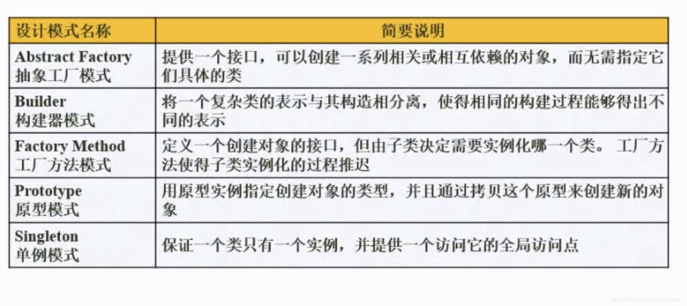
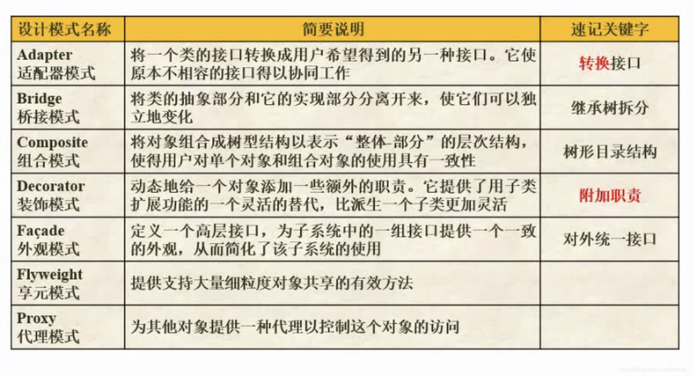
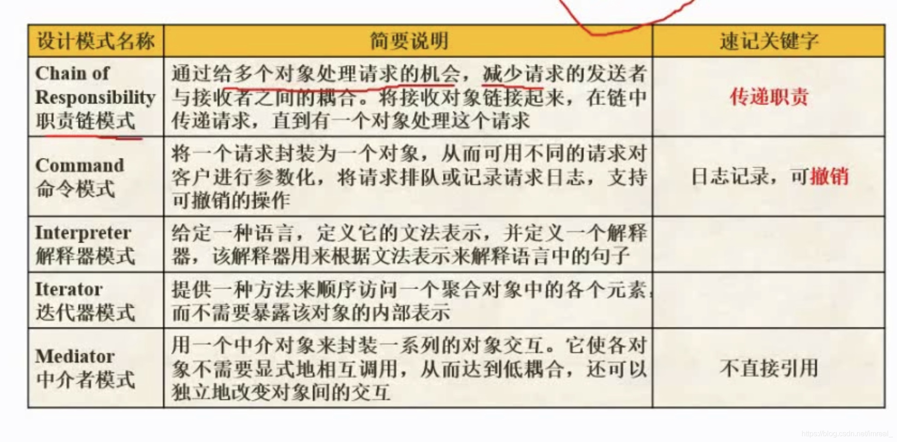
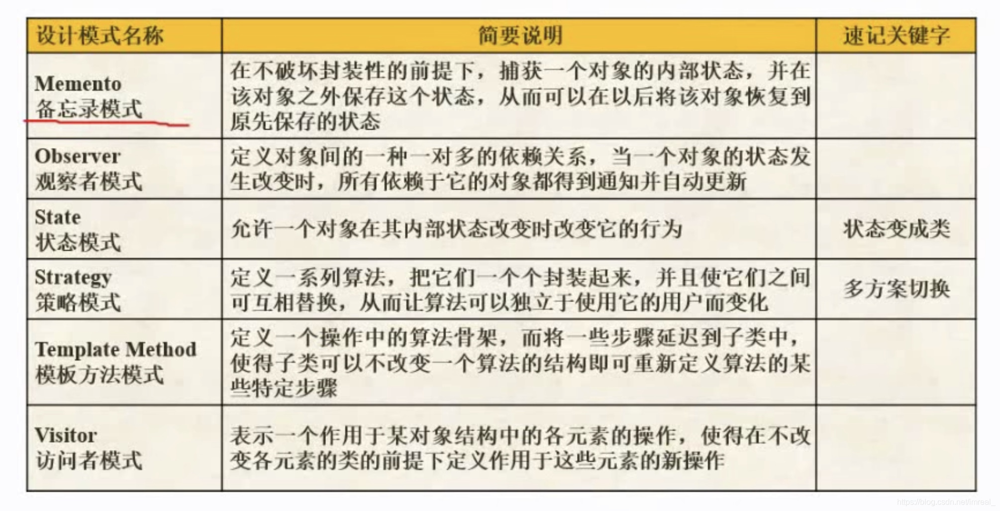

### 一、三种模式的概念及层次关系

---

#### 1.1 架构模式

软件设计中的高层决策，例如C/S结构就属于架构模式。

#### 1.2 设计模式

反映了开发软件系统过程中所作的基本设计决策，而设计模式则是主要关注软件系统的设计，与具体的实现语言无关，是在软件开发过程中，经过验证的，用于解决在特定环境下的、重复出现的、特定问题的解决方案。

#### 1.3 惯用法

是最底层的模式，关注软件系统的设计与实现，实现时通过特定的程序设计语言来描述构件与构建之间的关系。每种编程语言都有它自己特定的模式，即语言的惯用法。例如c++语言的惯用法就是：引用--计数。

### 二、设计模式的分类

---

#### 2.1 创建型模式

#### 2.2 结构型模式

- 组合模式：想表示对象的部分—整体层次结构(对象组合)
- 适配器模式：想使用一个已经存在的类，而它的接口不符合描述
- 装饰模式：在不影响其他对象的情况下，以动态透明的方式给单个对象添加职责
- 桥接模式：不希望在抽象和它的实现部分之间有一个固定判定关系
- 享元模式：即对象共享

#### 2.3 行为型模式

