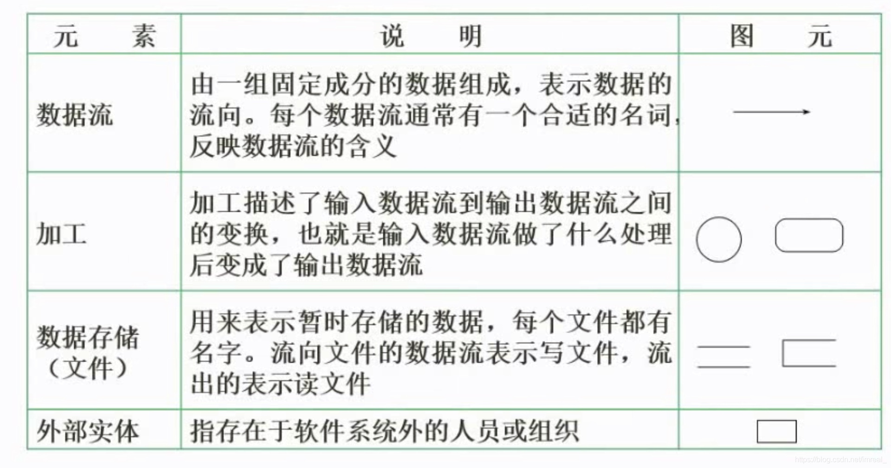
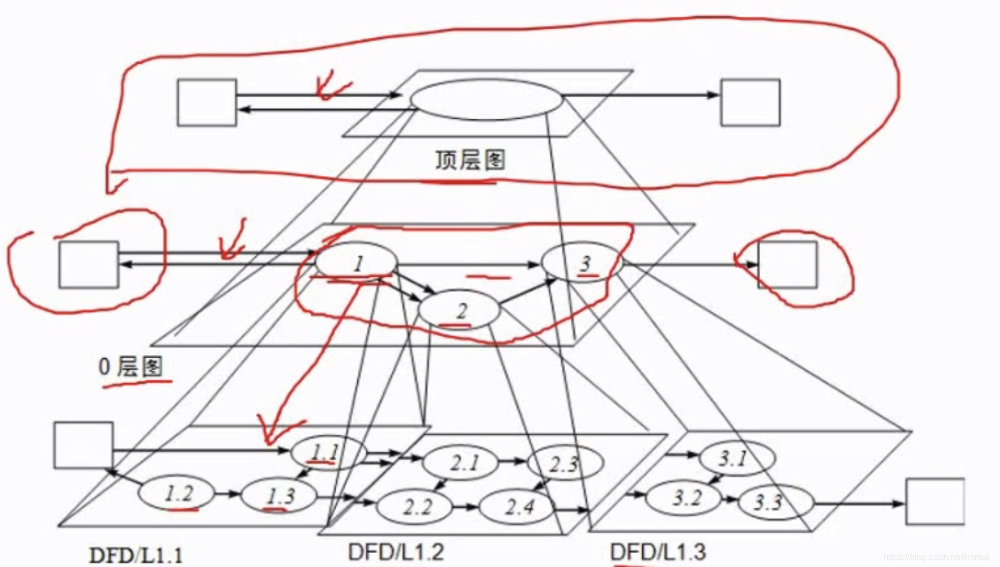
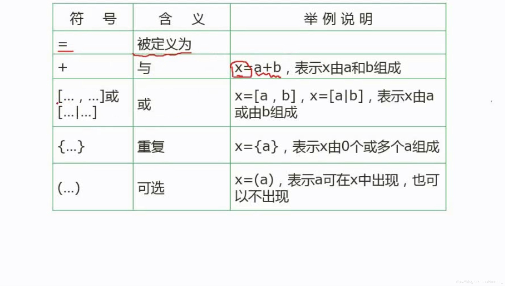
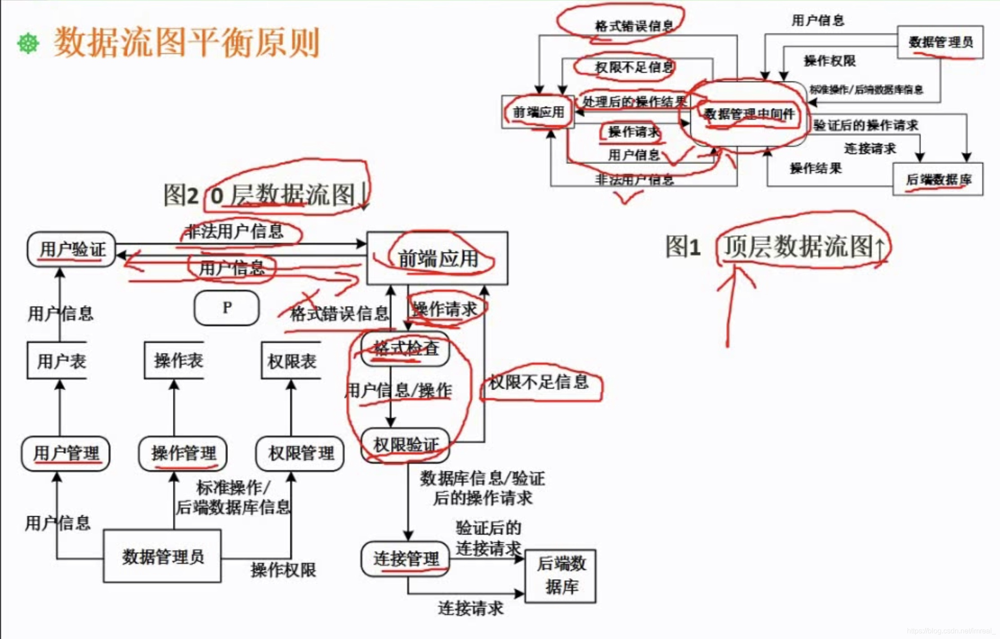
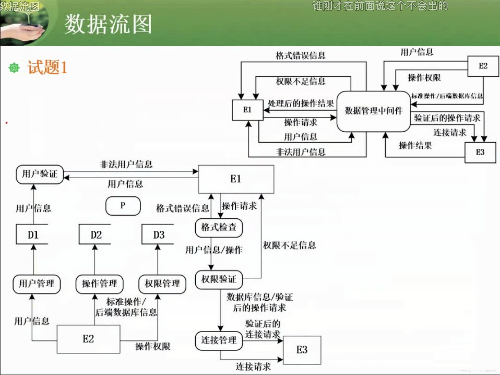
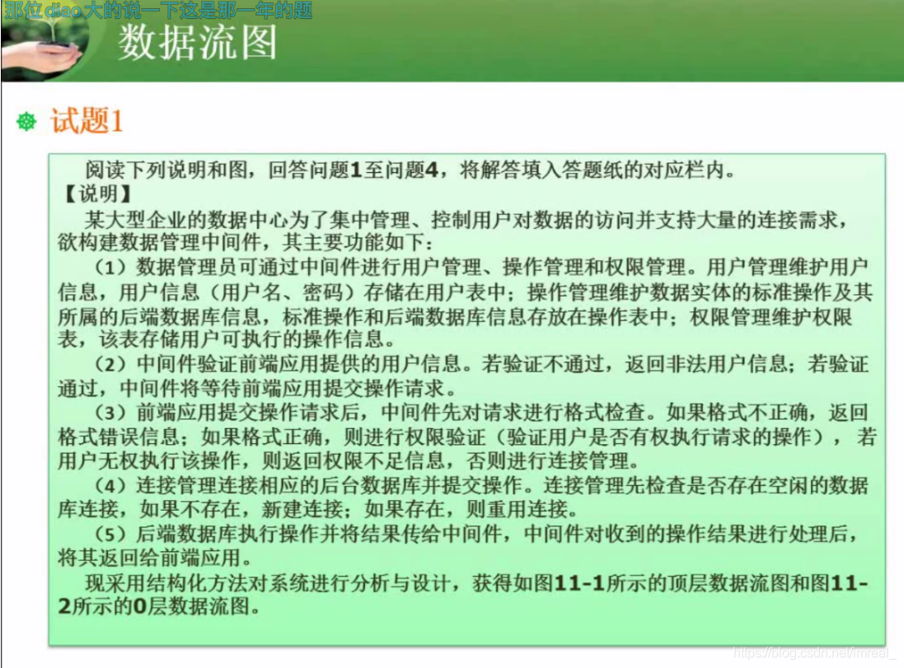
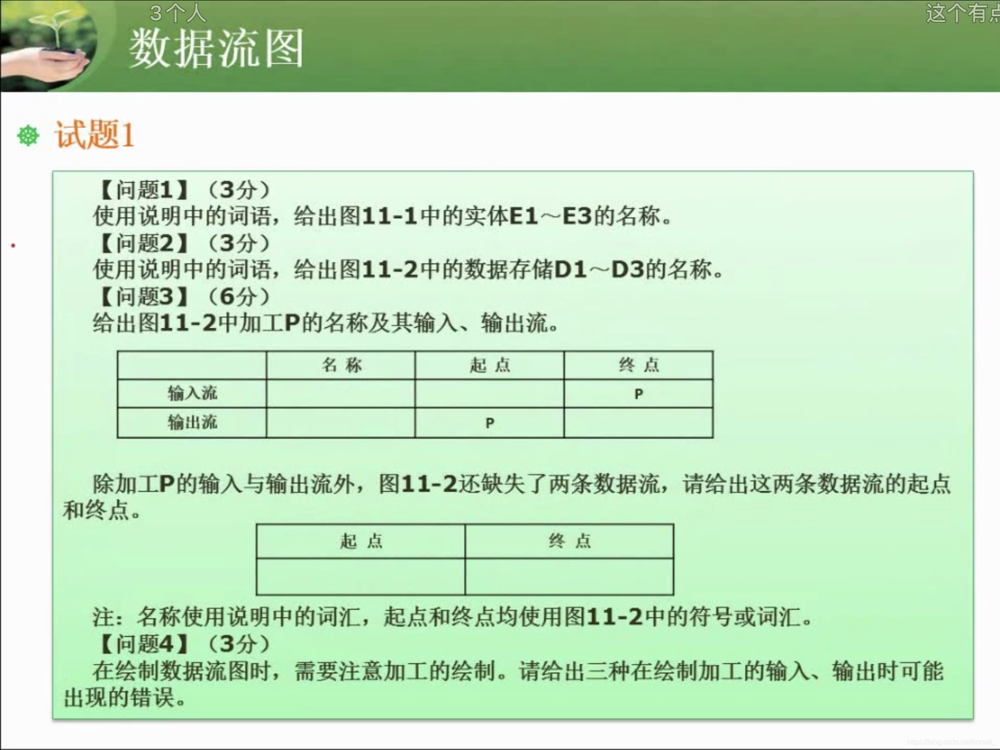

数据流图是一种在需求分析阶段用到的一种工具，是结构化开发方法中最为主流的开发工具，它的作用是在逻辑上描述系统的功能输入、输出和数据存储等，是系统逻辑模型的重要组成部分。

### 一、数据流图基本概念及四大组成元素

---

- 数据存储在题干描述时，要么是某某表，要么是某某文件，是存储了信息的文件。
- 加工即操作的名称，一般是动词+名词的结构。
- 数据流即信息。
- 外部实体一般是人员或组织以及系统。

#### 1.1 加工

数据流图中对每一个加工都必须有加工规格说明，该说明必须描述把输入数据流变换为输出数据流的加工规则，而加工规则的说明有三种方式：结构化语句、判断表(决策表)、判断树(决策树)。

#### 1.2 数据流

数据流类型在一般情况下包括变换流型和事务流型，不同类型的数据流有不同的映射方法。

### 二、数据流图的分层

---

### 三、数据字典

---

#### 3.1 概念

数据字典是配合数据流图的使用，对数据流图中的一些数据进行进一步的诠释，其内容包括：数据流、数据项、基本加工、数据存储。

#### 3.2 数据字典中的符号及其含义

### 四、数据流平衡原则

---

#### 4.1 父图与子图之间的平衡

即已知父图或者子图，将其子图或者父图补充完整。

#### 4.2 子图内平衡

概念：数据流的正常加工必须是既有**输入**，也有**输出**，而且每条数据流的起点或终点必须是加工，而只有输入没有输出的数据流称之为黑洞，只有输出没有输入的数据流被称之为奇迹，二者都属于不正常的数据流。

解题流程：首先根据题干，将外部实体、加工、数据存储提取出来，而第三问在解决时，应首先找到顶层数据流图在0层数据流图中缺失的部分，如果仍未找完，则根据题干的描述，寻找0层数据流内部缺失了哪些数据流，而起点和终点都是外部实体或数据存储。

数据流的错误可能是名称错误，也可能是起点和终点错误。