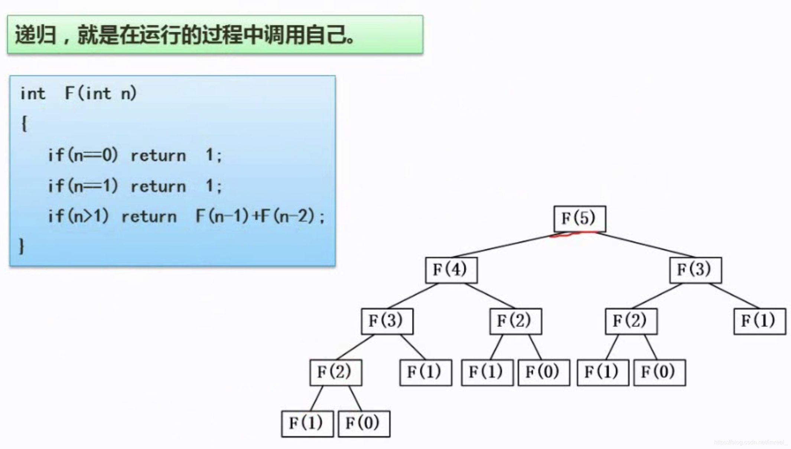

分治法基本思想是把一个比较大的、复杂的问题，拆分成一些比较小的子问题，如快速排序算法。

### 一、基本原则

---

1. 该问题的规模缩小到一定的程度就可以容易地解决
2. 该问题可以分解为若干个规模较小的相同问题
3. 利用该问题分解出的子问题的解可以合并为该问题的解
4. 该问题所分解出的各个子问题是相互独立的

### 二、分治法—递归技术

---

递归，就是在运行的过程中调用自己。

该算法的目的是求这样一个数列，由零开始的，每一个数都等于前面两个数之和的数列，该算法操作即：将F(3)转换为F(1)和F(2)之和，F(4)转换为F(2)和F(3)之和.....这样可以使所有的F(n)都能化为F(1)和F(0)的和。

### 三、分治法—二分法查找

---