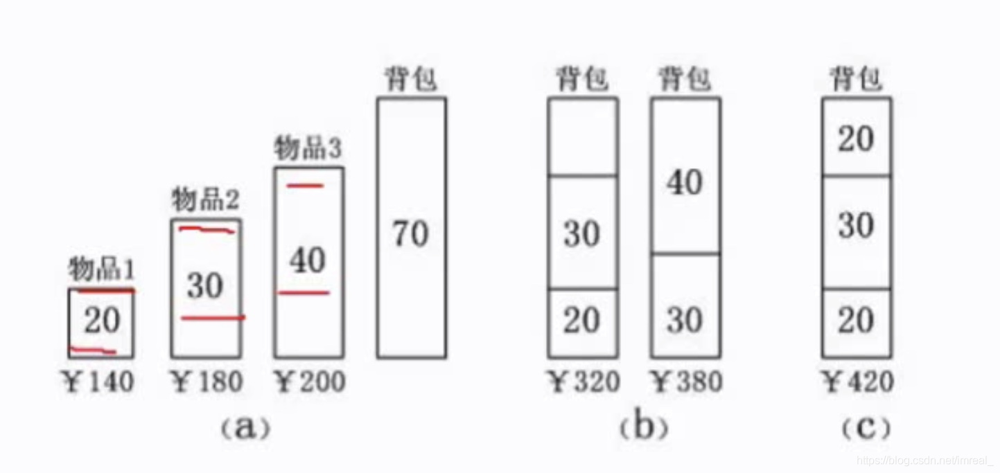

### 一、概念

---

总是做出在当前来说是最好的选择，而并不从整体上加以考虑，它所做的每一步选择只是当前步骤的局部最优选择，但从整体来说不一定是最优的选择。由于它不必为了寻找最优解而穷尽所有可能解，因此其耗费时间少，一般可以快速得到满意的解，但得不到最优解。

### 二、经典问题—背包问题

---

有三个物品(每种物品仅存一个)，其容量分别为：20，30，40；其价格分别为：140，180，200；而背包可容纳的总量为70，我们希望背包中能容纳尽可能多的物品，其容纳的物品价值最高，而贪心法则会根据单位容量价值最高的原则优先将这个物品进行容纳，如物品1的每10个容量其价值为70，物品2则为60，物品3则为50；因此，若采用贪心法，其将会优先放入物品1到背包中，然后放入物品2，此时空间只剩下20，无法装下物品3，因此，方案到此结束，采用该方法得到了总价320的物品，但这显然不是最优解，我们将物品3和物品1装入背包，得到的物品总价值为340。