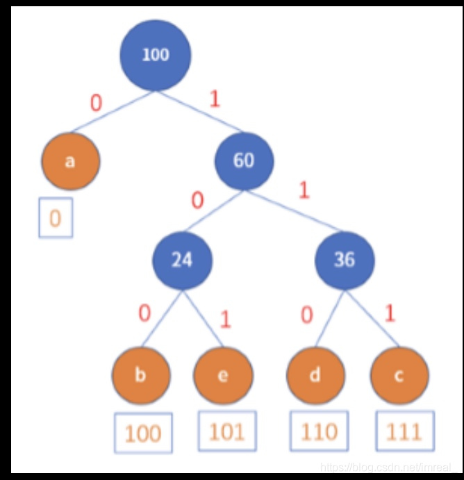
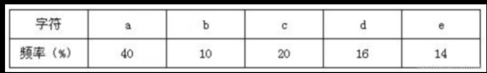

### 一、概念

---

哈夫曼编码的思想是，在传输信息时，**将频率高的数据用较少的二进制进行表示**，将频率低的数据用较多的二进制进行表示。

### 二、具体实现

---

首先我们必须知道每个字母或符号出现的**频率**。然后将其频率由小到大进行排序，然后我们将构造一棵二叉树，总体思路是从底向上进行构建，构造的规则是：将最小的两个结点作为底结点，并计算出二者的和，将和作为一个权代替两个结点并重新进行排序，在排序后的结点组合中挑选出最小的两个，若这两个结点中包含了之前已经构建的结点，则在此基础上进行并行构建，若不包含，则另外构建一棵二叉树，一直重复进行该操作，需要特别注意的是若两个结点求和后的权值和与某一未构建的结点值相等，则在排序时将求和权值置于该重复结点之后，直至所有结点用完。

这样的几个字符，其构造的二叉树为：

因此：a的哈夫曼编码为：0；b为：100；e为101；d为110；c为111

2.文档的压缩比计算：将利用哈夫曼编码得到的字符的二进制数中占据位数最大的提取出来令其为a，然后以位的个数数为乘数，每个字符的二进制数所占位数乘以其概率再依次相加令其为b，其文档的压缩比就是：(a-b)/a