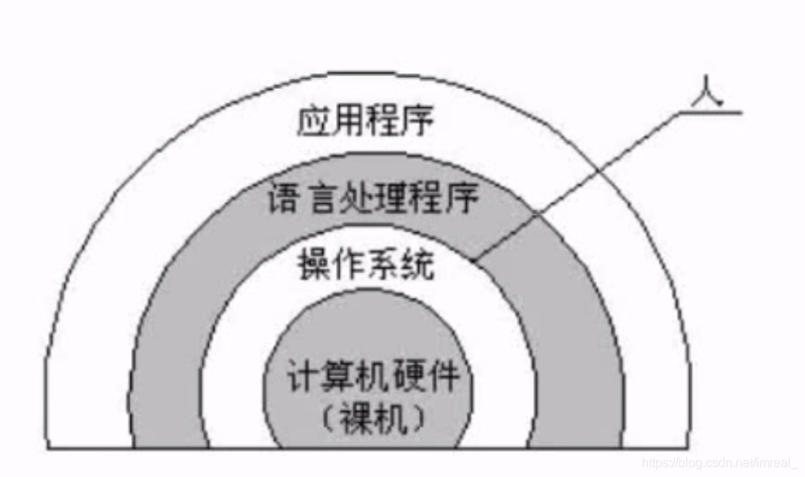

### 一、操作系统与计算机体系结构之间的关系

---

### 二、操作系统具备的管理职能

---

#### 进程管理

- 进程的状态
- 前驱图
- pv操作
- 死锁问题

#### 存储管理

- 段页式存储
- 页面置换算法

#### 文件管理

- 索引文件
- 位示图

#### 作业管理

#### 设备管理

- 数据传输控制方式

#### 微内核操作系统

- 虚拟设备
- SPOOLING技术