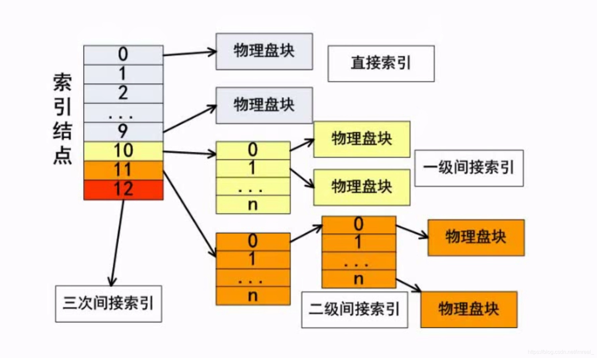

索引一般会有**13个节点**(默认情况下)，从0开始编号，其中==索引0到9这十个索引称为直接索引，直接对应物理盘块==，每一个物理盘块都对应了索引文件的内容，而索引10则称为间接索引，里面只存储地址，如一个物理盘块的地址大小为4个字节，而一个物理盘块的大小为4k，则`4k\4`字节等于1024，代表着1024个物理盘块的地址，因此该索引内可以存储的文件大小为`4k*1024`；该10号索引称之为一级间接索引；索引11则是二级间接索引，即索引的内容还是索引，再索引的内容才是物理盘块，二级简介索引存储的文件大小即为：`4k*1024*1024`；虽然分级越多存储的内容越多，但相应的，效率也会更低。
