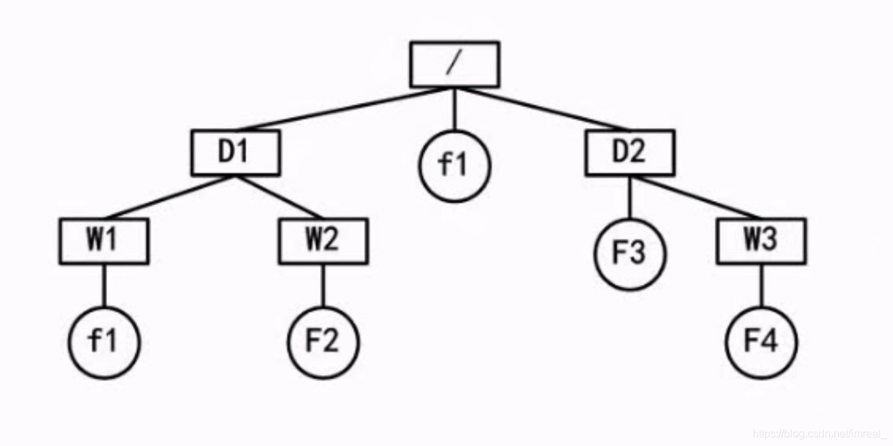

### 一、树形目录结构的路径

---

#### 绝对路径

从盘符开始的路径。

#### 相对路径

从当前路径开始的路径。

在该文件树型图中，若文件目录的位置是D1，若要求f2的路径，则绝对路径：/D1/W2/F2；相对路径：W2/F2。

### 二、文件属性及文件名的组成

---

#### 文件属性

R：只读文件属性

A：存档属性

S：系统文件

H：隐藏文件

#### 文件名的组成

- 驱动器号；
- 路径；
- 主文件名；
- 扩展名