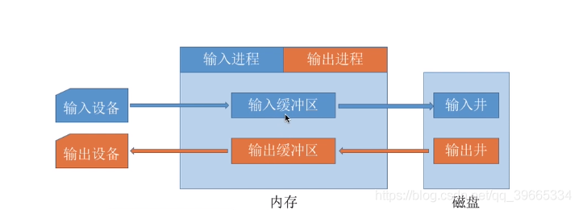

Simultaneous Peripheral Operation On-Line（外部设备联机并行操作）

SPOOLing技术是低速**输入输出设备**与主机交换的一种技术，通常也称为“**假脱机**真联机”，他的核心思想是以联机的方式得到脱机的效果。低速设备经通道和外设在主机内存的**缓冲存储器**与高速设备相联，该高速设备通常是**辅存**。为了存放从低速设备上输入的信息，或者存放将要输出到低速设备上的信息（来自内存），在辅存分别开辟一固定区域，叫“输出井”（对输出），或者“输入井”（对输入）。简单来说就是在内存中形成**缓冲区**，在高级设备形成输出井和输入井，传递的时候，从低速设备传入缓冲区，再传到高速设备的输入井，再从高速设备的输出井，传到缓冲区，再传到低速设备。

- SPOOLING技术是为了提高输入输出设备与主机交换的一种虚拟化技术，这个技术中缓冲区起很大作用；
- 输入时，用户在输出设备上键入数据，输入的进程将数据送往内存中的输入缓冲区，再从内存的输入缓冲区送到磁盘的输入井。当CPU需要数据时，会将输入井的内容送到内存。
- 输出时：输出的进程将内存的数据送到输出井中，等到输出设备空闲时，将用户要输出的数据传送到内存的输出缓冲区，再经输出缓冲区输出到设备上。

> 例如：四个人通过远程手段准备使用一台打印机，而这台打印机在同一段时间内只能让一个用户使用，若一个用户正在使用该打印机，另一名用户试图使用该打印机时就会提示该打印机被占用，，事实上这样做使得打印机的技术非常的低，而面对这个问提，采用了SPOOLING技术的打印机会进行如下操作：给打印机创建一个缓存区，每一个用户在打印时都会进入缓存区，而从缓存区到真正打印则需要挨个排队，即打印机在打印时不再排斥其他用户的打印操作，而是将其缓存起来，在将当前操作完成后立即进行第二个操作，这样做不仅使得用户的操作界面变得更为友好，也极大的提高了打印机的打印效率。