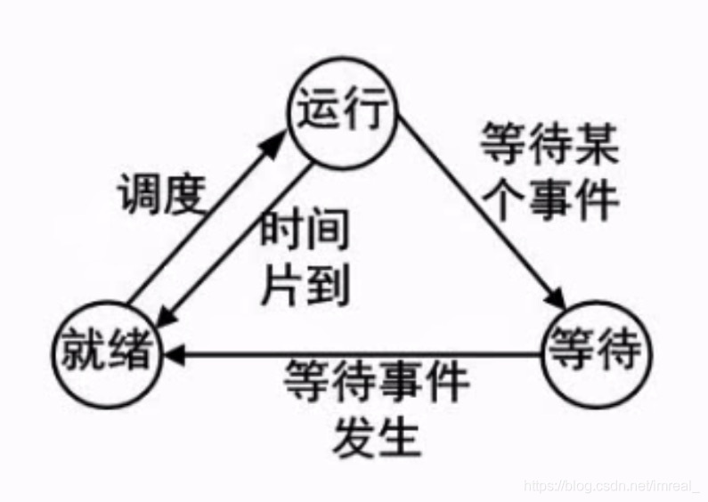

### 一、进程的三种基本状态（三态模型）

---

- 等待状态下的程序缺少CPU资源以外的其他资源，如用户指令或外设支持等资源；
- 就绪状态的程序除了CPU资源以外的所有资源都已经准备就绪；

处于就绪状态的程序需要排队获取CPU资源，且即使获取到了CPU资源，他们的运行时间也是有限的，因此，时间片到了以后就会从运行状态退出到就绪状态，而程序在运行时出现了某些资源的缺失则会退出至等待状态。

### 二、五态模型

---

该模型是三态模型的发展，将**就绪状态**分为了**静止就绪**和**活跃就绪**。

静止是该进程已经获得了CPU资源，但由于人为需要，由运行状态将其退出至就绪状态，如我们在听歌时突然来了电话，我们暂时将音乐关闭，这种人为的将程序由运行态转至的就绪态，即为静止就绪，再次调动该程序时，该程序就将由静止就绪转至活跃就绪进而被调用。

此外，阻塞态即为三态模型中的等待态。

### 三、进程控制块的组织方式

---

#### 链接方式

把具有同一状态的进程(PCB)，用其中的链接字链接成一个队列。这样，可以形成就绪队列、若干个阻塞队列和空白队列等。对其中的就绪队列常按进程优先级的高低排列，把优先级高的进程排在队列前面。此外，也可以根据阻塞原因的不同而把处于阻塞状态的进程的PCB排成等待I/O操作完成的队列和等待分配内存的队列等。

#### 索引方式

系统根据所有进程的状态建立若干索引表。例如，就绪索引表、阻塞索引表等，并把各索引表在内存的首地址记录在内存的一些专用单元中。在每个索引表的表目中，记录具有相应状态的某个PCB在PCB表中的位置。