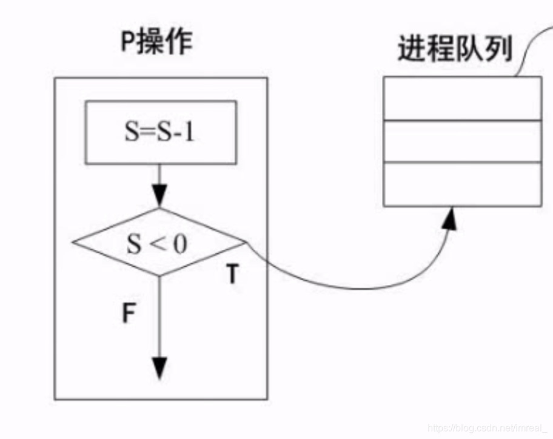
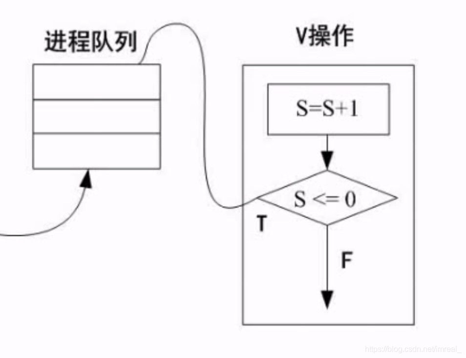
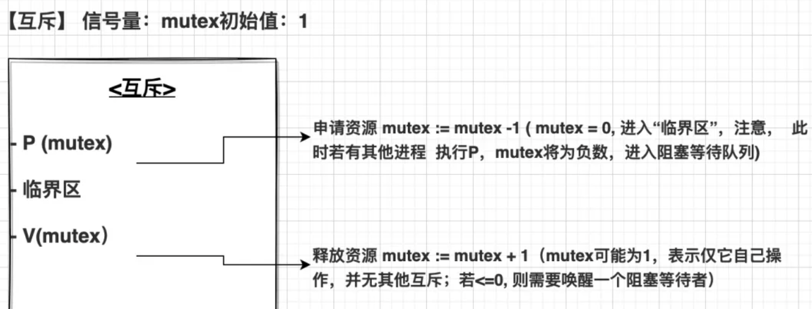
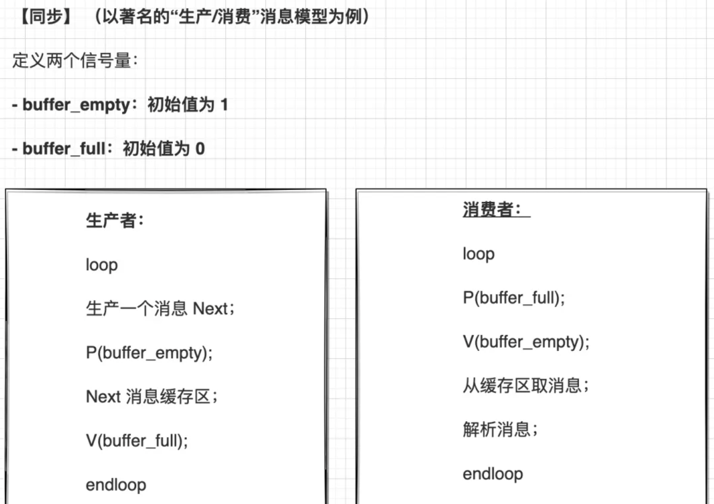
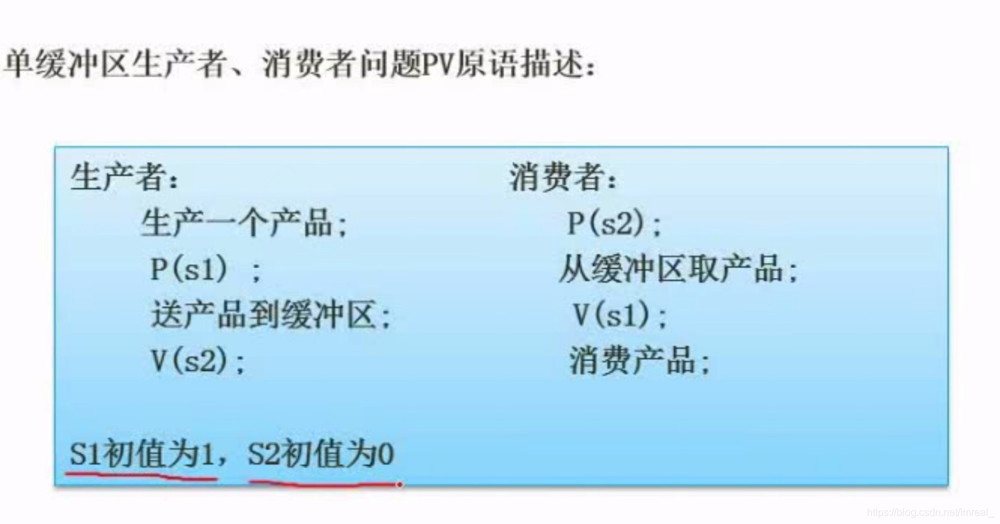
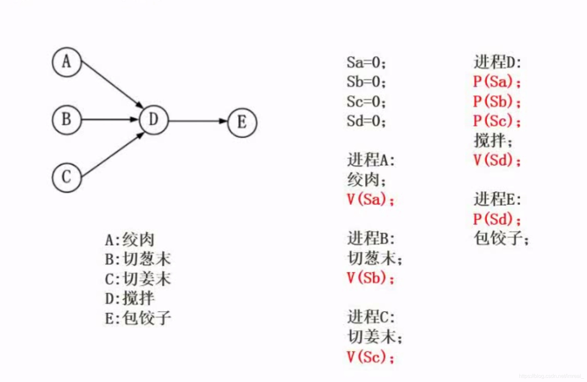

### 一、相关概念

#### 1.1 临界资源

诸进程间需要互斥方式对其进行共享的资源，如打印机，磁带机等。

#### 1.2 临界区

每个进程中访问临界资源的那段代码称为临界区。

#### 1.3 信号量

是一种特殊的变量，**符号为s**，只用于pv操作。

- 当 S >= 0 ：表示某资源的的可用数；
- 当 S < 0 ：表示**其绝对值表示阻塞队列中等待该资源的进程数**；

操作系统中的PV操作通常与进程同步和互斥有关，它们用于**协调多个并发进程之间的共享资源访问**。PV操作也称为信号量操作，其中包括两个主要操作：P（等待）和V（发出信号）

### 二、p操作

---

>P操作表示申请一个资源

P操作：S:=S-1  
- 若 S>=0, 则执行P操作的进程继续执行；
- 若 S < 0, 则将执行该操作的进程置为阻塞状态，并将其加入到“阻塞队列”；

### 三、v操作

---

>V操作表示释放一个资源

V操作：S:=S+1  
- 若 S>0，V操作继续；
- 若 S <= 0, 则从阻塞队列唤醒一个进程，并将其加入到 “就绪队列”；

### 四、PV操作如何实现“互斥”和“同步”

---

### 五、pv操作实例

---

该图为单缓存区下生产者与消费者在市场消费中的pv模式图，生产者的操作有：生产产品，送产品到缓存区；消费者的操作有：从缓存区取产品，消费产品；在这个模型中加入了pv操作后极大的提高了模型的效率，其中p(s1)表示将S1的值代入p操作，V(s2)表示将S2的值代入v操作。

>pv操作的根本目的是为了**解决两个或多个进程运行时的约束关系造成的麻烦**，如上例中的单缓存区市场消费问题；此外，有制约关系的操作双方信号量相同。

### 六、pv操作与前趋图

---

pv操作与前趋图结合起来考察。

通过观察箭头的指向来解题，被指箭头就用v操作，有几个箭头就用几次。