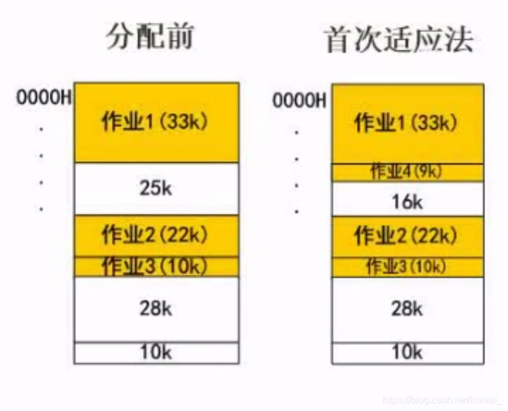
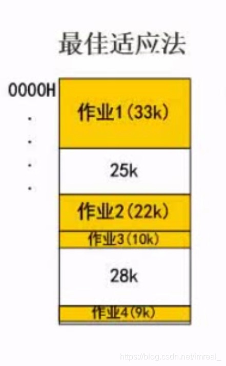
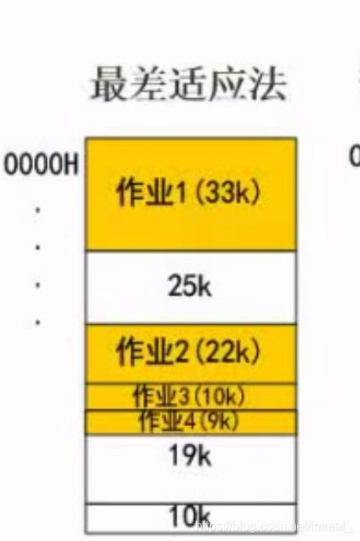
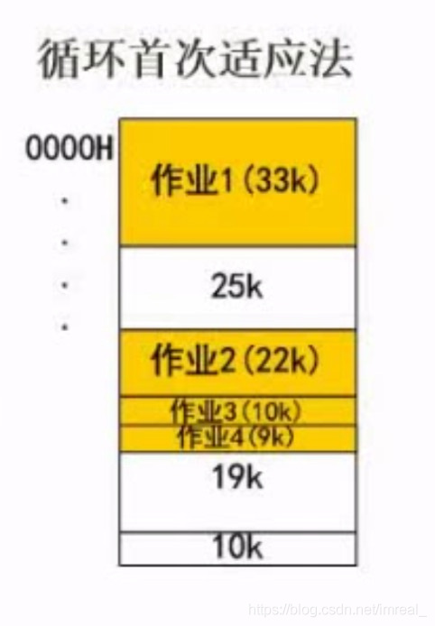

以一个例题为例，描述四个算法：

- 首次适应法
- 最佳适应法
- 最差适应法
- 循环首次适应法

>某计算机系统的内存大小为128k，采用可变分区分配方式进行内存分配，现在作业4申请内存9k，几种不同的内存分配算法在分配中，会产生什么样的结果呢？

### 一、首次适应法

---

首次适应法会把即将执行的作业安排在**第一个能够容纳它的空间**。

### 二、最佳适应法

---

最佳适应法会把即将执行的作业安排在**内存空间与它最接近的空间**进行存放，如该例子中，作业4占据空间9k，通过该算法，计算机就将其存放在了空间为10的地址中；由于在每次存放作业以后内存空间剩余量极低，长期以后该算法会造成内存空间碎片化，降低内存地址的利用率。

### 三、最差适应法

---

最差适应法能够解决内存空间碎片化的问题，如图所示：该算法优先将作业存放至内存空间最大的地址。

### 四、循环首次适应法

---

循环首次适应法是将空闲的区域连成环状，将作业在环状区域内顺次进行分配（**从第二个空闲区域开始分配**）。