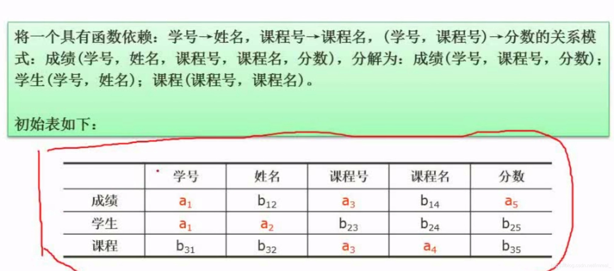
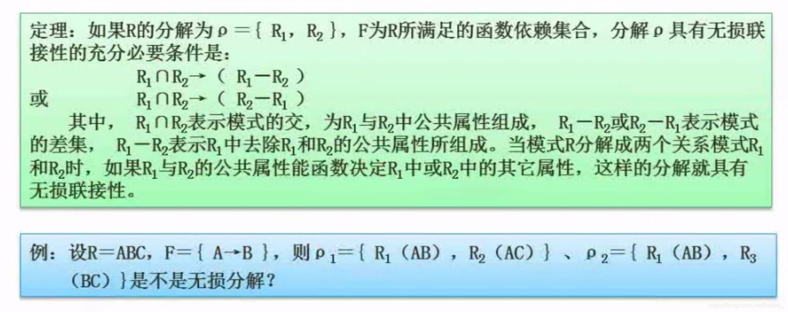

范式级别不够时我们采取模式的拆分。

### 一、模式拆分时要保持的原则

---

1. **保持函数依赖分解**(不需要保持冗余的函数依赖)
2. **无损分解**：有损即不能还原；无损即可以还原

无损联接分解：指将一个关系模式分解成若干个关系模式后，通过自然联接和投影等运算仍能还原到原来的模式。

### 二、判断是否满足无损分解的方法

---

#### 表格法

当有任意一行全为a时，该关系模式的分解即为无损分解。

#### 计算法

第一个p1是无损分解，第二个p2是有损分解。