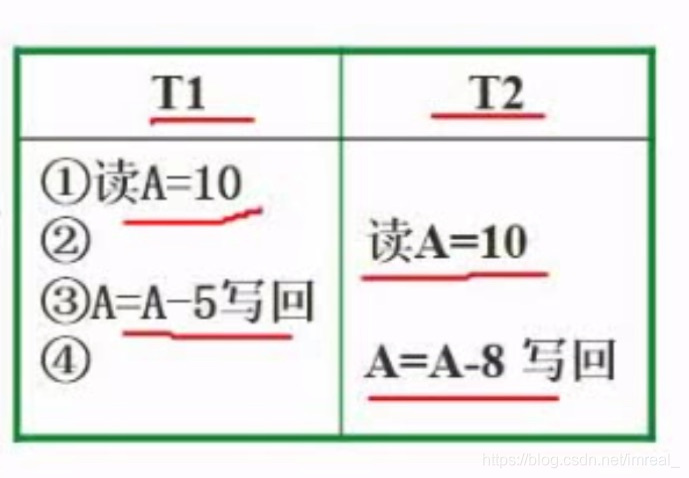
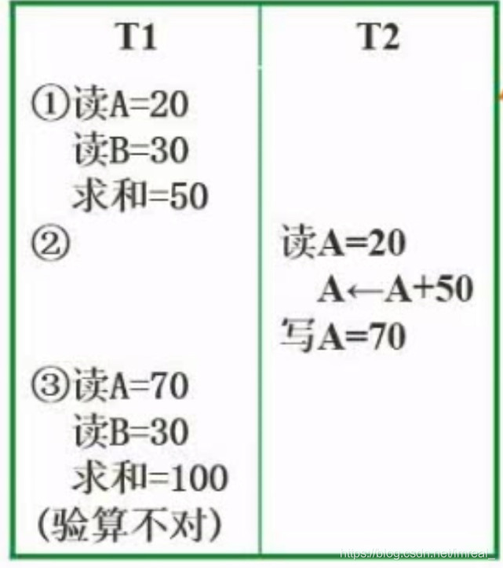
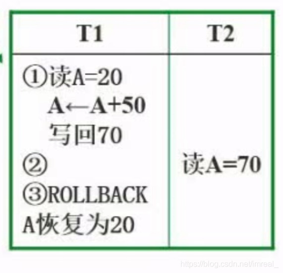

参考文档：https://zhuanlan.zhihu.com/p/464283526

### 一、事务

---

把多个操作封装起来，将其看成一个整体来进行操作，可以便于并行并发的处理一些事情。

#### 原子性

事务的内容操作要么全部做，要么全不做。

#### 一致性

在事务执行之前，数据保持一致的状态，执行之后数据也是一致的状态。

#### 隔离性

事务之间的执行是独立进行的。

#### 持续性

事务执行之后，其结果造成的影响是持续的，即使数据库崩溃，其对数据库的更新操作也永久有效。

### 二、并发并行带来的问题

---

#### 丢失更新

在这两个事务中，T1执行的结果为5，T2执行的结果为2，我们想要得到的是A减去5再减去8的结果，但最终结果为2，因为下一个执行的事务结果会覆盖上一个事务执行的结果。

#### 不可重复读

在T1运算中，求A与B的和时，为了提高准确率，程序会再次进行验算，但在第一次运算和第二次运算的间隙，将进行T2运算，T2运算的结果会将A与B的值进行覆盖，这将会产生死锁问题。

#### 读“脏”数据

脏数据不是真正的数据，不是我们执行过程中真的产生的数据，只是一个临时值。

值70是计算过程产生的数据，属于临时数据，该数据被恢复为了20，使得T2操作将会出错。

### 三、解决并发并行问题的方法——封锁协议

---

#### 一级封锁协议

事务T在修改数据R之前必须先对其加==X（写锁或排它锁）锁==，直到事务结束才释放。可以防止丢失修改，该锁可以使得除了T以外的所有事务将不能访问R，而事务T则可以阅读或者修改R。

#### 二级封锁协议

一级封锁协议加上事务T在读取数据R之前先对其加==S(读锁或共享锁)锁==，读完后即可释放S锁。可防止丢失修改，还可防止读"脏"数据，该锁的作用是，所有的事务都可以访问R，但包括T在内的所有事务都不能修改R。

#### 三级封锁协议

一级封锁协议加上事务T在读取数据R之前先对其加S锁，直到事务结束才释放。可防止丢失修改，防止读"脏"数据与防止数据重复读。

#### 两段锁协议

可串行化（通过加锁解锁两个阶段使并发事务排队进行）的。可能发生死锁。

>如果事物T对数据加上X锁后，就只允许事务T读取和修改数据，其他事务对数据A不能再加任何锁，从而也不能读取和修改数据，直到事务T释放数据上的锁。
>
>如果事务T对数据加上了S锁后，事务T就只能读数据但不可以修改，其他事务可以再对数据A加S锁来读取，只要数据上有S锁，任何事务都只能再对其加S锁，而不能加X锁。