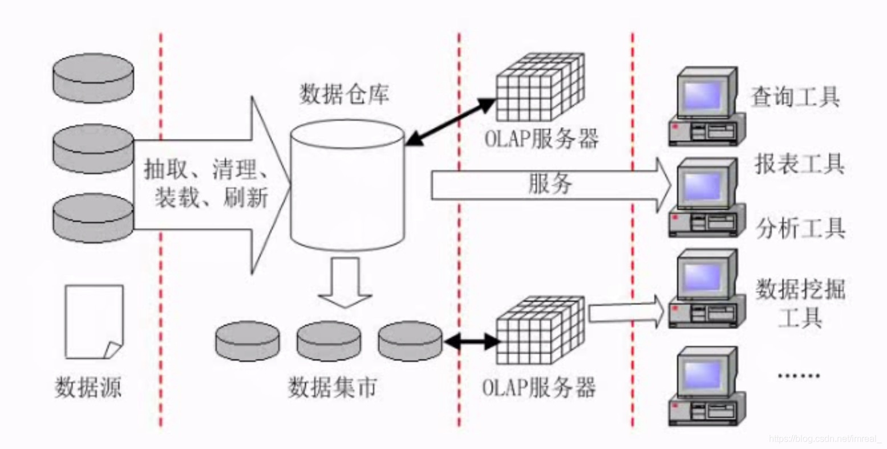

### 一、数据仓库

---

#### 1.1 概念

数据仓库是一种特殊的数据库；数据库系统在刚刚建立时运行速度很快，但随着时间的推移，其存储的数据量越来越大，速度也将逐步下降，而为了提高速度，人们会优化存储，通常采用删除较久远历史数据来进行优化，而这些数据仍然具有部分价值，因此我们会专门用一个数据库来对其进行存放，而用来存放这种数据的数据库并不需要插入，添加，修改等操作，更多的操作是**查询**，因此我们**将这种特殊用途的数据库称之为数据仓库**。

#### 1.2 特点

- 面向主题：不同于一般数据库的面向业务，数据仓库的数据是面向主题的。
- 集成性：数据仓库会存储诸如月报表，周报表等集成式的数据。
- 相对稳定性：进去的数据将不会进行修改，删除等操作。
- 反映历史变化（随着时间变化）：隔一段时间会将数据导入进来。

#### 1.3 数据仓库的建立过程

- 首先是从数据源中==抽取==，==清理==（使数据格式一致），==装载==（放到数据仓库中），==刷新==（定期向仓库中添加数据）；
- 数据集市即部门级的数据仓库，因为数据仓库的建立从企业全局的战略上讲具有非常大的风险，因此只建立部分数据库最后再将其整合则会降低风险，而其中**部门级的数据库则称为数据集市**。

#### 1.4 OLAP服务器的概念

Online Analytical Processing——联机分析处理服务器

专门做**分析处理**工作的，最表层是数据的前端工具，前端工具最普通的如**查询工具**，**报表工具**，**分析工具**以及比较独特的**数据挖掘工具**。

### 二、数据挖掘

---

#### 2.1 数据挖掘方法分类

- 关联分析：挖掘出隐藏在数据间的相互关系。
- 序列模式分析：侧重点是分析数据间的前后关系（因果关系）。
- 分类分析：为每一个记录赋予一个标记再按标记分类。
- 聚类分析：分类分析法的逆过程。

#### 2.2 数据挖掘方法

1. 决策树
2. 神经网络
3. 关联规则挖掘算法