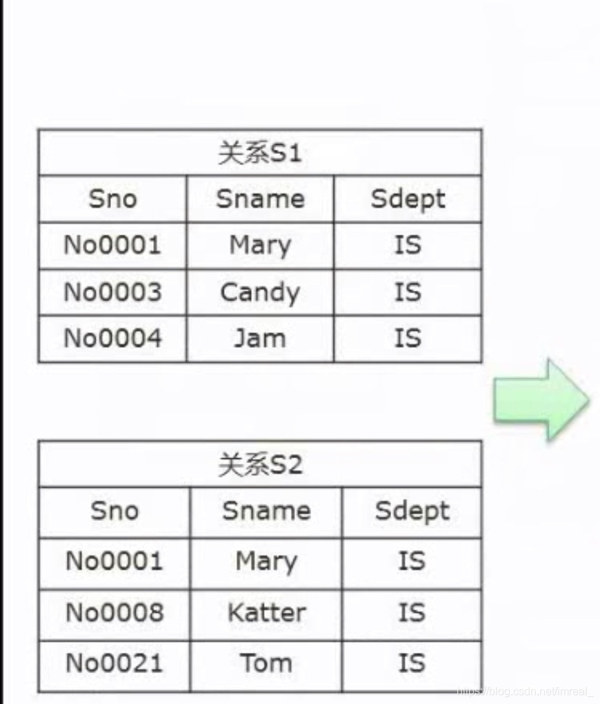
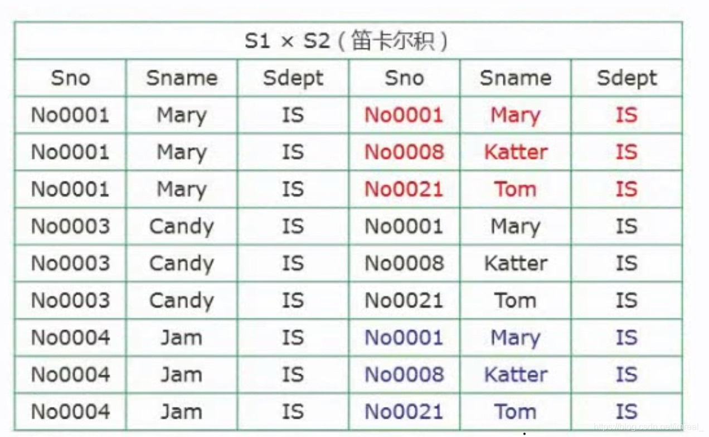
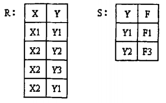
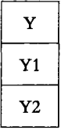
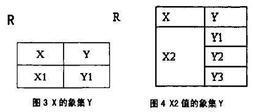
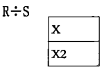
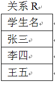
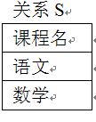
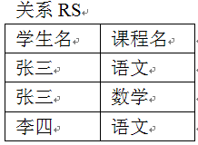

### 一、交（Intersection）

---

取两个关系中**共有的元组**。表示为`关系1 ∩ 关系2`。例如，男性员工 ∩ 婚姻状态=已婚(员工) ，取出已婚男性员工。

### 二、并（Union）

---

取两个关系的**所有元组，去除重复项**。表示为`关系1 ∪ 关系2`。例如，部门A员工 ∪ 部门B员工，取出在部门A或部门B工作的员工。

### 三、重命名（Renaming）

---

为关系中的属性赋予新的名称。表示为ρS (A1,…,An)(R)，ρ新表名(列名1,...,列名n)(原表名))。

### 四、差（Difference）

---

取一个关系中存在，而另一个关系中不存在的元组。表示为关系1 - 关系2。例如，部门A员工 - 部门B员工 取出只在部门A工作而不在部门B工作的员工。

### 五、笛卡尔积（Cartesian Product）

---

该运算的符号为“X”；若A与B进行“X”运算，则：

其第一个对象是*X*的成员而第二个对象是Y的一个成员的所有可能的有序对。

上图中：笛卡尔积中若AXB，则将A第一行记录写下，然后将其重复记录三次，然后将B的三行记录与B重写的记录一一对应写下，然后对A的第二行记录进行同样的重写，以及将B对应的记录重写......

### 六、投影（Projection）

---

从一个关系中选择特定属性（列）以创建一个新的关系。表示为π<属性列表>(关系)。例如，π<姓名, 部门>(员工) ，只选择员工的姓名和部门属性。

### 七、选择（Selection）

---

从一个关系中选择满足指定条件的元组。表示为σ<条件>(关系)。例如，σ<年龄>30(员工) ，选择年龄大于30的员工。

### 八、连接（Join）

---

将两个或多个关系根据一个或多个共同属性组合成一个新的关系。表示为关系1 ×<条件> 关系2。条件可以是等值连接或其他连接条件。例如，员工 ×<员工.部门=部门.部门号> 部门，连接员工和部门关系。

### 九、除法

---

关系除法运算的一般形式是：R ÷ S，其中 R 和 S 是两个关系，结果是一个新的关系，其中包含满足条件的元组。

设有关系R、S 如图所示，求R÷S 的结果

1. 找出关系R和关系S中相同的属性，即Y属性。在关系S中对Y做投影（即将Y列取出）；

   

2. 被除关系R中与S中不相同的属性列是X ，关系R在属性（X）上做取消重复值的投影为{X1，X2}；

3. 求关系R中X属性对应的像集Y。根据关系R的记录，可以得到与X1值有关的记录，如图3所示；与X2有关的记录，如图4所示：

   

4. 判断包含关系。R÷S其实就是判断关系R中X各个值的像集Y是否包含关系S中属性Y的所有值。对比即可发现：X1的像集只有Y1，不能包含关系S中属性Y的所有值，所以排除掉X1；而X2的像集包含了关系S中属性Y的所有值，所以R÷S的最终结果就是X2 ，

   

>除法运算可以解决什么问题
>
>例：设有关系R，S以及RS，如图所示，求RS÷S的结果
>
>
>
>求得结果为：{张三}
>
>RS÷S 在这里解决的问题就是：“得到选修了所有课程的学生”   RS÷S的意义就是：“在R和S的联系RS中，找出与S中所有的元组有关系的R元组”。