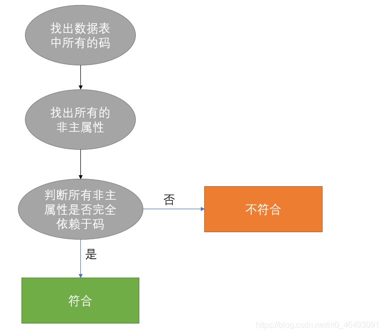
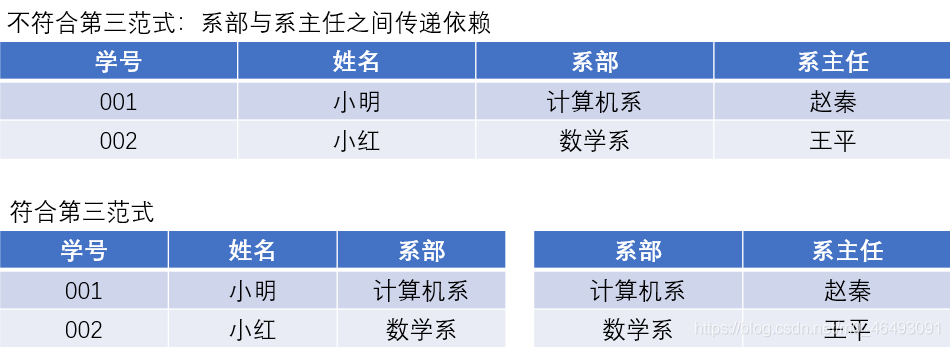
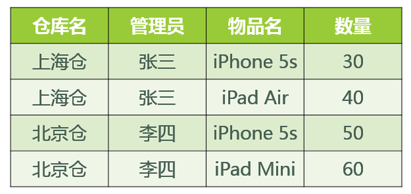
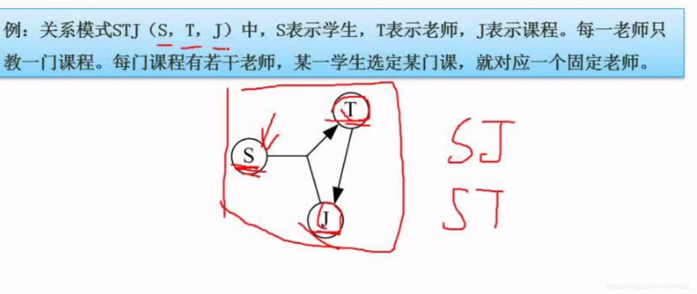
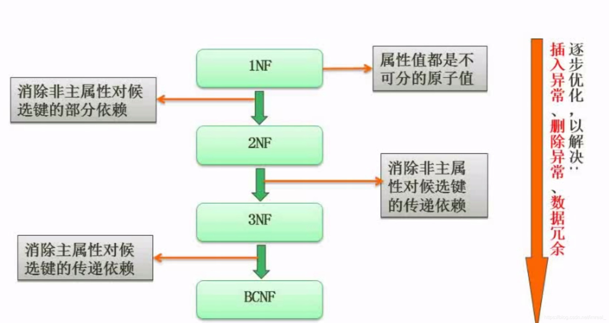

### 一、范式概念

---

范式符号为NF；范式分为一级范式。二级范式，三级范式.......；随着范式等级的提高，规范程度就会越高，数据表的拆分也将越来越细，而数据表拆分过细会造成性能方面的问题，因此，我们通常对范式的等级采取折中的方式，即做到三级范式。

### 二、第一范式（1NF）

---

>强调属性的原子性。即属性不可再分。

不符合：

符合：

### 三、第二范式（2NF）

---

> 前提必须满足1NF。每个关系必须**有且仅有一个数据项作为主键**，其他数据项与主键一一对应，即其他数据项完全依赖于主键。由此可知单主属性的关系均属于第二范式。

判断一个范式是否符合第二范式：

### 四、第三范式（3NF）

---

在2NF的基础上，消除了非主属性对码的传递依赖。

理解：确保数据表中的每一列数据都和主键直接相关，而不能间接相关。

### 五、巴斯-科德范式（BCNF）

---

假设：

1. 某公司有若干个仓库。
2. 每个仓库只能有一名管理员，一名管理员只能在一个仓库中工作。
3. 一个仓库中可以存放多种物品，一种物品也可以存放在不同的仓库中。每种物品在每个仓库中都有对应的数量。

则关系模式 `仓库（仓库名，管理员，物品名，数量）` 属于3NF范式。

码：（管理员，物品名），（仓库名，物品名）。

主属性：仓库名、管理员、物品名。

非主属性：数量。

非主属性完全依赖于码、同时不存在非主属性对于码的传递函数依赖，所以属于3NF范式。

这张表存在的问题：

1. 无法新增未指派管理员、未存放物品的仓库；
2. 清空仓库会删除仓库和管理员信息；
3. 仓库更换管理员，将修改该仓库的每一条记录。

造成3NF范式存在这些问题的主要原因是：存在主属性对于码的部分函数依赖或传递函数依赖：主属性仓库名 对于 码（管理员、物品）存在部分函数依赖。

BCNF在3NF的基础上消除主属性对于码的部分和传递函数依赖。

因此需要将上表拆分成两个表：

仓库（仓库名，管理员）

库存（仓库名，物品名，数量）

### 六、主属性的概念

---

主属性即为构成候选键的属性，在该关系图中，ST和SJ都是候选键，因此，S，J，T三个属性都属于主属性。

### 七、关系模式的概念

---

关系模式实际上就是记录类型。它的定义包括：模式名，属性名，值域名以及模式的主键。 关系模式不涉及到物理存储方面的描述，仅仅是**对数据特性的描述**。

### 八、图示

---

- 一级范式消除非主属性(即该属性不属于候选键的一部分)对候选键的部分依赖后就得到了二级范式；
- 二级范式消除了非主属性对候选键的传递依赖后就得到了第三范式；
- 第三范式在消除了主属性对候选键的传递依赖后就得到了BC范式。