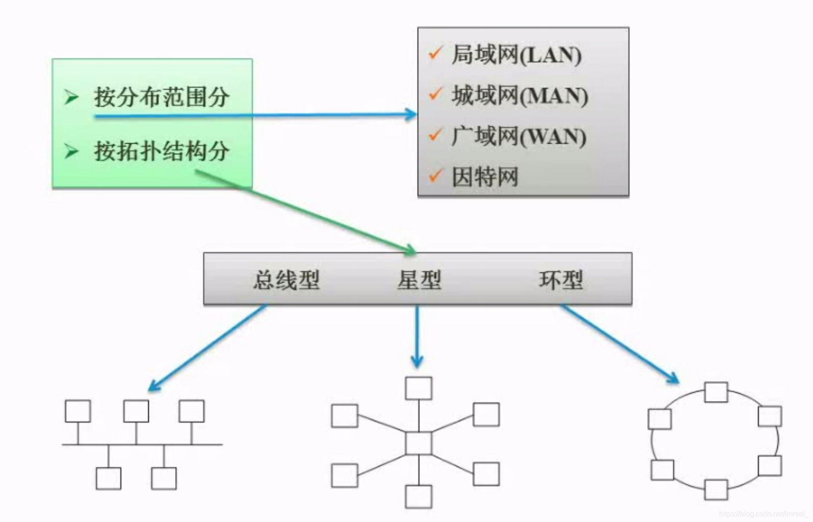

|                    | 优点                                 | 缺点                             |
| ------------------ | ------------------------------------ | -------------------------------- |
| 总线型             | 扩充性能好，可靠性高，廉价，安装方便 | 负载重时，线路的利用率较低       |
| 星型               | 维护方便                             | 线路利用率低，中央单元负荷重     |
| 环形               | 路径控制简单，可靠性高               | 扩充性差，传输效率低，响应速度慢 |
| 树形               | 与总线型相同                         | 与总线型相同                     |
| 网络结构（分布式） | 可靠性高，资源共享方便，响应速度快   | 硬件成本高，管理复杂             |

