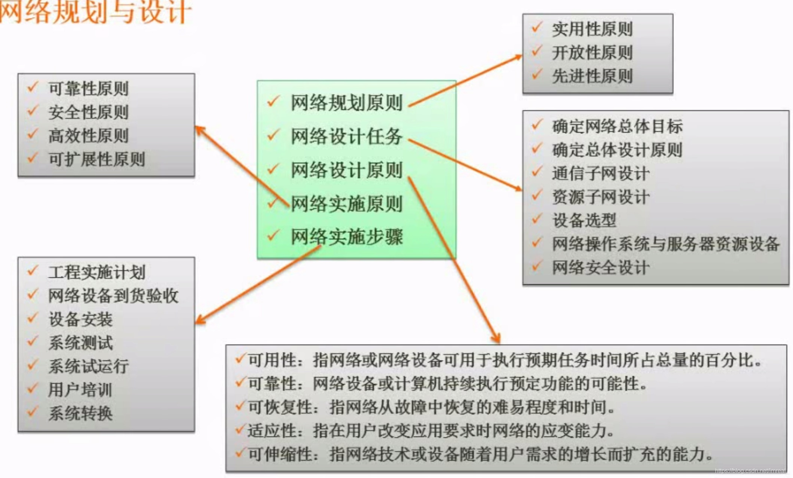
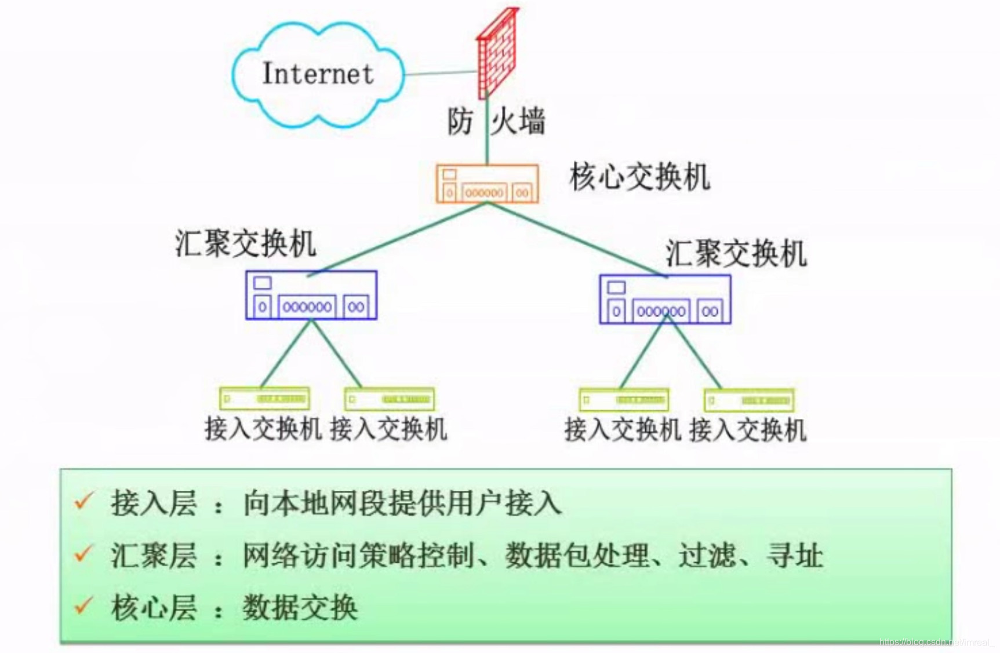

### 一、逻辑网络设计

---

利用需求分析和现有网络体系分析的结果来设计逻辑网络结构，最后得到一份逻辑网络设计文档，输出内容包括以下几点：

- 逻辑网络设计图
- IP地址方案
- 安全方案
- 具体的软硬件、广域网连接设备和基本服务
- 招聘和培训网络员工的具体说明
- 对软硬件、服务、员工和培训的费用初步估计

### 二、物理网络设计

---

物理网络设计是对逻辑网络设计的物理实现，通过对设备的具体物理分布、运行环境等确定，确保网络的物理连接符合逻辑连接的要求。输出如下内容：

- 网络物理结构图和布线方案
- 设备和部件的详细列表清单
- 软硬件和安装费用的评估
- 安装日程表，详细说明服务的时间以及期限
- 安装后的测试计划
- 用户的培训计划

### 三、分层设计

---

核心层只负责高速数据的交换，且采用冗余设计，即采用几台设备处理这些数据，这样做可以提高安全性，因此对设备的性能有较高要求。
