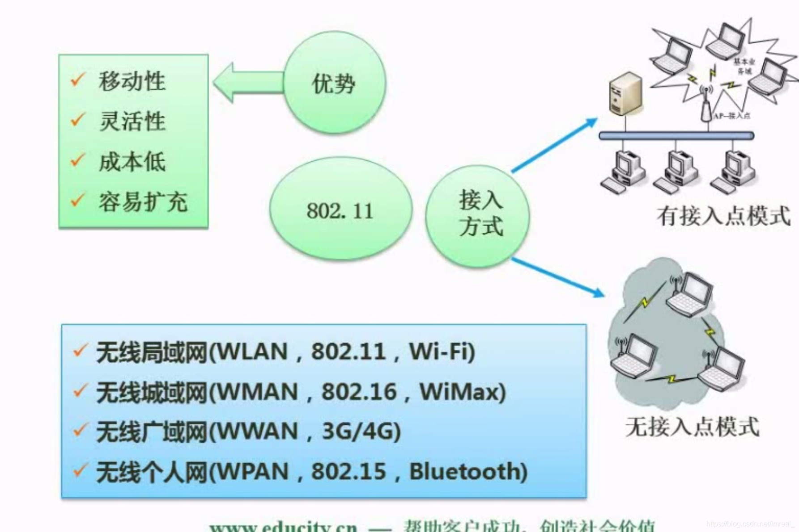

### 一、HTML主要标签

---

HTML是一种标签语言，是一种网页设计语言。

|            |                                |
| ---------- | ------------------------------ |
| `<a>`      | 定义锚                         |
| `<b>`      | 定义粗字体                     |
| `<body>`   | 定义文档的主体                 |
| `<button>` | 定义按钮                       |
| `
` | 定义居中文本                   |
| `<col>`    | 定义表格中一个或多个列的属性值 |
| ``   | 定义文字的字体、尺寸和颜色     |
| `<form>`   | 定义供用户输入的HTML表单       |
| `<frame>`  | 定义框架集的窗口或框架         |
| `<h1>`     | 定义HTML标题                   |
| `
`     | 定义水平线                     |
| `<html>`   | 定义HTML文档                   |
| ``    | 定义图像                       |
| `
`      | 定义段落                       |
| `<script>` | 定义客户端脚本                 |
| `<strong>` | 定义强调文本                   |
| `<table>`  | 定义表格                       |
| `<td>`     | 定义表格中的单元               |
| `<tr>`     | 定义表格中的行                 |
| `<title>`  | 定义文档的标题                 |

### 二、无线网

---

#### 2.1 无线网分类

- 无线局域网
- 无线城域网
- 无线广域网
- 无线个人网（蓝牙）

#### 2.2 无线网覆盖范围

个人 < 局域 <  城域 < 广域

#### 2.3 无线网优势

- 移动性
- 灵活性
- 成本低
- 容易扩充

#### 2.4 无线局域网的接入方式

- 接入点模式
- 无接入点模式