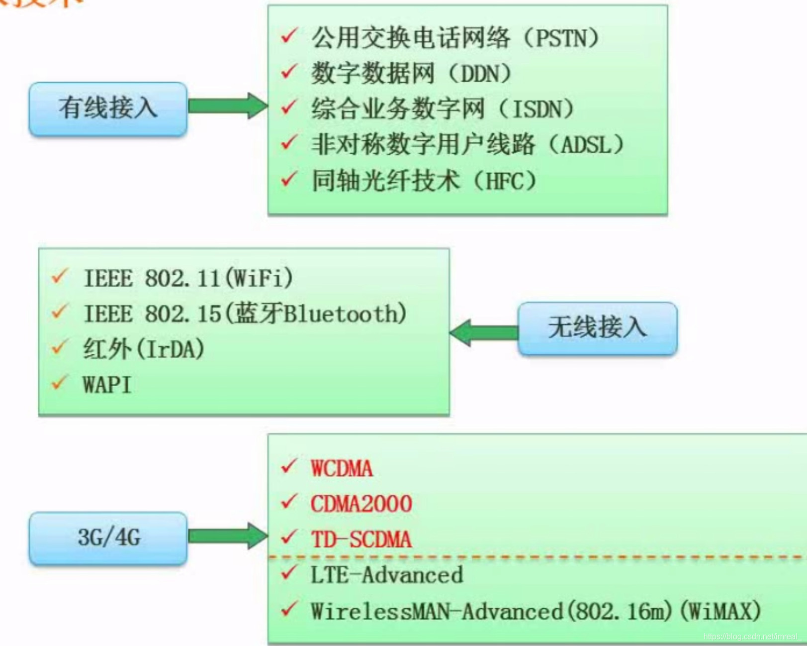

网络接入技术分为有线接入和无线接入以及3G/4G接入。

| 接入技术 | 说明                                                         |
| -------- | ------------------------------------------------------------ |
| PSTN     | 十多年前流行，其上网和通话功能不能同时进行，目前基本被淘汰，但pos机和传真依旧在使用 |
| ISDN     | 解决了上网和通话不能同时进行的问题，速度达到128KB            |
| ADSL     | 是ISDN的发展，目前是主流的有线网络接入方式，速度达到了8MB/S。ADSL上网拨号有三种方式：**专线方式（静态IP）**、**pppoA**和**pppoE** |
| HFC      | 目前广泛用于电视机接入网络                                   |
| TD-SCDMA | 国产技术，只在中国应用，由移动公司主导推广；目前最为广泛应用的技术是WCDMA，而FDD则是其发展版本 |
| TDD      | 是LTE—Advanced发展而来，是4G时代智能机的主流接入网络的方式   |

