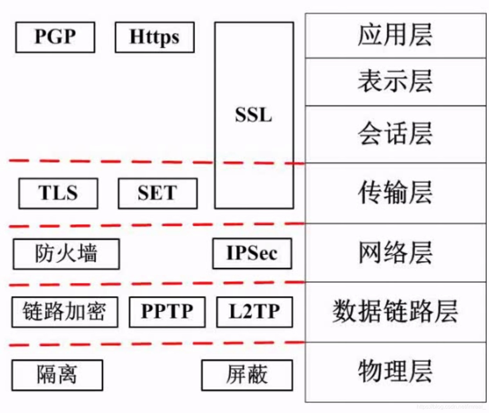

为了解决互联网协议随着信息技术的发展凸显出的安全问题。

从第二层开始实行协议保障安全，**IPSec 是对IP包进行加密的协议**。

### 一、SSH

---

是建立在应用层基础上的安全协议，SSH是目前较为可靠，**专为远程登录会话和其他网络服务提供安全性的协议**。利用SSH协议可以有效防止远程管理过程中的信息泄露问题。

### 二、SSL

---

SSL是为网络通信提供安全及数据完整性的一种安全协议，在传输层对网络连接进行加密，目前被广泛地用于**Web浏览器与服务器之间的身份认证和加密数据传输**。