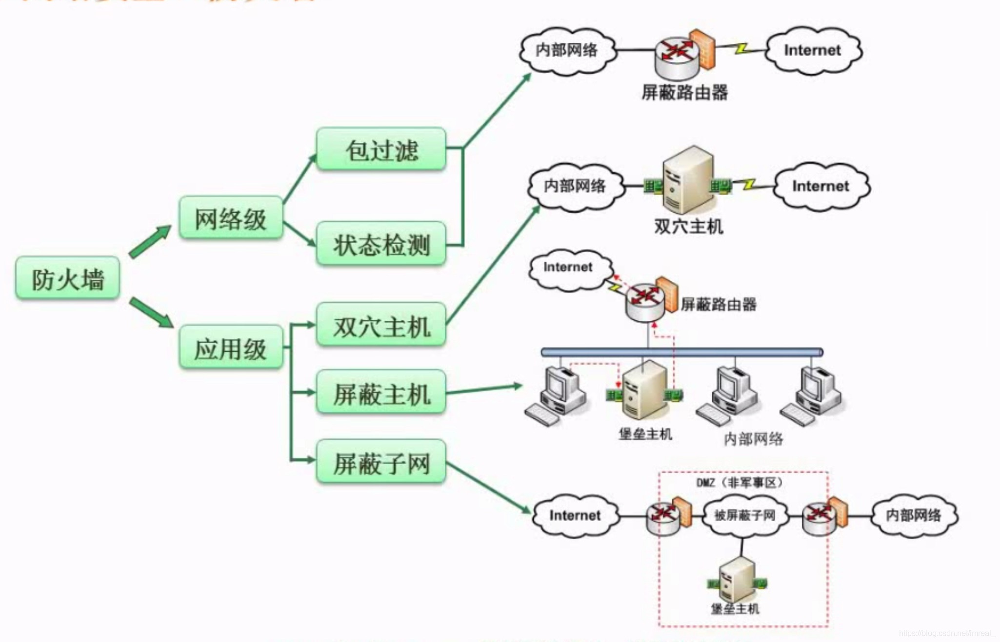

### 一、网络攻击分类

---

#### 1.1 主动攻击

包含攻击者访问他所需信息的故意行为。比如

- 通过远程登陆到特定机器的邮件端口以找出企业邮件服务器的信息；
- 伪造无效IP地址去连接服务器，使接受到错误IP地址的系统浪费时间去连接哪个非法地址。

攻击者是在主动地做一些不利于你或你的公司系统的事情。

主动攻击包括：

- 拒绝服务攻击
- 分布式拒绝服务
- 信息篡改
- 资源使用
- 欺骗
- 伪装
- 重放等攻击方式

#### 1.2 被动攻击

主要是收集信息而不是进行访问，数据的合法用户对这种活动一点也察觉不到。被动攻击包括嗅探、信息收集等攻击方式。

### 二、常见的网络威胁

---

| 威胁名称         | 描述                                                         |
| ---------------- | ------------------------------------------------------------ |
| 重放攻击（ARP）  | 所截获的某次合法的通信数据拷贝，处于非法的目的而被重新发送。 |
| 拒绝服务（DOS）  | 对信息或其它资源的合法访问被无条件地阻止。                   |
| 窃听             | 用各种可能的合法或非法的手段窃取系统中的信息资源和敏感信息。例如对通信线路中传输的信号进行搭线监听。或者利用通信设备在工作过程中产生的电磁泄漏截取有用信息等。 |
| 业务流分析       | 通过对系统进行长期监听，利用统计分析方法对诸如通信频度、通信的信息流向、通信总量的变化等参数进行研究，从而发现有价值的信息和规律。 |
| 信息泄漏         | 信息被泄漏或透露给某个非授权的实体。                         |
| 破坏信息的完整性 | 数据被非授权地进行增删、修改或破坏而受到损失。               |
| 非授权访问       | 某一资源被某个非授权的人、或以非授权的方式使用。             |
| 假冒             | 通过欺骗通信系统（或用户）达到非法用户冒充成为合法用户，或者特权小的用户冒充成为特权大的用户的目的。黑客大多是采用假冒进行攻击。 |
| 旁路控制         | 攻击者利用系统的安全缺陷或安全性上的脆弱之处获得非授权的权利或特权。例如，攻击者通过各种攻击手段发现原本应保密，但是却又暴露出来的一些系统”特性“。利用这些”特性“，攻击者可以绕过防线守卫者侵入系统的内部。 |
| 授权侵犯         | 被授权以某一目的使用某一系统或资源的某个人，却将此权限用于其它非授权的目的，也称作”内部攻击“。 |
| 特洛伊木马       | 软件中含有一个察觉不出的或者无害的程序段，当它被执行时，会破坏用户的安全。 |
| 陷阱门           | 在某个系统或某个部件中设置了”机关“，使得当提供特定的输入数据时允许违反安全策略。 |
| 抵赖             | 这是一种来自用户的攻击，比如：否认自己曾经发布过的某条消息、伪造一份对方来信等。 |

> - DOS攻击主要破坏了系统的可用性，使系统无法合法的使用相应的资源；
> - 业务流分析和窃听的区别在于业务流分析侧重长期监听、信息的分析
> - 窃听则只是获取信息。

kerberros系统通常**在报文中加入时间戳来防止ARP攻击**。

### 三、防火墙技术

---

防火墙技术大体可以分为网络级和应用级的防火墙技术。

- **网络级**的防火墙层次较低，但效率比较高，主要做法是拒绝接受指定IP段的信息，不管其内容；
- **应用级**防火墙则是层次较高，效率较低，主要做法是不论信息的来源而直接将信息开箱进行检查，若有问题则拒绝接收；
- 被屏蔽子网(DMZ)则是一块既不属于内网也不属于外网的隔离区，其目的是为了防止防火墙内部的攻击。

防火墙最重要的特性就是利用设置的条件，**监测通过的包的特征来决定放行或者阻止数据**，同时防火墙一般架设在提供某些服务的服务器前，具备网关的能力，用户对服务器或内部网络的访问请求与反馈都需要经过防火墙的转发，相对于外部用户而言防火墙隐藏了内部网络结构。防火墙作为一种网络安全设备，安装有网络操作系统，可以**对流经防火墙的流量信息进行详细的日志和审计**。

补充：入侵检测技术

包括：专家系统、模型检测、简单匹配