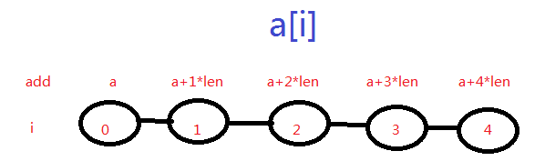
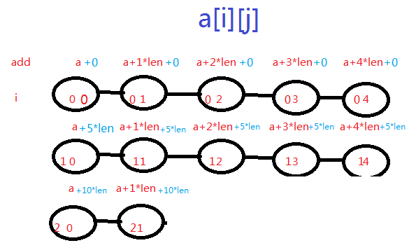
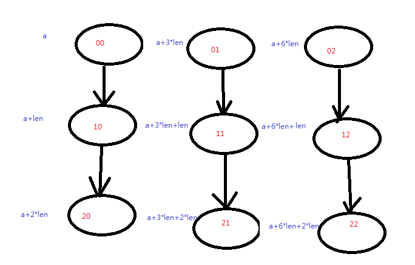

### 一、数组

---

#### 1.1 一维数组存储地址的计算

假设数组的首位置是：a

每个元素所占空间为：len

可以推断出`a[i]`的地址是：`a+i*len`

#### 1.2 二维数组存储地址的计算

分为按行优先和按列优先。

>**二维数组按行存储`a[3][5]`，m=3,n=5**
>
>
>
>假设数组的首位置是：a
>
>每个元素所占空间为：len
>
>可以推断出`a[i][j]`的地址是：`a+i*n*len+j*len`

>**二维数组按行存储`a[3][5]`，m=3,n=5**
>
>
>
>假设数组的首位置是：a
>
>每个元素所占空间为：len
>
>可以推断出`a[i][j]`的地址是：`a+i*m*len+i*len`

### 二、稀疏矩阵

---

#### 2.1 概念

在矩阵中，若数值为0的元素数目远远多于非0元素的数目，并且非0元素分布没有规律。

特性：

1. 稀疏矩阵其非零元素的个数远远小于零元素的个数，而且这些非零元素的分布也没有规律。
2. 稀疏因子是用于描述稀疏矩阵的非零元素的比例情况。设一个n*m的稀疏矩阵A中有t个非零元素，则稀疏因子δδ的计算公式如下：δ=tn∗mδ=tn∗m(当这个值小于等于0.05时，可以认为是稀疏矩阵)

考察：计算矩阵中某一个元素对应的数组的下标。