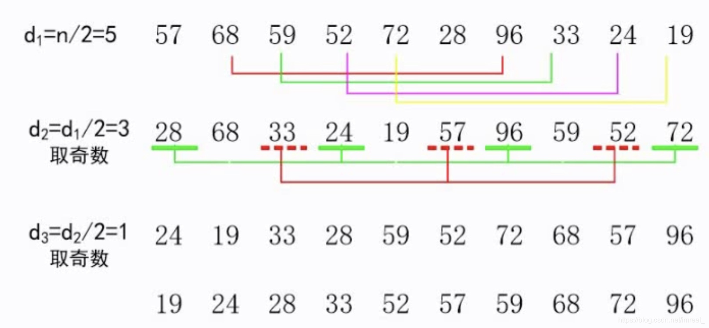
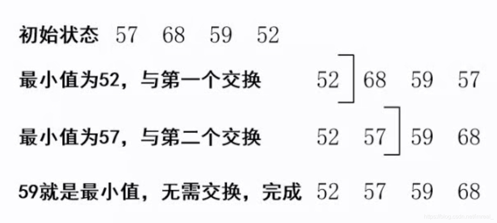

必考内容

### 一、直接插入排序

---

概念：即当插入第i个记录时，r1、r2、....rn-1都已经排好序，因此，将第i个记录ri依次与ri-1......r2、r1进行比较，找到合适的位置插入，它简单明了，但速度很慢。

直接插入排序的步骤：如这样一个序列：57 68 59 52；

1. 68>57；不做处理
2. 57<59<68；则68应在59之后(仍未做处理)
3. 52<57,插在57之前(此时开始处理)：57 59 68 52

### 二、希尔排序

---

属于插入排序的一种，效率高于直接插入排序，善于应对大量数据的排序。

概念：先取一个小于n的整数a1，然后把文件的全部记录分成a1个组，分组方法为：所有距离为d1的的倍数的记录放在同一个组中。分好组后再在各自的组内进行直接插入排序，排序完成以后解除分组，再取第二个小于a1的整数a2，再对该文件的所有记录进行相同方法的分组并同样进行直接插入排序，再取第三个小于a2的整数a3重复该操作........直至所取的整数an等于1为止。

### 三、直接选择排序

---

概念：首先在所有记录中选出排序码最小的记录，把它与第一个记录交换，然后在其余的记录内选出排序码最小的记录，与第二个记录交换....依次类推，直到所有记录排完为止。

### 四、堆排序

---

#### 4.1 概念

设有n个元素的序列(K1、K2、.....Kn)，当且仅当满足下列关系之一时，称之为堆：

1. ki<=k2i且ki<=k2i+1；(即每一个结点的孩子结点都比自己大) 。
2. ki>=k2i且ki>=k2i+1；(即每一个结点的孩子结点都比自己小)；其中(1)称为小顶堆(2)称之为大顶堆。

#### 4.2 堆排序的基本思想

先将序列建立堆，然后输出堆顶元素，再将剩下的序列建立堆，然后再输出堆顶元素，依次类推，直到所有元素均输出为止，此时元素输出的序列就是一个有序序列。

#### 4.3 初建堆的过程

对于一个二叉树，要将其调整为大顶堆，应有如下步骤：

1. 取树中的非叶子结点。
2. 将非叶子结点各自与其子结点的键值进行比较(从下往上)，如果比其中一个小，则与其交换位置，若比两个都小，则与最大的交换位置。

#### 4.4 堆排序的过程

1. 初建堆
2. 输出堆顶
3. 取一个叶子结点为新根结点
4. 再次进行堆的重建
5. 输出堆顶.......

### 五、冒泡排序

---

#### 5.1 概念

冒泡排序的基本思想是，通过相邻元素之间的比较和交换，将排序码较小的元素逐渐从底部移向顶部，由于整个排序的过程就像水底下的气泡一样逐渐向上冒，因此称为冒泡算法。

#### 5.2 步骤

一个数组中若有n个元素，对其采用冒泡排序：将第n个元素与第n-1个元素进行比较，若第n个元素较小，则将其与n-1个元素交换位置，再将n-1位置的元素与第n-2位置的元素进行比较....重复该操作。

### 六、快速排序

---

#### 6.1 概念

快速排序采用的是分治法，其基本思想是将原问题分解成若干个规模更小但结构与原问题相似的子问题。通过递归地解决这些子问题，然后再将这些子问题的解组成原问题的解(通俗的讲：就是把一个数组拆成了俩个数组)。

#### 6.2 步骤

1. 在数组中任取一个数为基准。
2. 定义一个指针，先指向左边第一个数，再指向右边第一个数，再指向左边第二个数，再指向右边第二个数....
3. 将基准与指针指向的数进行比较，若该数大于基准，则和基准交换位置，若小于基准则位置不变。
4. 最后将得到一个以基准为分割数的，右边大于基准的数组集合，左边小于基准的数组集合。

### 七、归并排序

---

#### 7.1 概念

归并也称合并，是将两个或两个以上的有序子表合并成一个新的有序表。若将两个有序表合并成一个有序表，则称为二路合并。

#### 7.2 步骤

合并的过程是：比较A[i]与A[j]的排序码大小，若A[i]的排序码小于等于A[j]的排序码，则将第一个有序表中的元素A[i]复制到R[k]中，并令i和k分别加1；如此循环下去，直到第一个有序表比较和复制完，然后再将另一个有序表的剩余元素复制到R中。

### 八、基数排序

---

#### 8.1 概念

将关键字拆分为个位、十位、百位...并对其各自位进行排序最后得出结果

#### 8.2 步骤

对于一个数组R。

1. 先收集其个位并对其个位进行排序(个位相同的则按照出现顺序紧挨着)
2. 按照个位排序的顺序将数组元素进行排序
3. 对刚刚排好序的数组收集其十位进行排序
4. 再将数组按照十位排序的顺序将数组元素进行排序
5. .......重复该操作，直至位数排尽

各个排序算法的时间复杂度和空间复杂度及稳定性(必考)。