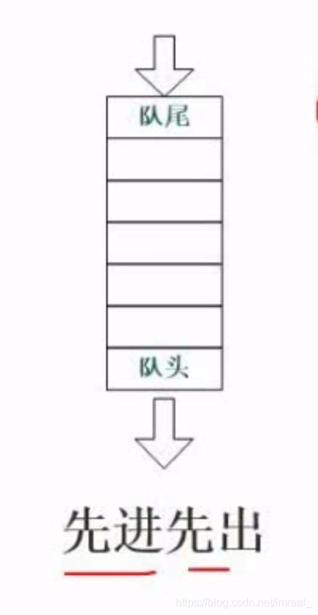

#### 一、队列的概念及特点

---

结点的存储及读取遵循**先进先出**的规律，原因是队列可以对两端进行操作。

### 二、栈的概念及特点

---

结点的存储及读取遵循**先进后出**的规律，原因是栈只能对一端进行操作。

### 三、循环队列

---

一种呈圆形的队列，尾指针会随着结点的依次存储而逐渐后移直至与头指针重合；因此，队满条件=队空条件=“**头指针等于尾指针**”；

解决队满与队空判断条件容易混淆的方法：方法(1)少存一个结点：此时的队满条件为(tail+1)%size=head。

### 四、队列与栈的练习

---

输出受限的双端队列是指元素可以从队列的两端输入，但只能从队列的一端输出，如下图所示，若有e1，e2，e3，e4依次进入输出受限的双端队列，则得不到输出序列（D）

A. e4 , e3 , e2 , e1								B. e4 , e2 , e1, e3

B. e4 , e3 , e1 , e2								D. e4 , e2 , e3 , e1

>栈和队列都属于线性表，不过他们都是**操作受到限制**的线性表。