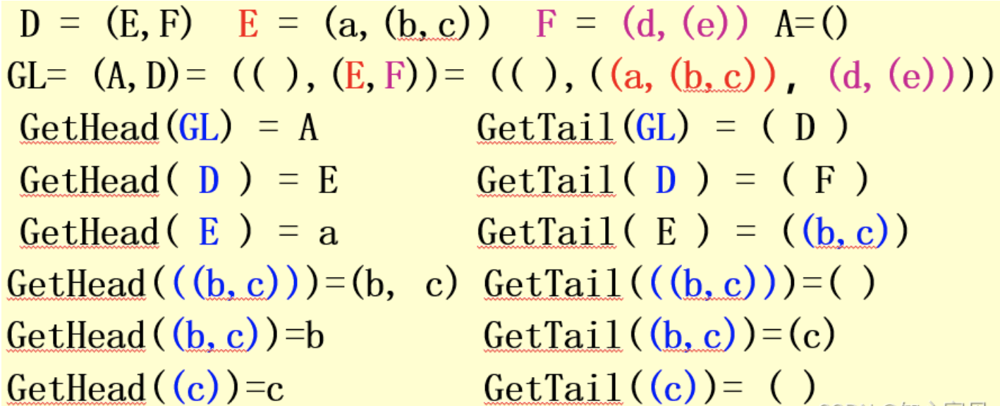

>考察广义表的长度计算、深度计算、head及tail运算。

### 一、概念

---

n个表元素组成的有限序列，GL = (d0, d1, …, dn-1)  GL是表名，d为表元素

- **表头（head）**：表中第一个元素，GetHead()取表头 
- **表尾（tail）**：表中最后一个元素，GetTail()取表尾
- **长度**：最外层包含元素的个数
- **深度**：最大所含括弧的重数

### 二、表示

---

LS=(a0，a1.......,an)。注：其中LS是表名，ai是表元素，它可以是表(称作子表)，也可以是数据元素(也称原子).其中n是广义表的长度(最外层包含的元素个数),n=0的广义表为空表；而递归定义的重数就是广义表的深度，直观的说，就是定义中嵌套的次数(原子的深度为0，空表的深度为1)。

### 三、广义表设计的运算

---

#### 3.1 GetHead

取广义表的第一个元素，去除最外一层括号。

#### 3.2 GetTail

取广义表的最后一个元素，不去除最外一层括号。

#### 3.3 深度

最大的括号重数，上图D E F A深度分别为1 2 2 1。

#### 3.4 长度

表中元素个数，上图E和F元素个数为2