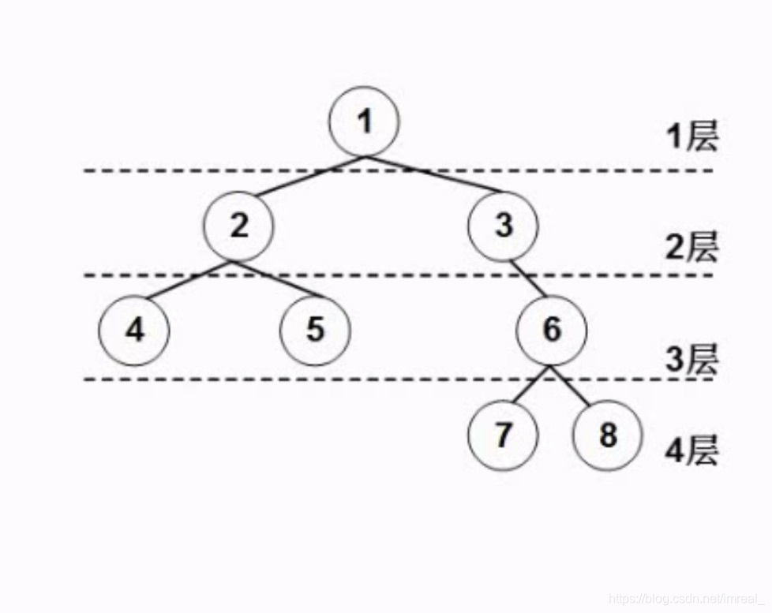
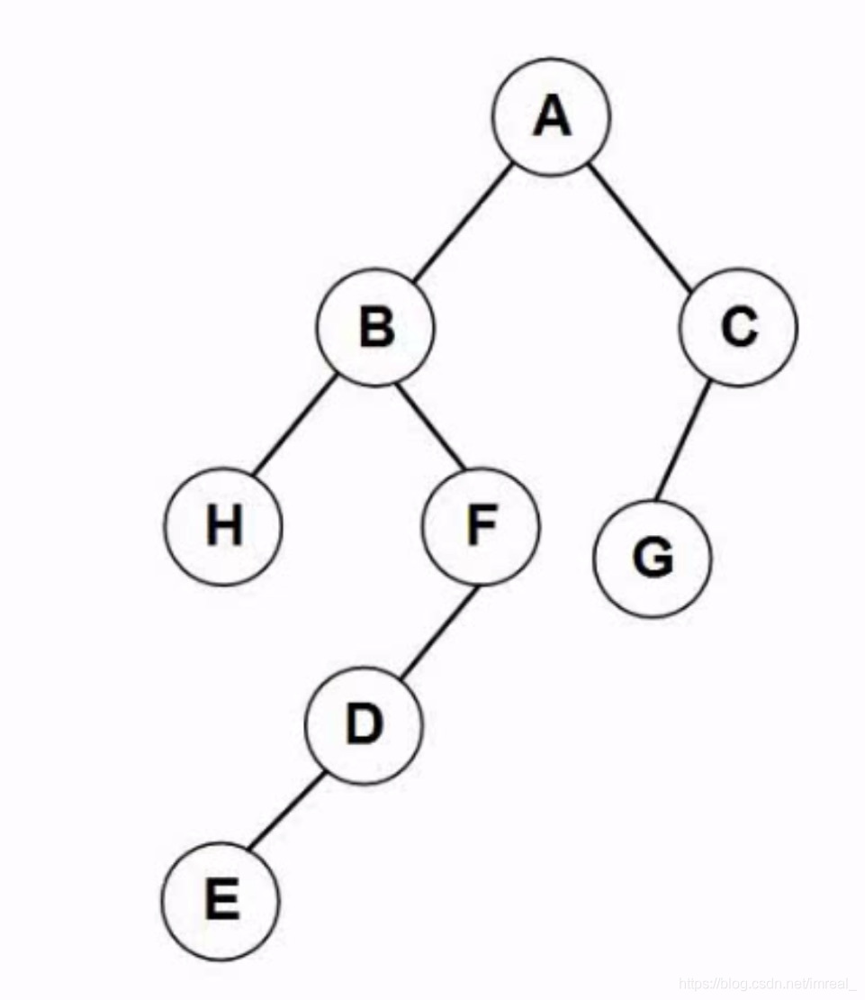
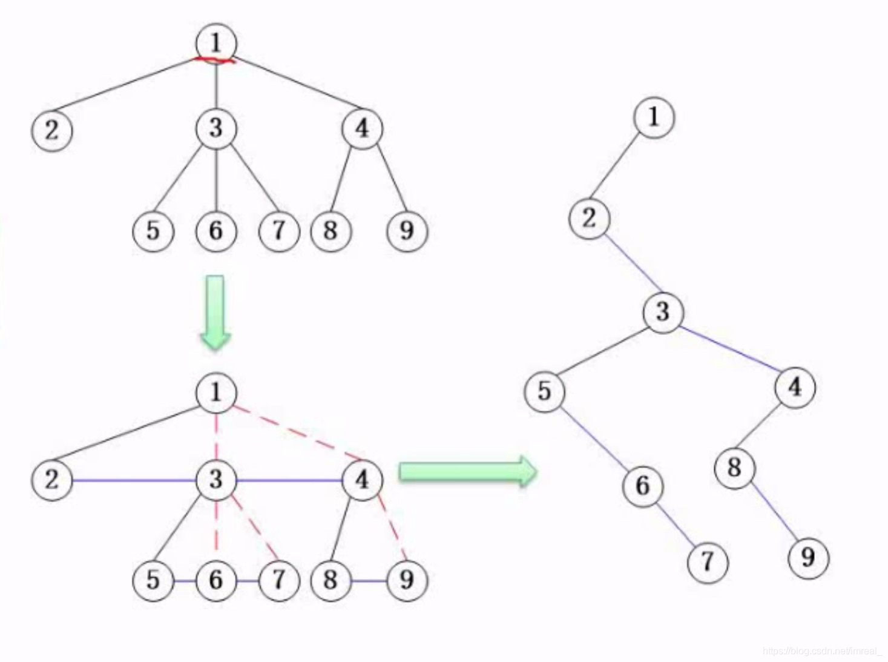
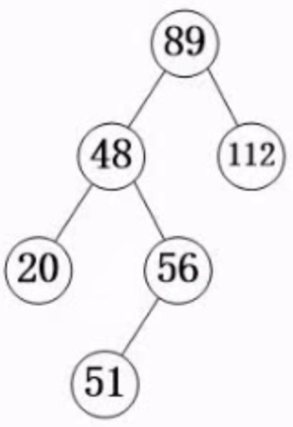
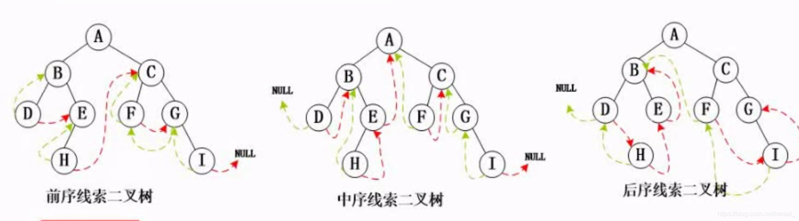
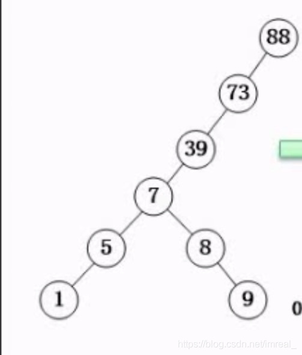
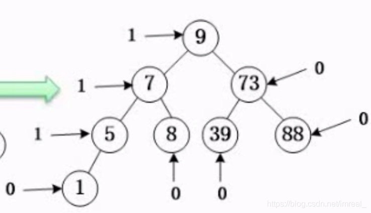

### 一、基本概念

---

|                |                                                              |
| -------------- | ------------------------------------------------------------ |
| 结点           | 图中①、②、③...都表示结点                                     |
| 结点的度       | 一个结点所有的孩子结点数（如结点①的度就是2，结点③的度即为1） |
| 树的度         | 一个树当中，结点的度最高的那个结点的度数                     |
| 叶子结点       | 如⑦、⑧等**没有孩子结点的结点**                               |
| 内部结点       | 非叶子结点又非根结点（最上面那个结点）                       |
| 父结点和子结点 | 相对概念，如②就是④的父节点，④就是②的子节点                   |
| 兄弟结点       | 同属于一个父结点的子结点间称之为兄弟结点                     |
| 层次           | 行数即为层次，该图中的层次即为4                              |

### 二、满二叉树

---

整个树可以构成一个完整的三角形即为满二叉树。

### 三、完全二叉树

---

最后一行的叶子结点的父节点必须要有兄弟结点且它要么也是叶子结点要么只有一个结点且该结点和最后一行的叶子结点紧挨着。

### 四、二叉树的重要特性

---

- 在二叉树的第i层上最多有 2^i-1^ 个结点（i≥1）；
- 深度为k的二叉树最多有 2^k^-1 个结点（k≥1）；
- 对任何一棵二叉树，如果其叶子结点数为 n~0~ ，度为2的节点数为 n~2~ ，则 n~0~=n~2~+1。
- 如果对一棵有n个结点的完全二叉树的结点按层序编号（从第1层到log2n+1，每层从左到右），则对任一结点i（1≤i≤n），有：
  - 如果i=1，则结点i无父结点，是二叉树的根；则父结点i/2；
  - 如果2i＞n，则结点i为叶子结点，无左子结点；否则，其左子结点是结点2i；
  - 如果2i+1＞n，则结点i无右子叶点，否则，其右子结点是结点2i+1。

### 五、二叉树遍历

---

- 层次遍历
- 前序遍历、中序遍历、后序遍历

#### 5.1 层次遍历

从根结点开始，按照从上到下，从左到右的顺序依次遍历结点。

#### 5.2 前序遍历

（根左右）

将根结点的访问放在最前面。然后访问左右子树结点。

#### 5.3 中序遍历

（左根右）

先访问左子树结点(左子节点以及它的所有子节点构成的新二叉树)，再访问根节点，再访问右子树结点。

#### 5.4 后序遍历

（左右根）

先访问左子树结点，再访问右子树结点，再访问根节点。

### 六、反向构造二叉树（重点考察）

---

知道二叉树的遍历序列，然后反向推出二叉树的构造。

由前序序列为ABHFDECG；中序序列为HBEDFAGC构造二叉树。

>解题方法：标注根结点，然后推左右结点。

### 七、树转二叉树

---

由于树的应用主要是二叉树的应用，所以我们需要将树转化为二叉树。

基本原则：某个结点的孩子结点都会成为它的左子树结点，某个结点的兄弟结点都会成为它的右孩子结点。

>例：
>
>

### 八、查找二叉树

---

#### 8.1 概念

(每一个)根节点的左子树结点的键值都小于根节点，根节点的右子树结点都大于根节点的一类二叉树即被称之为查找二叉树(或排序二叉树)。

#### 8.2 价值

这种二叉树能极大的提高查询的效率和速度。

#### 8.3 插入运算

1. 若该键值已存在，则不再插入。
2. 若查找二叉树为空树，则以欲插入的新结点为查找二叉树。
3. 将要插入结点键值与插入后父结点键值比较，就能确定新结点的位置是父结点的左子结点，还是右子结点。

#### 8.4 删除结点

1. 若待删除结点是叶子结点，则直接删除。
2. 若待删除结点只有一个子结点，则将这个子结点与待删除结点的父结点直接连接。
3. 若待删除结点p有两个子结点，则在其左子树上，用中序遍历寻找键值最大的结点s，用结点s的值代替结点p的值，然后删除原结点s，结点s必属于上述1或2。

### 九、最优二叉树(哈夫曼树)

---

这种二叉树是一种工具，用于哈夫曼编码，哈夫曼编码是一种无损压缩的方式,哈夫曼树中每一个父结点的键值都等于其子结点之和(不是子树结点)。

1. 树的路径长度：即在树中指定一条路径，将路径的段数相加。
2. 权：在最优二叉树中即某个叶子结点的键值(该键值将代表某个字符出现的频度)。
3. 带权路径长度：分为结点和二叉树的带权路径长度，结点的带权路径长度等于路径长度乘以权，二叉树的带权路径长度即为所有结点的带权路径长度之和。
4. 哈夫曼树设计的基本思想：让二叉树的带权路径长度尽可能小。

### 十、线索二叉树

---

由于二叉树中有许多结点处于空闲的状态，有许多指针并未被利用，而将其空闲资源利用起来方便遍历则是线索二叉树的由来，线索二叉树根据遍历的分类可以被分成三种线索二叉树：前序二叉树、中序二叉树、后序二叉树。

红线代表推出，绿线代表由来；如图一中二叉树的前序遍历为：ABDEHCFGI。

### 十一、平衡二叉树

---

更为平衡、更为饱满的二叉树。

任意结点的左右子树深度不能相差超过1，即每结点的平衡度(该结点的左右子树结点的深度之差)只能为-1、0或1。

图一和图二都属于排序二叉树，但图一的查询效率远低于图二，因为图一不属于平衡二叉树。而图二属于平衡二叉树。