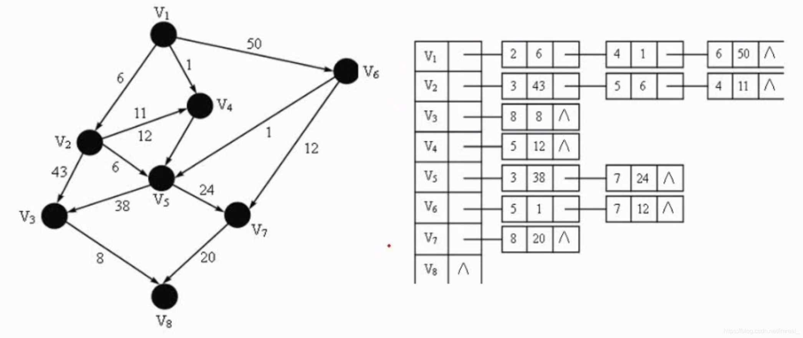
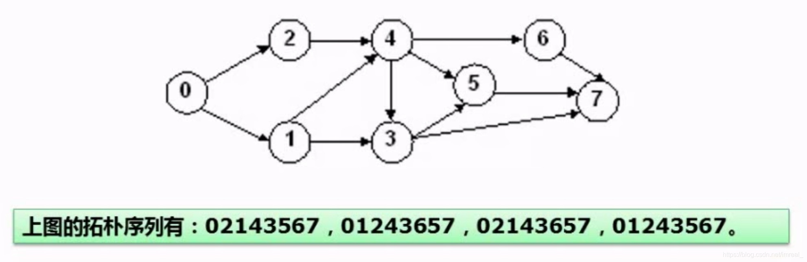

### 一、概念

---

图分为：

1. 无向图：在该图中，若每一个顶点与其他所有顶点都有一条边相连，则称该图为无向图。
2. 有向图：若每一个顶点与其他所有顶带都有两条有向边相互联系，则称该图为有向图。

### 二、图的存储—邻接矩阵

---

#### 2.1 矩阵的大小

若有a个结点，则该矩阵为aXa阶矩阵。

#### 2.2 矩阵的内容

矩阵内只有0和1两种数字，以矩阵的第一个行(hang)为例，第一个结点按照与后续每一个结点是否有边来确定矩阵的内容，若有边则对应的该行该列值为1，无边则为0。

#### 2.3 图的广度遍历过程

从图中某个顶点触发，在访问了顶点之后，一次性访问顶点的各个未被访问的邻接点，然后分别从这些邻接点出发，依次访问它们的邻接点，并使“先被访问的邻接点”先于“后被访问的邻接点”被访问，直到图中所有已访问的顶点的邻接点都被访问到。

### 三、图的存储—邻接表

---

首先会有一个表记录每一个结点，即把每个顶点的邻接顶点用链表表示出来，然后用一个一维数组来顺序存储上面每个链表的头指针。

### 四、图的遍历

---

图的遍历分为**深度优先遍历**和**广度优先遍历**。

#### 4.1 深度优先遍历

首先一条路径试探到底，然后再回退回来继续深入下一条路径。

#### 4.2 广度优先遍历

即从顶点开始，一行一行遍历。

### 五、图—拓扑排序

---

用一个序列来表达哪些事件可以先执行，哪些事件可以后执行。

AOV网络：我们把用有向边表示活动之间开始的先后关系，这种有向图称之为用顶点表示活动网络，简称AOV网络。

### 六、图的最小生成树—普利姆算法

---

1. 最小生成树：如图若有a个顶点，则在图中取a-1条边，用这些顶点和边重新构成一个树，而路径值最短的情况下的树即为最小生成树。
2. 求最小生成树——普利姆算法(最近点法)：任选一个结点A并将其标定为红点集，其余所有结点标定为蓝点集，然后将离红点集A距离最短的结点B连接起来并将其也纳入红点集，然后继续寻找蓝点集和红点集之间的最短距离结点并将其纳入红点集，重复该操作直至所有结点被纳入红点集(将结点纳入红点集时注意不能形成环)。
3. 求最小生成树——克鲁斯卡尔算法(最近边法):任选一条边并将其标定为红点集，其余所有边标定为蓝点集，然后将离红点集边端点距离最短的边连接起来并将其也纳入红点集，然后继续寻找蓝点集和红点集之间的最短距离边并将其纳入红点集，重复该操作直至红点集纳入了结点数-1数量的边(将边纳入红点集时注意不能形成环)。