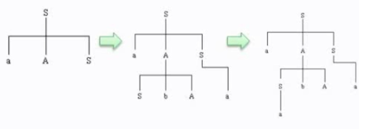

>语言是一定的群体用来信息交流的工具 ，而信息交流的基础是需要按照共同约定的**生成规则**和**理解规则**去生成句子和理解句子。程序设计语言经过形式化提取后可以得到以下内容：
>
>- 程序设计语言(Programming Language)：组成程序的所有语句的集合。
>- 程序(Program)：满足语法规则的语句序列。
>- 语句(Sentence) ：满足语法规则的单词序列。
>- 单词(Token) ：满足词法规则的字符串。
>
>语言的描述形式——**文法**，对于单词和语句有不同的概念：
>
>词法——单词
>单词的组成规则
>描述方法：BNF范式、正规式
>
>语法——语句
>语句的组成规则
>描述方法：BNF范式、语法(描述)图

### 一、文法的定义

---

G = (V_T , V_N , P , S )

- **A：V_T：终结符集合**

  终结符（terminal symbol）是文法所定义的语言的基本符号，有时也称为token。

  例: `V_T = { apple, boy, eat, little }`

- **B：V_N：非终结符集合**

  非终结符(nonterminal) 是用来表示语法成分的符号，有时也称为“ 语法变量”

  例：`V_N = { <句子>, <名词短语>, <动词短语>, <名 词>, … }`

- **C：P ：产生式集合**

  产生式( production)描述了将终结符和非终结符组合成串的方法。产生式的一般形式：α→β 读作：α 定义为 β

  **α∈(V_T∪V_N)+**：且α中至少包含V_N中的一个元素：称为产生式的头 (head )或左部(left side)

  **β∈(V_T∪V_N)\*** ：称为产生式的体(body)或右部(right side)

- **D：S ：开始符号**

  S∈VN

  开始符号(start symbol)表示的是该文法中最大的语法成分

>示例：
>
>G =( { id, +, *, (, ) }, {E}, P, E )
>
>P ={
>
>E → E + E ,
>
>E → E * E ,
>
>E → ( E ) ,
>
>E → id }
>
>约定：不引起歧义的前提下，可以只写产生式
>
>G : E → E + E E → E * E E → ( E ) E → id

### 二、文法的分类

---

- 0型文法 (即：短语结构文法)
- 1型文法 (即：上下文有关文法)
- 2型文法 (即：上下文无关文法)
- 3型文法 (即：正规文法)

### 三、语法推导树

---

可以用来进行语法规则的推导，通过推导树，我们可以了解到一种语法能够表达的串以及能够构造的句型是什么样子。

>例：G=( {S,A},{a,b},P,S )，其中：
>
>S —> aAS|a;
>
>A —> SbA|SS|ba
>
>请构造句型aabAa的推导树。
>
>
>
>首先，S(开始符)推导出对应的句子
>
>S=>a<u>A</u>S=>a<u>SbA</u>S=>aabAS=>aabAa
>
>

程序设计语言的大多数语法现象可用其中的上下文无关文法来描述。