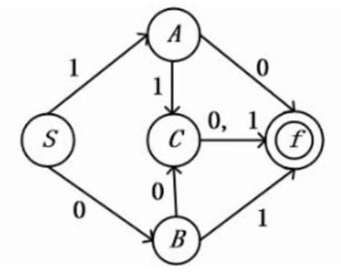
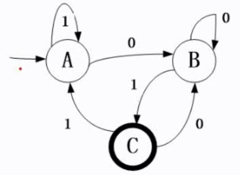

### 一、有限自动机

---

M=(S, Σ, δ, S0, Z)

1. S是一个有限集，每个元素为一个状态。
2. Σ(xigema)是一个有穷字母表，每个元素为一个输入字符。
3. δ是转换函数，是一个单值对照。
4. s0∈S，是唯一的初态。
5. Z是一个终态集(可空)。

有限状态自动机可以形象地用状态转换图表示，设有限状态自动机：

DFA=({S,A, B, C, f}, {1, 0},8,S, {f}),
其中:
8(S, 0)= B, 8(S,1)=A, δ(A,0)= f, δ(A,1)= C, δ(B, 0)= C, δ(B, 1)= f,8(C, 0)= f, 8(C,1)= f



(S,0)=B表示S通过路径0可以得到B，而S即为初态，f即为终态。

考察形式：设定一个值：如10或01或001，问是否能够构建这样一条通路？实际上该题即问终态与初态相连，求出其路径，再看其路径值是否与与题意相符。

#### 1.1 例题

下图所示为一个有限自动机（其中，A是初态、C是终态），该自动机可识别（）。



A. 0000			B. 1111			C. 0101			D. 1010

**被有限自动机所识别是指从初态开始到终态结束，所输入的字符串能够按顺序地执行下去**，若到某个状态不能往下走得到下一个字符，则认为不能识别。

直接把选项中的路径代入图中运行，从初态开始运行，若选项提供的路径使其到达了终态，那么这就是正确的选项，该题中即为C选项。


### 二、正规式

---

正规式是描述程序语言单词的表达式。

#### 2.1 例题1

下面文法G[S]它无法识别（1），此文发对应正规式为（2）。

G[S]:

S—>aA|bB

A—>bS|b

B—>aS|a

```
（1）A. ababab	B. bababa	C. abbaab	D. babba
（2）A. (a|b)*	B. (ab)*	C. (ab|ba)*	D. (ab)*(ba)*

“|”代表“或”；“*”代表循环多次，如在或运算中，可以任意选择左式和右式的循环次数，循环次数可以从零到无穷大。
```

解析：

```
S->aA->abS->abaA->ababS->(ab)*
S->bB->baS->babB->babaS->(ba)*
S->aA->abS->abbB->abbaaA->abbaab->(ab|ba)*
```

答案为D，C
