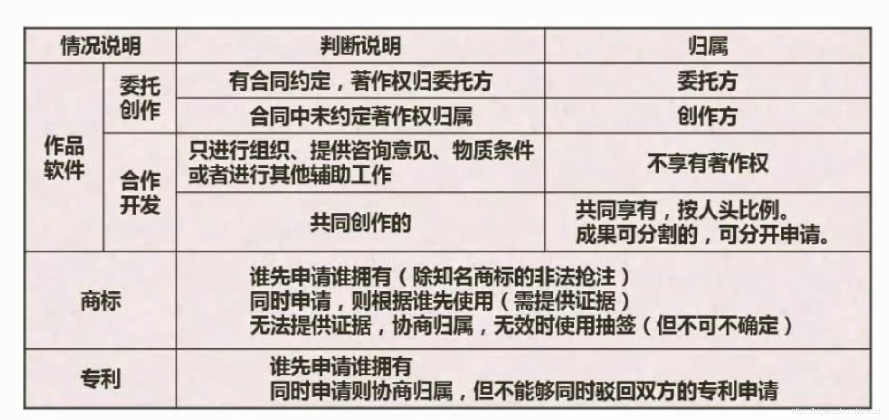

| 情况说明        | 判断说明                                                     | 归属                                         |
| --------------- | ------------------------------------------------------------ | -------------------------------------------- |
| 作品/职务作品   | 职务作品                                                     | 除署名权外其他著作权归单位                   |
|                 | 有合同约定，其著作权属于单位                                 | 除署名权外其他著作权归单位                   |
|                 | 其他                                                         | 作者用于著作权，单位有权在业务范围内优先使用 |
| 软件/职务作品   | 属于本职工作中明确规定的开发目标                             | 单位享有著作权                               |
|                 | 属于从事本职工作活动的成果                                   | 单位享有著作权                               |
|                 | 使用了单位资金、专用设备、未功能开的信息等物质、技术条件，并有单位或组织承担责任的软件 | 单位享有著作权                               |
| 专利权/职务作品 | 本职工作中作出的发明创造                                     | 单位享有著作权                               |
|                 | 履行本单位交付的本职工作之外的任务所作出的发明创造           | 单位享有著作权                               |
|                 | 离职、退休或调动工作后一年内，与原单位工作相关               | 单位享有著作权                               |

