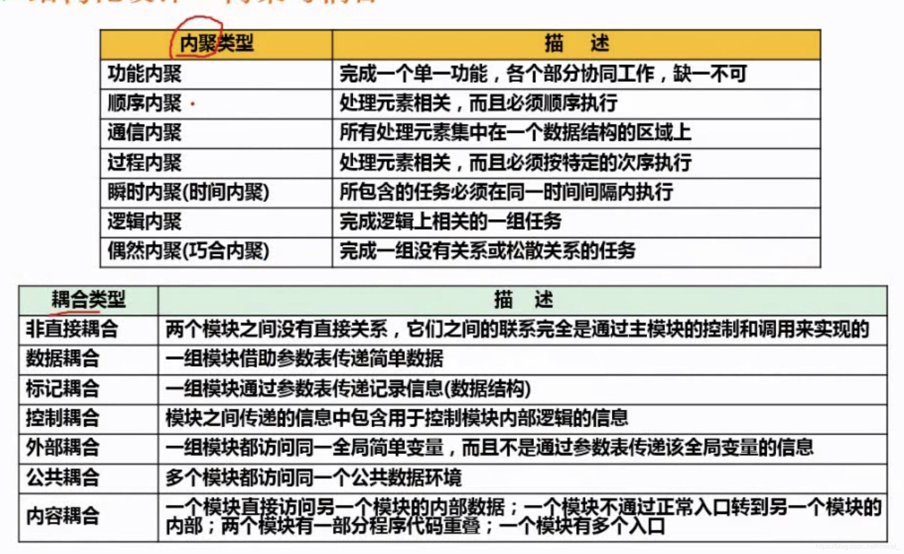

结构化方法中的软件设计问题，包括概要设计和详细设计，其设计原则是：自顶向下、逐步求精，信息隐蔽、模块独立(通过：高内聚、低耦合、复杂度)。

### 一、内聚与耦合

---

耦合是指模块与模块之间的关系，内容耦合的在耦合中程度最高。

### 二、结构化设计的原则

---

1. 保持模块的大小适中
2. 尽可能减少调用的深度
3. 多扇入，少扇出(上层模块调用自己称之为扇入，自己调用其他模块称之为扇出)
4. 单入口，单出口
5. 模块的作用域应该在模块之内
6. 功能应该是可预测的

### 三、结构化分析的结果

---

包括：一套分层的数据流图、一本数据词典、一组小说明(又称加工逻辑说明)、补充说明

### 四、概要设计

---

1. 设计软件系统总体结构。
2. 数据结构设计。
3. 数据库设计。
4. 编写概要设计文档：文档中应有概要设计说明书、数据库设计说明书、用户手册以及修订测试计划。

>注：需求分析确定软件要完成的功能及非功能要求，概要设计将需求转化为软件的模块划分，确定模块之间的调用关系；详细设计将模块进行细化，得到详细的数据结构和算法；编码根据详细设计进行代码的编写，得到可以运行的软件，并进行单元测试。