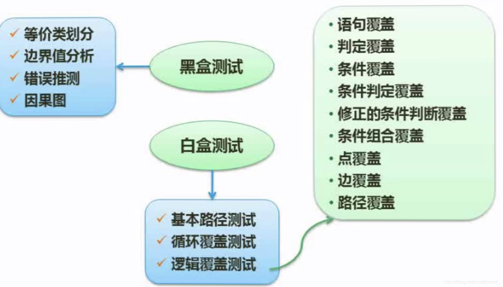
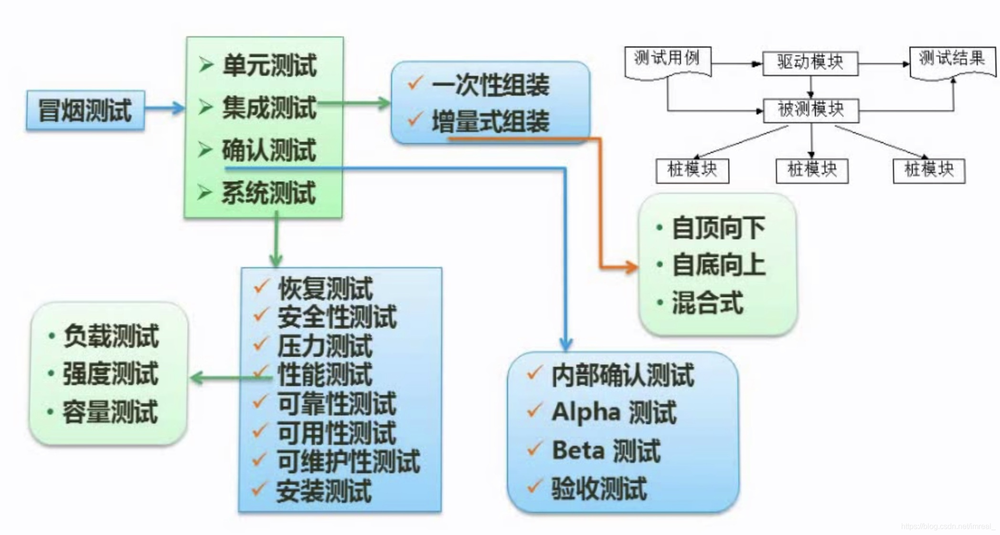
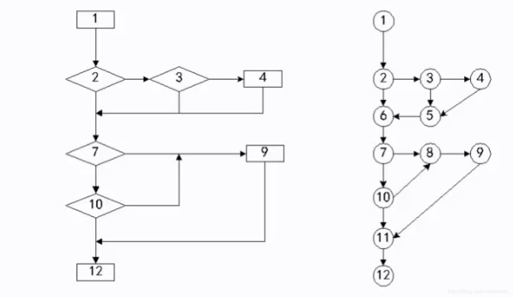

### 一、测试原型与类型

---

#### 1.1 原则

1. 尽早、不断的进行测试；
2. 程序员避免测试自己设计的程序；
3. 既要选择有效、合理的数据，也要选择无效、不合理的数据；
4. 修改后应进行回归测试；
5. 尚未发现的错误数量与该程序已发现错误数成正比。

#### 1.2 类型

软件测试类型分为动态测试(利用到了计算机的测试)和静态测试(纯手工的测试)

1. 动态测试包括：黑盒测试法(即看不到程序内部，只管输入的是什么，输出的是什么)、白盒测试法(从程序结构方面进行测试)、灰盒测试法。
2. 静态测试包括：桌前检查、代码走查、代码审查。

### 二、测试用例设计

---

黑盒测试：

等价类划分：即将所有数据类划分为许多个层次，每个数据层次挑选出一个最具代表性的数据进行测试即可。

边界值分析：即需要对等价类之间的边界值进行测试(一般是端点、略小于端点的值、略大于端点的值)。

错误推测：即自己推测错误的原因，该方法强调经验。

白盒测试(主要是逻辑覆盖测试)：

语句覆盖测试：即程序中的每一条语句都要进行测试(覆盖度最低的测试)，通过设计n组数据，使其覆盖掉所有的路径。

判定覆盖：即所有判断的真假分支都要测试一遍。

条件覆盖：即在判定时对判定的条件的真假性进行测试。

### 三、测试阶段

---

测试阶段可分为四个步骤：单元测试、集成测试、确认测试、系统测试；许多项目只需做到确认测试

单元测试：模块性的测试，即对于一个函数，是否达到了其目的，每个模块的功能是否完善

集成测试：即模块间的衔接测试，不衔接的模块就将其组装起来，组装方式有两种：一次性组装(一次全部组装)和增量式组装(组装两个模块时测试一下、组装到三个模块时再测试一下....)

确认测试：即对需求进行确认，测试该程序是否满足需求，测试包括：内部确认测试、Alpha测试(即项目在开发环境进行测试)、Beta测试(即用户在自己的本地计算机自行测试)、验收测试

系统测试：主要是压力、性能、可靠性的测试，而性能测试包括：负载测试、强度测试(即系统资源缺失的情况下系统能否正常运行)、容量测试，压力测试则是测试同时访问人数的极限。

### 四、软件测试抽象方法

---

1. 演绎法(靠蒙的推理)：从一般性的前提出发，通过推导即“演绎”，得出具体陈述或个别结论的过程。
2. 归纳法(有素材的推理)：以一系列经验事物或知识素材为依据，寻找出其服从的基本规律或共同规律，并假设同类事物中的其他事物也服从这些规律，从而将这些规律作为预测同类事物的其他事物的基本原理的一种认知方式。

### 五、McCabe复杂度（必考）

---

这类题通常将程序抽象为有向图，并要求计算环路复杂度。

计算有向图的环路复杂度公式为：`V(G)=m-n+2`；说明：其中V(G)是有向图G中的环路个数，m是G中的有向弧数(边数)，n是G中的节点数(点数)