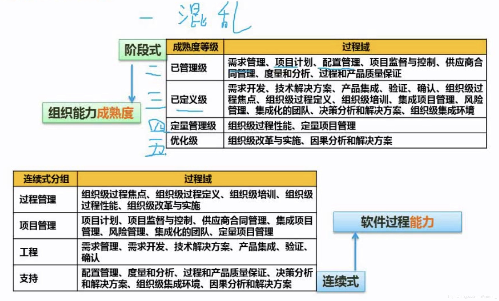

CMMI是一个软件开发团队的评级标准，该评级标准分为了阶段式和连续式两种分组。

### 一、阶段式

---

一级为混乱级，即未通过CMMI认证的团队都是该等级。

二级为项目级，即对某个具体的项目有相关开发经验和开发能力，但只限于模仿和套用。

三级为定义级，该进别下的团队有了自己的改进能力，能对他人的项目提出不同的看法。

### 二、连续式

---

CL0(未完成的)：过程域未执行或未得到CL1中定义的所有目标。

CL1(已执行的)：其共性目标是过程将可标识的输入工作产品转换成可标识的输出工作产品，以实现支持过程域的特别目标。

CL2(已管理的)：其共性目标是已管理的过程的制度化。根据组织级政策规定过程的运作将使用哪个过程，项目遵循已文档化的计划和过程描述，所有正在工作的人都有权使用足够的资源，所有工作任务和工作产品都将被监控、控制、和审评。

CL3(已定义级的)：其共性目标集中于已定义的过程的制度化。过程是按照组织的裁剪指南从组织的标准过程中裁剪得到的，还必须收集过程资产和过程的度量，并且用于将来对过程的改进。

CL4(定量管理的)：其共性目标集中于可定量管理的过程的制度化，使用测量和质量保证来控制和改进过程域，建立和使用关于质量和过程执行的质量目标作为管理准则。

CL5(优化的)：使用量化(统计学)手段改变和优化过程域，以满足客户的改变和持续改进计划中的过程域的功效。