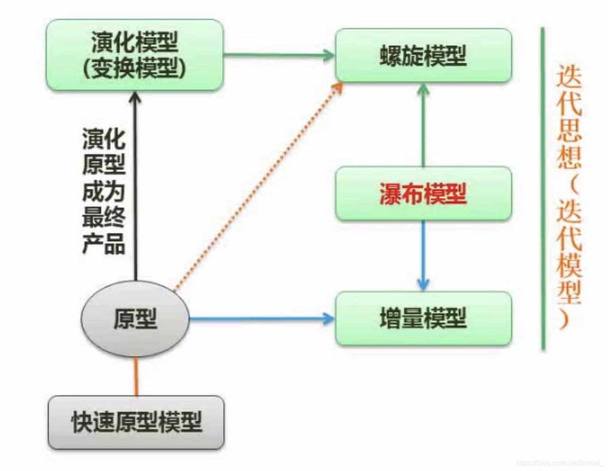

1. **原型**：和瀑布模型是互补关系，原型是为了解决用户需求分析难以把控即需求不明确而提出的，该模型即：先做出初步模型，然后让用户使用，以便于用户进一步明确自己的需求，是一种抛弃式的模型，因为需求一旦明确就会被抛弃。
2. **演化模型**：是一种渐进式的原型，即它采取原型的设计模式，但不会将其抛弃，而是在此基础上进一步进行设计。
3. **增量模型**：是一种递增式设计，将产品一步一步进行设计，每完成一步就交由客户审视，这样也可以使得下一步的设计更为明确。