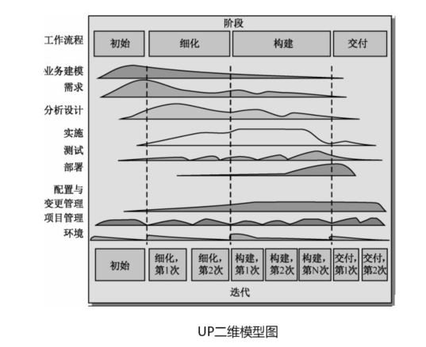

> 统一过程（Unified Process，UP）是由Rational公司开发的一种迭代的软件过程，是一个优秀的**软件开发模型**，它提供了完整的开发过程解决方案，可以有效地降低软件开发过程的风险，经过裁剪的UP可以适应各种规模的团队和系统。
>
> 如图所示。对于UP而言，时间主线就是横轴的阶段，随着时间的流逝，软件开发活动总要经过初始、细化、构建和交付这4个阶段方能完成。而纵轴的工作流程则描述了在不同的阶段需要进行的主要工作。
>
> 

统一过程模型定义了四个技术阶段及其制品，包括：

1. 起始阶段
   - 目标：明确项目范围、目标和关键约束条件。
   - 主要活动：定义项目愿景、确认问题领域、确定关键利益相关者、初步风险评估、指定高级项目计划。
   - 里程碑目标：确定项目是否值得进一步投资，指定初步计划和预算。
2. 精化阶段
   - 目标：详细定义项目的需求、架构和计划，以便更好地理解和管理项目的复杂性。
   - 主要活动：详细需求分析、系统架构设计、详细计划和预算、风险管理。
   - 里程碑目标：定义系统的关键特性、确定系统架构，制定详细计划，明确开发的方向。
3. 构建阶段
   - 目标：确保软件开发进展顺利，软件能够进入生产环境。
   - 主要活动：编码、测试、集成、性能优化、持续质量保证。
   - 里程碑目标：确保代码的质量、性能，准备部署到生产环境。
4. 移交阶段
   - 目标：将软件部署到生产环境并提供支持。
   - 主要活动：软件部署、用户培训、问题解决、性能监测、用户支持。
   - 里程碑目标：软件成功地部署到生产环境，用户接受培训并能够使用系统，项目进入维护阶段。

### 一、敏捷开发方法

---

该方法是一类方法，其特点是快捷，该类方法包括：自适应开发、水晶方法、特征驱动开发、SCRUM、极限编程；他们都遵循一些基本原则和价值观，该类方法适用于做小型项目。

1.极限编程(XP)特点：测试先行、结对编程、集体代码所有制、持续集成(可以按日甚至按小时为客户提供可运行的版本)、每周工作40个小时。

2.并列争球法特点：使用迭代的方法，其中把每三十天一次的迭代成为一个冲刺，并按需求的优先级来实现产品，多个自组织和自治小组递增实现产品，并通过简短的日常情况会议进行协调。

3.水晶法特点：该方法认为每一个不同的项目都需要一套不同的策略、约定和方法论。

4.敏捷开发方法的重要技术。

重构：重构是一种重新组织技术，重新审视需求和设计，重新明确的描述他们的需求和现有的需求，可以简化构件的设计而无需改变其功能或行为。