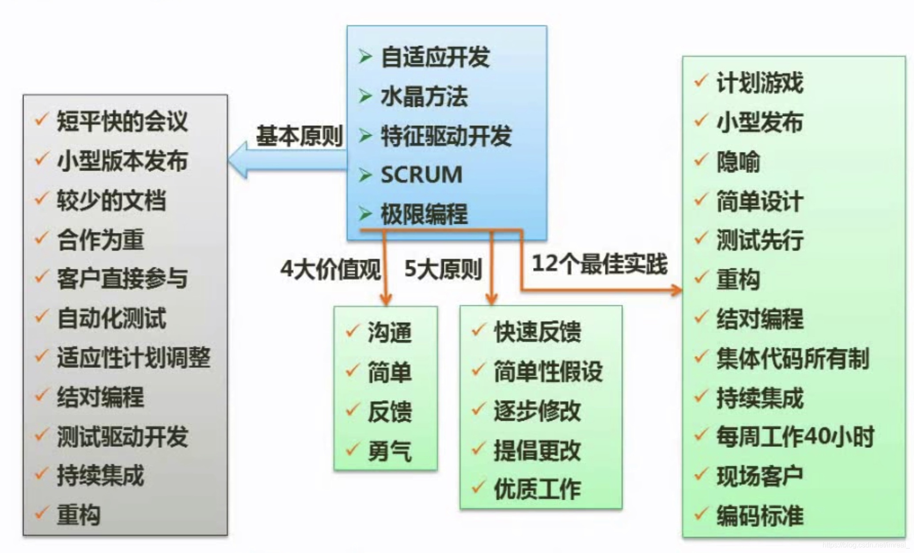

统一过程模型定义了四个技术阶段及其制品，包括：

1. 起始阶段：该阶段专注于项目的初创活动。
2. 精化阶段：精化阶段在理解了最初的领域范围之后进行需求分析和架构演进。
3. 构建阶段：该阶段关注系统的构建，产生实现模型。
4. 移交阶段：关注软件提交方面的问题，产生软件增量。

### 一、敏捷开发方法

---

该方法是一类方法，其特点是快捷，该类方法包括：自适应开发、水晶方法、特征驱动开发、SCRUM、极限编程；他们都遵循一些基本原则和价值观，该类方法适用于做小型项目。

1.极限编程(XP)特点：测试先行、结对编程、集体代码所有制、持续集成(可以按日甚至按小时为客户提供可运行的版本)、每周工作40个小时。

2.并列争球法特点：使用迭代的方法，其中把每三十天一次的迭代成为一个冲刺，并按需求的优先级来实现产品，多个自组织和自治小组递增实现产品，并通过简短的日常情况会议进行协调。

3.水晶法特点：该方法认为每一个不同的项目都需要一套不同的策略、约定和方法论。

4.敏捷开发方法的重要技术。

重构：重构是一种重新组织技术，重新审视需求和设计，重新明确的描述他们的需求和现有的需求，可以简化构件的设计而无需改变其功能或行为。