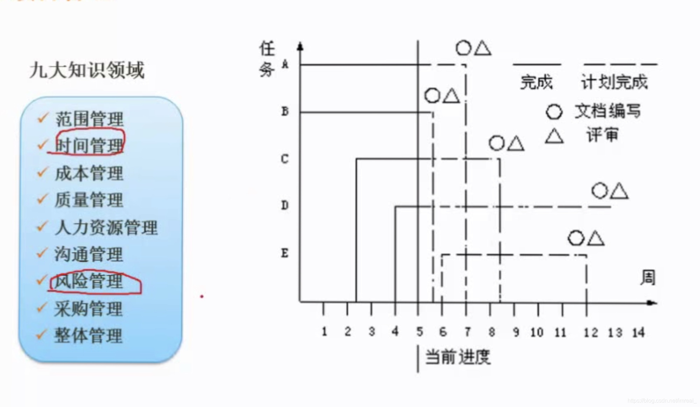
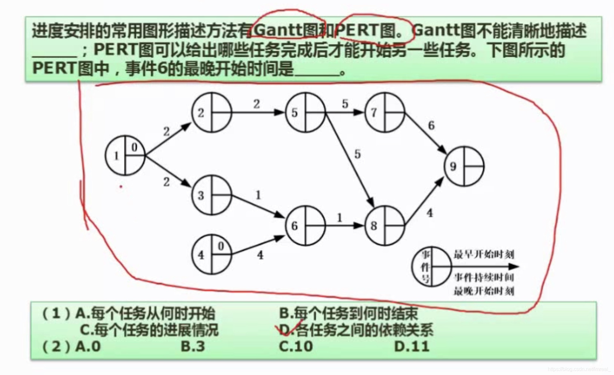

只需要掌握时间管理的概念及计算以及风险管理的概念；右图为Gantt图，其最为直观的特点是简洁明了，可以很清楚的看到计划的开展，缺点是不能看出计划间的逻辑关系，无法看出哪个任务先做，哪个任务后做。

### PERT图的计算相关问题

---

PERT图的缺点是不能清晰地描述各个任务之间的并行关系，每一个原型的左侧是事件执行的顺序号，右上角是最早时间，右下角是最晚时间；事件六的最晚开始时间的计算步骤：先从事件1逐步进行推进，如事件1到事件2最早需要时间加2，事件2到事件5则再需要加2(此时最早时间等于4),而事件1到事件6需要的最早执行时间为3，事件4到事件6的最早时间为4，因此取时间长的为事件6的执行时间(原因是事件六的执行需要事件3和4共同作用),以此类推，事件9所需最早时间为15，再由事件9逆推回来15-4-1=10即为事件6的最晚开始时间。

### 风险管理

---

1. 风险：指“损失或伤害的可能性”，风险可以分为项目风险和技术风险以及商业风险，特点是关心未来、关心变化、关心选择。
2. 风险曝光度：计算方法是：风险出现的概率乘以风险可能造成的损失；风险曝光度常用于风险的管控。

### 软件项目估算

---

常用的估算方法有三种：基于已经完成的类似项目进行估算、基于分解技术进行估算(分解技术包括问题分解和过程分解)、基于经验估算模型(IBM模型、COCOMO模型、Putnam模型)

COCOMO：该模型按其详细程度分为基本、中级、详细COCOMO模型。

- 基本：该模型是一个静态单变量模型，用于对整个软件系统进行估算。
- 中级：该模型时一个静态多变量模型，将软件系统模型分为了系统和部件两个层次，系统由部件构成。
- 详细：将软件系统模型分为系统、子系统和模块三个层次。

注：COCOMOII模型在模型层次结构中有三种不同的规模估算选择：对象点、功能点和代码行。