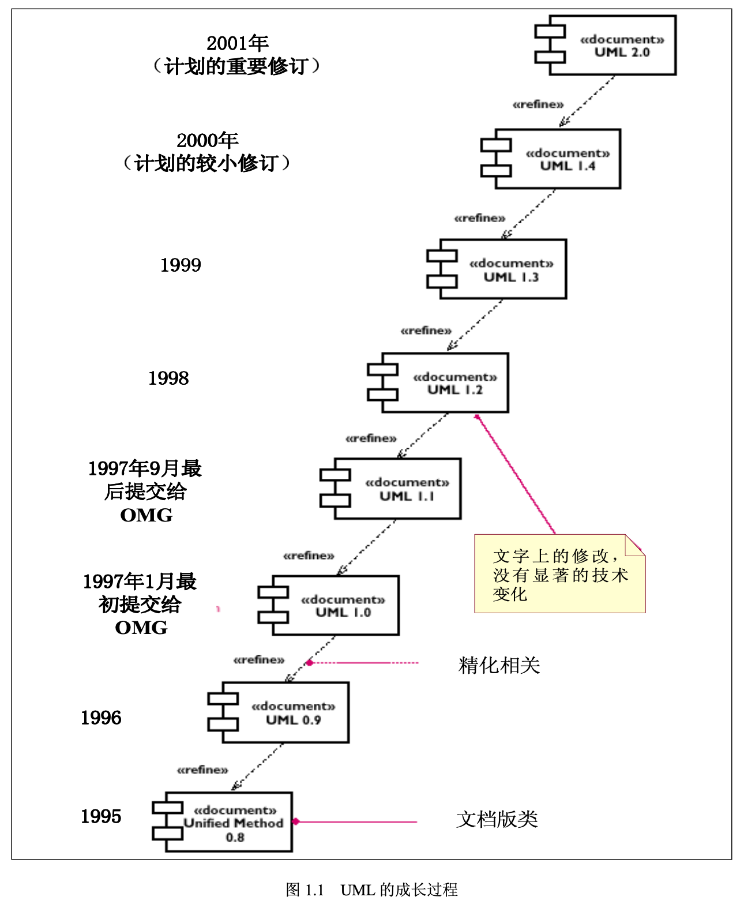

### 一、UML的产生和成长

---

统一建模语言（Unified Modeling Language）是一种建模语言，是第三代用来为面向对象开发系统的产品进行说明、可视化和编制文档的方法。它是有信息系统（IS，Information System）和面向对象领域的方法学家提出的。这种建模语言有OMG组织（Object Management Group）采纳作为业界标准。

### 二、什么是UML

---

UML是一种标准的图形化建模语言，它是面向对象分析与设计的一种标准表示。

目标：

1. 易于使用、表达能力强，进行可视化建模；
2. 与具体的实现无关，可应用于任何语言平台和工具平台；
3. 与具体的过程无关，可应用于任何软件开发的过程；
4. 简单可扩展，具有扩展和专有化机制，便于扩展，无需对核心概念进行修改；
5. 为面向对象的设计与开发中涌现出的高级概念（例如协作、框架、模式和组件）提供支持，强调在软件开发中，对架构、框架、模式和组件的重用；
6. 与最好的软件工程实践经验继承；
7. 可升级，具有广阔的适用性和可用性；
8. 有利于面对对象工具的市场成长。

#### 2.1 UML的架构

由**图**（UML语法）和**元模型**（UML语义）组成。

UML的语义定义在一个四层（或四个抽象级）建模概念框架中：

1. **元元模型（meta-metamodel）层**，组成UML的基本元素，包括面向对象和面向组件的概念。这一层的每个概念都是元元模型中“`事务`”概念的实例（通过版类化）；
2. **元模型（metamodel）层**，组成了UML最基本的元素“`事物（Thing）`”，代表要定义的所有事物；
3. **模型（model）层**，组成了UML的模型，这一层中的每个概念都是元模型层中概念的一个实例（通过版类化），这一层的模型通常叫做类模型（class model）或类型模型（type model）；
4. **用户模型（user model）层**，这层中的所有元素都是UML模型的例子。这一层中的每个概念都是模型层的一个实例（通过分类），也是元模型层的一个实例（通过版类化）。这一层的模型通常叫做对象模型（object model）或实例模型（instance model）。

#### 2.2 UML的模型、视图、图与系统架构建模

UML用来描述模型，它用模型来描述系统的结构或静态特征、以及行为或动态特征。它从不同的视角为系统的架构建模，形成系统的不同视图（view），包括：

- **用例视图（use case view）**，强调从用户的角度看到的或需要的系统功能，这种视图也叫做用户模型视图（user model view）或想定视图（scenario view）；
- **逻辑视图（logical view）**，展现系统的静态或结构组成及特征，也称为结构模型视图（structural model view）或静态视图（statis view）；
- **并发视图（concurrent view）**，体现了系统的动态或行为特征，也称为行为模型视图（behavioral model view）、过程视图（process view）协作视图（collaborative）、动态视图（dynamic view）；
- **组件视图（component view）**，体现了系统实现的结构和行为特征，也称为实现模型视图（implementation model view）和开发视图（development view）；
- **展开视图（deployment view）**，体现了系统实现环境的结构和行为特征，也称为环境模型视图（implementation model view）或物理视图（physical view）；

每一种UML的视图都是由一个或多个图组成的，一个图就是系统架构在某个侧面的表示，它与其它图是一致的，所有的图一起组成了系统的完整视图。UML提供了九种不同的图，可以分成两大类，一类是静态图，包括用例图、类图、对象图、组件图、配置图；另一类是动态图，包括序列图、协作图、状态图和活动图。也可以根据它们在不同架构视图的应用，把它们分成：

- 在用户模型视图：用例图（Use case diagram），描述系统的功能；
- 在结构模型视图：类图（Class diagram），描述系统的静态结构；对象图（Object diagram），描述系统在某个时刻的静态结构；
- 

