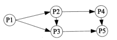
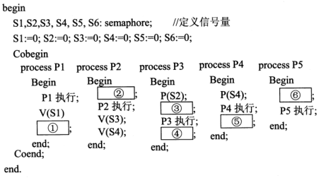
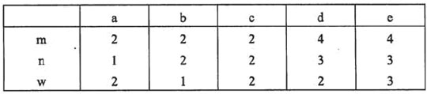
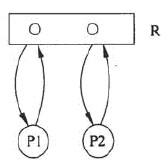
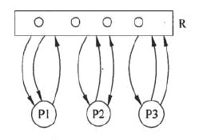
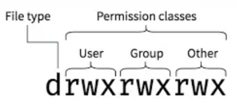

#### 其他

在Windows系统中，默认权限最低的用户组是（A  ）。

A.everyone

 B.administrators

 C.power users

 D.users

- `Everyone`（即所有的用户），计算机上的所有用户都属于这个组，它的**默认权限最低**。
- `Administrators`（即管理员组），默认情况下，Administrators中的用户对计算机/域有不受限制的完全访问权。分配给该组的默认权限允许对整个系统进行完全控制，该组**拥有最高的默认权限**。
- `power users`（即高级用户组），它可以执行除了为 Administrators 组保留的任务外的其他任何操作系统任务，它的默认权限仅次于Administrators。
- `Users`（即普通用户组），这个组的用户无法进行有意或无意的改动。因此，用户可以运行经过验证的应用程序，但不可以运行大多数旧版应用程序。Users 组是最安全的组，因为分配给该组的默认权限不允许成员修改操作系统的设置或用户资料。


#### 线程的概念

- 线程共享的内容包括：进程代码段、进程的公有数据（利用这些共享的数据，线程很容易实现相互之间的通讯）、进程打开的文件描述符、信号的处理器、进程的当前目录、进程用户ID与进程组ID 。
- 线程独有的内容包括：线程ID、寄存器组的值、线程的堆栈（比如，栈指针）、错误返回码、线程的信号屏蔽码。


#### 前趋图与PV操作

进程P1、P2、P3、P4和P5的前趋图如下所示：



若用PV操作控制这5个进程的同步与互斥的程序如下，那么程序中的空①和空②处应分别为（ D ）；空③和空④处应分别为（ B ）；空⑤和空⑥处应分别为（ C ）。



A.V（S1）和P（S2）

B.P（S1）和V（S2）

C.V（S1）和V（S2）

D.V（S2）和P（S1）

A.V（S3）和V（S5）

B.P（S3）和V（S5）

C.V（S3）和P（S5）

D.P（S3）和P（S5）

A.P（S6）和P（S5）V（S6）

B.V（S5）和V（S5）V（S6）

C.V（S6）和P（S5）P（S6）

D.P（S6）和P（S5）P（S6）

分析：

1. **先标信号S**：按照从左到右、从上到下，如果两条线的起点相同，就比较终点；终点在上或在前的，就排在前面。
2. **依次分析每个进程**，原则：
   - 初始进程，只有V，没有P
   - 终止进程，只有P，没有V
   - 进程内，从P到V
   - 进程间，从V到P
   - 一个进程有几个输入，就有几个P；有几个输出，就有几个V

>前趋图（Precedence Graph）
>
>- 是一个由结点和有向边构成的**有向无循环图**（DAG directed acyclic graph），用于**描述进程之间的执行顺序**，及用于**表现事务之间先后顺序的制约关系**。
>- 结点：可以表示一个语句、一个程序段或是一个进程。
>- 有向边：结点间的有向边表示两个结点之间存在的前趋关系。
>
>前趋图强调了程序**在整体上的顺序执行**。
>
>程序顺序执行
>
>- 程序顺序执行
>
>  前一个程序执行完，才能运行后一个程序
>
>- 程序顺序执行的特征：
>
>  1. 顺序性。
>  2. 封闭性：程序运行时**独占全机资源**。
>  3. 可再现性：只要程序运行时和初始条件相同，当重复运行时，都可获得相同的结果。
>
>该特性为程序员检测和校正程序的错误带来了极大的方便。
>
>程序并发执行
>
>虽然程序顺序执行可以给程序员带来方便，但资源利用率却很低。因此引入多道程序技术，使程序并发执行。
>
>- 程序并发执行
>
> 并非所有的程序都可以并发执行，只有没有前驱关系的程序才能并发执行。
>
>- 程序并发执行的特性：
>
> 1. 间断性：由于多个程序对资源的要求**产生的制约性**，而导致的**某一个程序在运行时等待资源**的情况。
> 2. 失去封闭性：当系统中存在多个可并发的程序时，资源将为它们共享。
> 3. 不可再现性：即使程序执行的环境和初始环境相同，得到的结果各不相同。
>
>程序的**顺序执行**和**并发执行**的特性是**完全相对**的，故而为了**解决并发执行存在的一些问题**，操作系统中引入了线程这个概念。

>PV操作
>
>P操作：相当于请求资源、输入
>
>V操作：相当于释放资源、输出
>
>- 在单一进程内部，由 P操作 --> V操作
>
>  1. P：请求到资源（相当于程序输入）
>  2. 执行...
>  3. V：释放资源（相当于程序的输出）
>
>- 在两个进程之间，由 V操作 --> P操作
>
>  1. V：一个进程释放了资源
>  2. P：另一个进程可以申请该资源
>
>- 起始进程：只有V操作（输出）
>
>  相当于程序只出不进
>
>- 终止进程：只有P操作（输入）
>
>  相当于程序只进不出
>
>- 前趋图中信号排序规则
>
>  


#### 位示图

某文件管理系统采用位示图（bitmap）记录磁盘的使用情况。如果系统的字长为32位，磁盘物理块的大小为4MB，物理块依次编号为：0、1、2、…,位示图字依次编号为：0、1、2、…,那么16385号物理块的使用情况在位示图中的第（ C ）个字中描述；如果磁盘的容量为1000GB，那么位示图需要（ D ）个字来表示。

A.128

B.256

C.513

D.1024

A.1200

B.3200

C.6400

D.8000

16385个物理块需要16385个bit来记录，一个字长32bit，所以需要16385/32

1000G等于`1000*1024M`，1024000个物理块，，一个字32bit，需要1024000/32=8000个字来表示。

>**位示图**是利用二进制的一位来表示磁盘中的一个盘块的使用情况。当其值为“0”时，表示对应的盘块空闲；为“1”时，表示已经分配。有的系统把"0"作为盘块已分配的标记，把“1”作为空闲标志。(它们的本质上是相同的，都是**用一位的两种状态标志空闲和已分配两种情况**。)磁盘上的所有盘块都有一个二进制位与之对应，这样，由所有盘块所对应的位构成一个集合，称为位示图。


#### 设备管理

在操作系统设备管理中，通常临界资源不能采用（C）分配算法。

 A.静态优先级

B.动态优先级

C.时间片轮转

D.先来先服务

>**临界资源**
>
>在操作系统的设备管理中，**临界资源是一种被多个进程或线程共享的资源，但一次只能由一个进程或线程访问的资源**。在这种情况下，为了避免竞争条件和死锁等问题，通常会采用锁和同步机制来确保临界资源的正确访问。
>
>以下是一些常见的临界资源分配算法和同步机制：
>
>1. **互斥锁（Mutex）：** 互斥锁是一种基本的同步机制，它可以确保一次只有一个线程可以访问临界资源。当一个线程访问临界资源时，它会尝试获取互斥锁，如果锁已经被其他线程持有，那么该线程将被阻塞直到锁被释放。互斥锁通常用于确保多线程环境下对临界资源的互斥访问。
>2. **信号量（Semaphore）：** 信号量是一种更一般化的同步机制，它可以用来控制对多个资源的访问。信号量维护一个计数器，当资源被占用时，计数器减少，当资源被释放时，计数器增加。通过信号量可以实现临界资源的互斥访问，也可以用于限制某些资源的数量。
>3. **读写锁（Read-Write Lock）：** 读写锁允许多个线程同时读取共享资源，但只允许一个线程写入资源。这在某些情况下可以提高效率，因为读操作通常不会改变资源状态，而写操作会。
>4. **条件变量（Condition Variable）：** 条件变量用于在多线程环境下等待某个特定条件的发生。它通常与互斥锁结合使用，以实现复杂的同步需求，例如等待某个条件满足后再访问临界资源。
>5. **自旋锁（Spin Lock）：** 自旋锁是一种特殊的锁，它不会阻塞线程，而是在资源被释放之前不断尝试获取锁。自旋锁适用于临界区非常小且短时间内会释放锁的情况。
>
>选择合适的临界资源分配算法和同步机制取决于具体的应用场景和需求。不同的机制适用于不同的并发情况，因此需要仔细考虑来确保多线程环境下的正确性和性能。


#### 死锁资源数计算

设系统中有 R 类资源 m 个，现有 n 个进程互斥使用。若每个进程对 R 资源的最大需求为w，那么当m、n、w取下表的值时，对于下表中的a～e五种情况，（  ）两种情况可能会发生死锁。对于这两种情况，若将（  ），则不会发生死锁。



A.a和b

B.b和c

C.c和d

D.c和e

A.n加1 或w加1

B.m加1 或w减1

C.m减1 或w加1

D.m减1 或w减1

一般情况下，若系统中有m个单位的存储器资源，它被n个进程使用，当每个进程都要求w个单位的存储器资源，当m<nw时，可能会引起死锁。

- 情况a：m=2，n= 1，w=2，系统中有2个资源，1个进程使用，该进程最多要求2个资源，所以不会发生死锁。

- 情况b：m=2，n=2，w=1，系统中有2个资源，2个进程使用，每个进程最多要求1个资源，所以不会发生死锁。

- 情况c：m=2，n=2，w=2，系统中有2个资源，2个进程使用，每个进程最多要求2个资源，此时，采用的分配策略是轮流地为每个进程分配，则第一轮系统先为每个进程分配1个，此时，系统中已无可供分配的资源，使得各个进程都处于等待状态导致系统发生死锁，这时进程资源图如下图所示。

  

- 情况d：m=4，n=3，w=2，系统中有4个资源，3个进程使用，每个进程最多要求2个资源，此时，采用的分配策略是轮流地为每个进程分配，则第一轮系统先为每个进程分配1个资源，此时，系统中还剩1个资源，可以使其中的一个进程得到所需资源运行完毕，所以不会发生死锁。

- 情况e：m=4，n=3，w=3，系统中有4个资源，3个进程使用，每个进程最多要求3个资源，此时，采用的分配策略是轮流地为每个进程分配，则第一轮系统先为每个进程分配1个，第二轮系统先为一个进程分配1个，此时，系统中已无可供分配的资源，使得各个进程都处于等待状态导致系统发生列锁，这时进程资源图如下图所示。

  

因此，情况c和e可能会发生死锁。

对于c情况，若将m加1，则情况c：m=3，n=2，w=2，系统中有3个资源，2个进程使用，每个进程最多要求2个资源，系统先为每个进程分配1个，此时，系统中还剩1个可供分配的资源，使得其中的一个进程能得到所需资源执行完，并释放所有资源使另一个进程运行完；若将w减1，则情况c：m=2，n=2，w=1，系统中有2个资源，2个进程使用，每个进程最多要求1个资源，系统为每个进程分配1个，此时进程都能够运行完成，并释放所有资源，不会发生死锁。

对于情况e并没有正确的选项符合要求，只有B选项最贴近正确答案。 因此，当m加1或w减1时，c和e不会发生死锁。


#### 文件管理可靠性

若系统正在将（ B ）文件修改的结果写回磁盘时系统发生崩溃，则对系统的影响相对较大。

A.空闲块

B.目录

C.用户数据

D.用户程序

影响文件系统可靠性因素之一是文件系统的一致性问题。很多文件系统是先读取磁盘块到主存，在主存进行修改，修改完毕再写回磁盘。例如读取某磁盘块，修改后再将信息写回磁盘前系统崩溃，则文件系统就可能会出现不一致性状态。如果这些未被写回的磁盘块是索引节点块、目录块或空闲块，特别是系统目录文件，那么对系统的影响相对较大，且后果也是不堪设想的。通常解决方案是采用文件系统的一致性检查，一致性检查包括块的一致性检查和文件的一致性检查。

目录是文件系统的一部分，它包含了文件的元数据和组织结构。如果目录在写回磁盘的过程中发生损坏，可能会**导致文件索引、位置信息以及文件之间的关系丢失，进而影响到整个文件系统的结构和文件的可访问性**。


#### 文件权限

在 Linux 中，文件权限用一串字符来表示，共有 10 个字符，可以分为四个部分：文件类型、用户权限、组权限和其他权限。



每个字符的含义如下：

- 第一个字符表示文件类型。常见的文件类型包括 `-`（普通文件）和 `d`（目录）。
- 后面的三个字符表示用户权限，即文件所有者对文件的权限。
- 接下来的三个字符表示组权限，即文件所属组的用户对文件的权限。
- 最后的三个字符表示其他权限，即其他用户对文件的权限。

每个权限字符可以是以下四个字符之一：

- `r`（读取）：允许读取文件内容、查看目录内容。
- `w`（写入）：允许修改文件内容、在该目录中创建、删除文件。
- `x`（执行）：对于文件，允许执行文件；对于目录，允许进入该目录。
- `-`（无权限）：表示没有相应的权限。

>文件权限可以分为三个部分：用户权限、组权限和其他权限。
>
>用户权限：指的是文件的所有者对文件的权限。文件的所有者可以是系统中的任何用户。
>
>组权限：指的是文件所属组中的用户对文件的权限。每个文件都会关联一个所属组。
>
>其他权限：指的是不属于文件所有者和所属组的用户对文件的权限。

>**设置文件权限**
>
>```bash
>chmod [选项] 权限 文件
>```
>
>**权限符号表示法**
>
>使用符号来指定权限设置。以下是常用的权限符号表示法：
>
>- `+`：添加权限。
>- `-`：移除权限。
>- `=`：设置权限。
>
>例如，要为文件所有者添加写入权限，可以运行以下命令：
>
>```bash
>chmod u+w 文件名
>```
>
>可以使用以下符号来表示不同的权限：
>
>- `u`：文件所有者。
>- `g`：文件所属组。
>- `o`：其他用户。
>- `a`：所有用户（包括所有者、所属组和其他用户）。
>
>例如，要为文件所有者和文件所属组添加读取和写入权限，可以运行以下命令：
>
>```bash
>chmod ug+rw 文件名
>```
>
>**权限数字表示法**
>
>权限数字表示法使用数字来表示权限设置。每个权限字符都被赋予一个特定的数字值：
>
>- `r`：4
>- `w`：2
>- `x`：1
>- `-`：0
>
>要设置文件权限，可以将这些数字相加。例如，要为文件所有者设置读取和写入权限，可以运行以下命令：
>
>```bash
>chmod 6 文件名
>```
>
>这将为文件所有者设置读取和写入权限（4+2=6）。

>**查看文件权限**
>
>- `ls` 命令可以列出文件和目录的详细信息，包括文件权限。要查看文件权限
>- `stat 文件名` 命令可以显示文件的详细信息，包括文件权限。要查看文件权限。

>**更改文件所有者和所属组**
>
>- `chown` 命令用于更改文件的所有者。要更改文件的所有者，可以运行以下命令：
>
>  ```bash
>  chown 新所有者 文件名
>  ```
>
>  其中，新所有者 可以是用户或用户组。
>
>- `chgrp` 命令用于更改文件的所属组。要更改文件的所属组，可以运行以下命令：
>
>  ```bash
>  chgrp 新所属组 文件名
>  ```

>**粘着位（Sticky Bit）**
>
>粘着位是一种特殊权限，适用于目录。当目录的粘着位被设置时，只有目录的所有者和文件的所有者才能删除或重命名目录中的文件。
>
>```bash
>chmod +t 目录
>```
>
>设置用户或组的默认权限
>
>在 Linux 中，可以为用户或组设置默认权限，以确保新创建的文件或目录具有特定的权限。
>
>要为用户设置默认权限，可以编辑用户的配置文件 `.bashrc` 或 `.bash_profile`，并添加以下行：
>
>```bash
>umask 权限掩码
>```
>
>其中，权限掩码是一个三位八进制数，用于设置默认权限。例如，要为用户设置默认权限为 644，可以使用权限掩码 `022`，将以下行添加到用户的配置文件中
>
>同样地，要为组设置默认权限，可以编辑 `/etc/profile` 文件，并添加以下行：
>
>```bash
>umask 权限掩码
>```
>
>在这种情况下，所有属于该组的用户将具有相同的默认权限。


#### 磁盘管理

假设磁盘臂位于15号柱面上，进程的请求序列如下表所示，如果采用最短移臂调度算法，那么系统的响应序列应为（ B ）。


 A.①②③④⑤⑥

B.⑤①②④③⑥

C.②③④⑤①⑥

D.④②③⑤①⑥

最短移臂调度算法，即优先响应距离较近磁道的申请。

1. 当前磁头位于15号柱面（柱面号即磁道编号），请求序列分别位于12号柱面（①⑤）、19号柱面（②④）、23号柱面（③）、28号柱面（⑥）；
2. 距离15号柱面最近的应该是12号柱面（①⑤），优先响应（①⑤），次序不限；
3. 此时磁头位于12号柱面，距离最近的应该是19号柱面（②④），次序不限；
4. 此时磁头位于19号柱面，距离最近的应该是23号柱面（③）；
5. 此时磁头位于23号柱面，距离最近的应该是28号柱面（⑥）。


