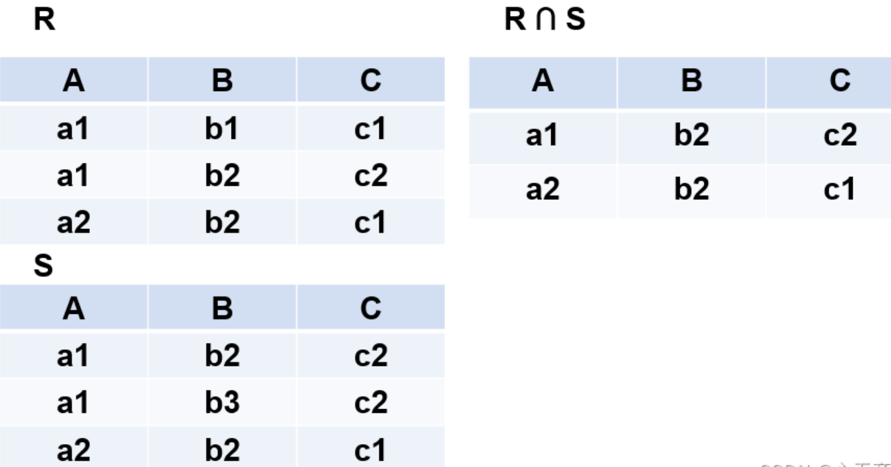

#### 关系代数

若对关系R（A，B，C，D）进行π1,3（R）运算，则该关系运算与（ C ）等价，表示（ D ）。

A.πA=1，C=3（R）

B.πA=1∧C=3（R）

C.πA，C（R）

D.πA=1∨C=3（R）

A.属性A和C的值分别等于1和3的元组为结果集

B.属性A和C的值分别等于1和3的两列为结果集

C.对R关系进行A=1、C=3的投影运算

D.对R关系进行属性A和C的投影运算

投影运算是从一个关系里面抽取指明的属性（列）组成一个新的关系，这种运算是一种对列进行操作的运算。`π1,3（R）`的含义就是从关系R中，选取第1列（A）和第3列（C）组成一个新的关系模式。

>关系代数概述
>
>关系代数是一种抽象的查询语言，是关系数据操纵语言的一种传统表达方式，它是利用对关系的运算来表达查询的。
>
>关系代数的运算对象是关系，运算结果亦为关系。

>在关系代数运算中，有5种基本运算，它们是并（U）、差（—）、投影、选择、笛卡尔积（X），其它运算即交、连接和除，均可通过5种基本的运算来表达 。
>
>运算符：
>
>- 集合运算符
>  - 将关系看成**元组**的集合
>  - 从关系的“水平”方向即行的角度来进行运算
>- 专门的关系运算符
>  - 不仅涉及**行**而且涉及**列**
>- 算术比较符
>  - 辅助专门的关系运算符进行操作
>- 逻辑运算符
>  - 辅助专门的关系运算符进行操作
>
>

>传统的集合运算
>
>设关系R和关系S是相容的，t 代表元组变量，现将各种运算分别介绍如下：
>
>1. 并（Union）
>
>- 关系R 与关系S 的并记作：R ∪ S = { t ∣ t ∈ R ∨ t ∈ S }
>- 结果关系是由属于R 或属于S 的元组组成，且结果仍为n 目关系，但结果关系要消除重复元组。
>
>举例：
>
>R 和S 
>
>- 具有相同的目n nn（即两个关系都有n个属性）
>- 相应的属性取自同一个域
>
>R ∪ S 
>
>- 仍为n nn目关系，由属于R 或属于S 的元组组成
>  - R ∪ S = { t ∣ t ∈ R ∨ t ∈ S }
>
>具体如下图所示：
>
>
>
>2. 交（ Intersection）
>
>- 关系R 与关系S 的交记作：R ∩ S = { t ∣ t ∈ R ∧ t ∈ S }
>- 结果关系由既属于R 又属于S 的元组组成，且仍为n 目关系。
>
>举例：
>
>R 和S 
>
>- 具有相同的目n 
>- 相应的属性取自同一个域
>
>R ∩ S 
>
>- 仍为n 目关系，由既属于R 又属于S 的元组组成
>  - R ∩ S = { t ∣ t ∈ R ∧ t ∈ S }
>
>具体如下图所示：
>
>
>
>3. 差（Difference）
>
>- 关系R与关系S的差记作：R − S = { t ∣ t ∈ R ∧ t ∉ S } 
>- R 和S 的差，结果关系由属于R 而不属于S 的所有元组组成，且仍为n 目关系，即在关系R 中减去R 和S 的相同元组。
>
>举例：
>
>R 和S 
>
>- 具有相同的目n 
>- 相应的属性取自同一个域
>
>R − S 
>
>- 仍为n 目关系，由属于R 而不属于S 的所有元组组成
>- R − S = { t ∣ t ∈ R ∧ t ∉ S }
>
>
>
>4. 广义笛卡尔积（Extended Cartesian Product）
>
>- 两个分别为 n 目和m 目的关系，R 和S 的广义笛卡尔积是一个( n + m ) (n+m)(n+m)列的元组的集合。
>- 元组的前n 列是关系R 的一个元组，后m 列是关系S 的一个元组。若R 有k~1~ 个元组，S 有k~2~ 个元组，则关系R 和关系S 的广义笛卡尔积有k~1~ × k~2~ 个元组。
>- 记作：R × S = { ( a~1~ , a~2~ , … a~m~ , b~1~ , b~2~ , … b~n~ ) ∣ ( a~1~ , a~2~ , … a~m~ ) ∈ R ∧ ( b~1~ , b~2~ , … b~n~ ) ∈ S } 。
>
>严格地讲应该是广义的笛卡尔积
>- R : n 目关系，k~1~ 个元组
>- S : m 目关系，k~2~ 个元组
>
>R x S
>
>- 列：m+n列元组的集合
>  - 元组的前n 列是关系R 的一个元组
>  - 后m 列是关系S 的一个元组
>- 行：k~1~ × k~2~ 个元组
>
>
>
>具体如下图所示：
>
>

> 专门的关系运算
>
> 
>
> 举例如下：
>
> 
>
> 上面抽象的例子可能并不是特别容易理解，那么我们就拿生活中的实际例子进行解释：
>
> 学生-课程-选修关系：
> 学生关系Student、课程关系Course和选修关系SC
>
> 
>
> 在上面的关系表中，我们可以把SC表看作一个关系R，它的属性组为学号，课程号以及成绩，即R ( S n o , C n o , G r a d e ) 。这时我们将SC表与上面那个例子对比可以看出，Sno为`200215121`的学号在关系R（SC表）中的象集为Sno~200215121~ = { 1 ， 2 ， 3 } ，以此类推，这样就比较容易理解一点。
>
> **选择运算**
>
> - 选择又称为限制
> - 选择运算符的含义
>   - 关系R上的选择操作是根据某些条件对关系R做水平分割，从行的角度选择符合条件的元组。
> - 在关系R中选择满足给定条件的诸元组
>   - 记作：σ F （ R ） = { t ∣ t ∈ R ∧ F ( t ) = ‘真’ }
> - F：选择条件，是一个逻辑表达式，取逻辑值“真”或“假”。
> - 选择运算是从关系R中选取使逻辑表达式F为真的元组，是从行的角度进行的运算
>
> 
>
> F：选择条件，是一个逻辑表达式
>
> - 基本形式为：X~1~θY~1~ 
> - θ ：比较运算符（＞， ≥ ，＜， ≤ ，＝或 < > ） 
> - X~1~ ，Y~1~ ：属性名、常量、简单函数.
> - 属性名也可以用它的序号来代替；
>
> 以最上面的学生-课程-选修关系表举例说明更好理解：
>
> [例1] 查询信息系（IS系）全体学生
> σ~S d e p t~ = ′ I S ′ ( S t u d e n t ) 或 σ~5~ = ′ I S ′ ( S t u d e n t ) 
>
> 结果：
>
> 
>
> **投影（Projection）**
> 投影运算符的含义：
>
> - 从R中选择出若干属性列组成新的关系
>   - π~A~ ( R ) = t [ A ] ∣ t ∈ R 
>   - A：R中的属性列
>
> 投影操作主要是从列的角度进行运算：
>
> 
>
> 但投影之后不仅取消了原关系中的某些列，而且还可能取消某些元组（避免重复行）
> 举例说明一下：
> [例3] 查询学生的姓名和所在系
> 即求Student关系上学生姓名和所在系两个属性上的投影
> π~Sname~ ，~Sdept~ (Student) 或 π~2，5~ (Student)
> 结果：
>
> 
>
> [例4] 查询学生关系Student中都有哪些系
>
> π~Sdept~ (Student) 
>
> 结果：
>
> 
>
> 由此可见，使用投影操作可以将关系表中的列单独拿出来组成新的关系表，这样方便我们可以更加清楚的查看自己想要的信息。
>
> **连接（Join）**
>
> 连接也称为θ θθ连接
>
> 连接运算的含义：
>
> 从两个关系的笛卡尔积中选取属性间满足一定条件的元组
>
> 
>
> 连接运算从R 和 S R和SR和S的广义笛卡尔积R × S R×SR×S中选取（R RR关系）在A AA属性组上的值与（S SS关系）在B BB属性组上值满足比较关系θ θθ的元组
>
> 举例说明一下：
> [例5]关系R和关系S 如下所示：
>
> 
>
> 
>
> **等值连接（equijoin）**
>
> - θ为“＝”的连接运算称为等值连接
> - 从关系R与S的广义笛卡尔积中选取A、B属性值相等的
>   那些元组，即等值连接为：
>
> 
>
> 举例说明：
>
> 
>
> 
>
> **自然连接（Natural join）**
>
> - 自然连接是一种特殊的等值连接
>   - 两个关系中进行比较的分量必须是相同的属性组
>   - 在结果中把重复的属性列去掉
> - 自然连接的含义
>   - R和S具有相同的属性组B
>
> 
>
> 
>
> 一般的连接操作是从行的角度进行运算。
>
> 
>
> 自然连接还需要取消重复列，所以是同时从行和列的角度进行运算。
>
> **除（Division）**
> 给定关系R ( X ， Y ) ，其中X ， Y ， Z 为属性组。R 中的Y 与S 中的Y 可以有不同的属性名，但必须出自相同的域集。R 与S 的除运算得到一个新的关系P ( X ) ，P 是R 中满足下列条件的元组在 X 属性列上的投影：
>
> 元组在X 上分量值x 的象集Y~x~ 包含S 在Y 上投影的集合，记作：
>
> 
>
> 关于象集的概念我们在前面已经提到了，在此直接举例子说明除：
>
> [例6]设关系R 、 S R、SR、S分别为下图的(a)和(b)，R ÷ S R÷SR÷S的结果为图
>
> 
>
> 通过上面的结果我们可以发现，关系R 中的B 、 C 属性组，和关系S 中的B 、 C 属性组的域都是相同的，R 与 S 的除运算得到了一个新的关系，我们将它当做P(A) ，P 是R 中满足上述条件的元组在A 属性列中的投影。
>
> 分析：
> 设关系R，S,分别为例6中的(a)和(b)，R ÷ S 的结果为图,关系R 中A 可以取四个值{ a 1 ， a 2 ， a 3 ， a 4 }, 其中：
>
> - a 1 的象集为{ （ b 1 ， c 2 ） , （ b 2 ， c 1 ），（ b 2 ， c 3 ） } 
> - a 2 的象集为{ （ b 3 ， c 7 ） , （ b 2 ， C 3 ） } 
> - a 3 的象集为{ ( b 4 ， c 6 ) } 
> - a 4 的象集为{ （ b 6 ， c 6 ） } 
>
> S 在（ B ， C ） 上的投影为{ （ b 1 ， c 2 ），（ b 2 ， c 1 ） , （ b 2 ， c 3 ） } 
> 显然只有a 1 的象集包含了S 在( B , C ) 属性组上的投影，所以R ÷ S = { a 1 }。
> 除操作是同时从行和列角度进行运算
>
> 

#### 事务处理基础知识

若事务T1对数据A已加排它锁，那么其它事务对数据A（ D ）。

A.加共享锁成功，加排它锁失败

B.加排它锁成功，加共享锁失败

C.加共享锁、加排它锁都成功

D.加共享锁、加排它锁都失败

并发事务如果对数据读写时不加以控制，会破坏事务的隔离性和一致性。控制的手段就是加锁，在事务执行时限制其他事务对数据的读取。在并发控制中引入两种锁：排它锁< Exclusive Locks， X锁）和共享锁（Share Locks ， S锁）。

- 排它锁又称为写锁，用于对数据进行写操作时进行锁定。如果事务T对数据A加上X锁后，就只允许事务T对数据A进行读取和修改，其他事务对数据A不能再加任何锁，从而也不能读取和修改数据A，直到事务T释放A上的锁。
- 共享锁又称为读锁，用于对数据进行读操作时进行锁定。如果事务T对数据A加上了S锁后，事务T就只能读数据A但不可以修改。其他事务可以再对数据A加S锁来读取，只要数据A上有S锁，任何事务都只能再对其加S锁读取而不能加X锁修改。

#### 模式分解

设关系模式R（U，F），其中：U= {A，B，C，D，E } ，F={A→B，DE→B，CB→E，E→A，B→D}。（ D ）为关系模式R的候选关键字。分解（ D ）是无损连接，并保持函数依赖的。

A.AB

B.DE

C.DB

D.CE

A.ρ={ R1（AC），R2（ED），R3（B）}

B.ρ={ R1（AC），R2（E），R3（DB）}

C.ρ={ R1（AC），R2（ED），R3（AB）}

D.ρ={ R1（ABC），R2（ED），R3（ACE）}

1. 根据题目函数依赖集F可知，C是没有入度的，即没有属性可以推导出C，所以C一定是R 的候选关键字之一，只有选项D出现了C，无疑选D。然后因为CE可以推导出任一属性，所以CE就是候选关键字。

2. 使用表格法还原：
   选项D表格法如下所示：

   

   ABCDE为U的属性，分解后的R1、R2、R3中如果有相应的属性在，那么就填上aj ，j为列，如果不存在，那么就填上bi,j，i为行，j为列，如果三行中一行或多行通过函数依赖推导，能够全为ai，那么就说明分解后的关系模式是无损连接
   因为A→B，R1和R3的第一列相等，所以b3,2也为a2，同理E→A、A→B，所以b2,1也为a1，b2,2也为a2。

   

   因为B→D，所以b1,4和b3,4都为a4，又因为A→B、CB→E，所以AC→E，则b1,5为a5。

   

   很显然第一行和第三行都全为ai，所以D是无损连接的。

>判断是否无损连接
>
>- 对于一个分解，有k个子集，n个属性，建立一张k行n列的初始表，对于每一行也就是分解的每个子集，把该分解子集出现的属性对应的列写上𝑎~𝑗~，否则写上𝑏~𝑖𝑗~
>- 对于每一个依赖，找到左部属性对应的列，根据行的值分组，对于行的值相同的这些行，查看对应右部属性的列，如果这些格子里有a值，那把所有这些格子改成a值，如果没有，改成行最小的b值。**如果某个b值改成a值，那么其他行(不属于当前操作的行)的相同b值也要改成a值**。
>- 如果不变则停止，如果出现有一行为a1 a2 ... an，那么说明该连接为无损连接。

#### 范式

