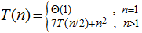
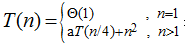
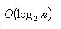
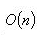
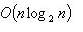
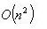
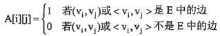
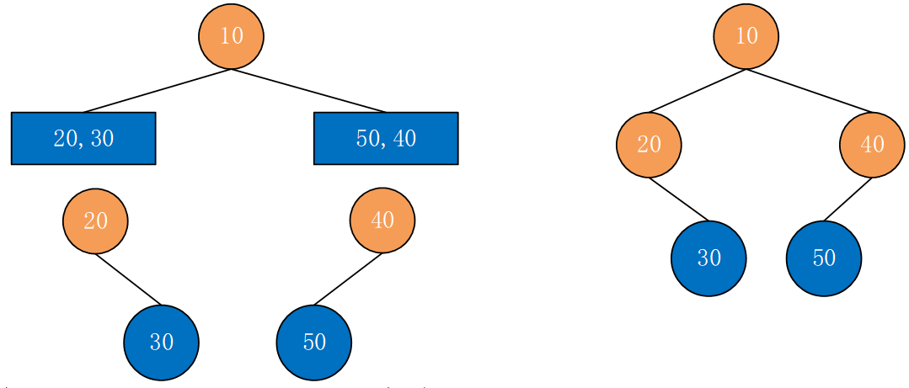
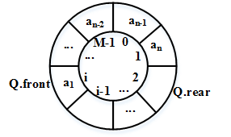
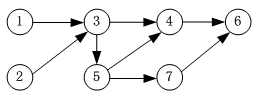

#### 时间复杂度与空间复杂度

设算法A的时间复杂度可用递归式表示，算法B的时间复杂度可用递归式表示，若要使得算法B渐进地快于算法A，则a的最大整数为（ A )。

A.48

B.49

C.13

D.14

要求使得算法B渐进地快于算法A，即B的时间复杂度小于A的时间复杂度。对算法A进行简单的化简，令n=n/2，我们可以得到算法A的T(n)=49T(n/4)+11/4n2；而算法B的T(n)=aT(n/4)+n2，而根据渐进的规则，算法A的时间复杂度应该为49T(n/4)，而算法B的时间复杂度应该为aT(n/4)，因此a的取值应该要小于49。


#### 数组与矩阵

对于一个n阶的对称矩阵A，将其下三角区域（含主对角线）的元素按行存储在一维数组S中，设元素A[i][j]存放在S[k]中，且`S[1]=A[0][0]`，则k与i，j（i≤j）的对应关系是（ ）。

 A.k = i（i+1）/2+j-1

B.k = j（j+1）/2+i+1

C.k = i（i+1）/2+j+1

D.k = j（j+1）/2+i-1


本题有隐含条件需要注意，虽然前半段描述的是我们存储的下三角部分元素，但是最后提问的是i<=j情况下，元素下标与k的对应关系，此时已经指向的是其对称元素位置了。

【方法1】可用代入法解决问题。

将`S[1]=A[0][0]`实例，对应上三角元素`A[0][0]`，代入选项验证可得，只有B和C选项符合要求；

根据按行存储的顺序来看，下一个元素应该是`A[1][0]`，对应上三角元素`A[0][1]`，对应的一维数组位置为S[2]，代入BC选项进行验证，选项结果都为2，无法区分；

根据按行存储的顺序来看，接下来元素应该是`A[1][1]`，对应上三角元素`A[1][1]`，对应的一维数组位置为S[3]，代入BC选项进行验证，选项结果都为3，无法区分； 

根据按行存储的顺序来看，接下来元素应该是`A[2][0]`，对应上三角元素`A[0][2]`，对应的一维数组位置为S[4]，代入BC选项进行验证，选项C结果为3不符合要求，选项B结果为4是正确的选项；

所以本题选择B选项。  

【方法2】也可以根据规律分析。对于对称矩阵A[][]结构如下：

```
A[0][0]  A[0][1]  A[0][2]  ...  A[0][n-1]  A[0][n]   

A[1][0]  A[1][1]  A[1][2]  ...  A[1][n-1]  A[1][n]   

A[2][0]  A[2][1]  A[2][2]  ...  A[2][n-1]  A[2][n]   

...  

A[n-1][0]  A[n-1][1]  A[n-1][2]  ...  A[n-1][n-1]  A[n-1][n]   

A[n][0]    A[n][1]    A[n][2]    ...  A[n][n-1]    A[n][n]  
```

S[1]对应A[0][0]，对于下三角元素A[i][j]（i>=J），按行存储时，先处理前i-1行元素，此时每行对应元素分别为1、2、3、...、i-1、i个，求和，结果为（1+i）*i/2。接着处理第i行数据，本行列下标分别为0、1、2、...、j-1、j，共有j+1个元素。所以A[i][j]元素从S[1]开始，对应k=i（i+1）/2+j+1下标。这是下三角位置的分析过程。

再根据本题问题，i<=j的元素，此时是对称的上三角区域元素，对称关系为A[i][j]=A[j][i]，将上面的表达式i、j位置互换即可，结果为k=j（j+1）/2+i+1。答案选择B选项。


#### 排序

若总是以待排序列的第一个元素作为基准元素进行快速排序，那么最好情况下的时间复杂度为（）。

 A.

 B.

 C.

 D.

对于快速排序，元素有序排列是其最坏情况，时间复杂度为O（n2）。当每次划分都可以将待排序列分为均匀的两部分时，进行的排序趟数最少，时间复杂度为O（nlog2 n ） 。


#### 二分查找

对于有序表（8,15,19,23,26,31,40,65,91），用二分法进行查找时，可能的关键字比较顺序为（ C）。

A.26,23,19

B.26,8,19

C.26,40,65

D.26,31,40

将有序表放入数组如下：

| 序号   | 0    | 1    | 2    | 3    | 4    | 5    | 6    | 7    | 8    |
| ------ | ---- | ---- | ---- | ---- | ---- | ---- | ---- | ---- | ---- |
| 关键码 | 8    | 15   | 19   | 23   | 26   | 31   | 40   | 65   | 91   |

根据二分法的查找过程：

1. 第一轮比较对象（0+8）/2=4，即与序号为4的关键字26进行比较；
2. 第二轮如果选择左侧较小列，则下一个比较对象应该为（0+3）/2=1（**向下取整**），即与序号为1的关键字15比较，没有对应的选项；
3. 第二轮如果选择右侧较大列，则下一个比较对象应该为（5+8）/2=6（向下取整），即与序号为6的关键字40进行比较。


#### 贪心法

迪杰斯特拉(Dijkstra)算法用于求解图上的单源点最短路径。该算法按路径长度递增次序产生最短路径，本质上说，该算法是一种基于（  ）策略的算法。

A.分治

B.动态规划

C.贪心

D.回溯

针对单源最短路径问题，由Dijkstra提出了一种按路径长度递增的次序产生各顶点最短路径的算法。若按长度递增的次序生成从源点s到其他顶点的最短路径，则当前正在生成的最短路径上除终点以外，其余顶点的最短路径均已生成（将源点的最短路径看做是已生成的源点到其自身的长度为0的路径）。这是一种典型的贪心策略，就是每递增一次，经对所有可能的源点、目标点的路径都要计算，得出最优。

> 贪心算法（Greedy Algorithm）是一种常用的算法设计策略，它**在每一步选择局部最优解**，希望通过一系列局部最优选择来达到全局最优解。贪心算法通常在问题具有某些特定性质时有效，但并不保证一定能够得到最优解。
>
> 贪心算法的基本思想是，每次都选择在当前情况下看起来最好的解决方案，然后继续迭代这个过程，直到达到全局的最优解。贪心算法的实现通常包括以下步骤：
>
> 1. **选择阶段：** 在当前情况下，从多个选择中选择一个看起来最优的解决方案。
> 2. **验证阶段：** 验证所选择的方案是否满足问题的限制条件和要求。
> 3. **更新阶段：** 根据验证结果，更新问题的状态或信息。
>
> 贪心算法的关键在于选择局部最优解的策略，以及如何确保每一步选择都不会破坏问题的整体性质。贪心算法在一些问题上可以高效地得到近似最优解，但并不适用于所有问题。
>
> 一些经典的问题可以通过贪心算法来求解，比如：
>
> - **找零钱问题（Coin Change Problem）：** 给定一些面额的硬币和一个总金额，求解最少需要多少硬币来凑成这个总金额。
> - **背包问题的一些变种：** 在某些背包问题中，贪心算法可以用来求解近似最优解。
> - **活动选择问题（Activity Selection Problem）：** 给定一些活动的起始时间和结束时间，求解最多可以安排多少个不重叠的活动。
>
> 需要注意的是，贪心算法不适用于那些需要考虑全局影响或涉及到交叉关系的问题，因为在这些问题中简单的局部最优选择可能并不会导致最终的全局最优解。在使用贪心算法时，必须仔细分析问题的特性，判断贪心策略是否合适。


#### 树与二叉树的特性

设某二叉树采用二叉链表表示（即结点的两个指针分别指示左、右孩子）。当该二叉树包含k个结点时，其二叉链表结点中必有（ C ）个空的孩子指针。

A.k-1

B.k

C.k+1

D.2k

 二叉树的二叉链表存储结构中每个结点有2个指针。每个结点有0个、1个或者2个空指针对应有2个、1个、0个非空指针。
二叉树中边的个数等于非空指针的个数
假设二叉树中节点的总个数为N
假设二叉树中边的个数为M
假设二叉树中度为0的结点的个数为n0
假设二叉树中度为1的结点的个数为n1
假设二叉树中度为2的结点的个数为n2
所以有 n0+n1+n2=N -------------（1）
二叉树中除了根结点之外，其他的结点都有一条边进入该结点，所以二叉树中边的总个数为M=N-1；-------（2）
又 M=n1+2×n2;-------------------------（3）
所以由 （1）（2）（3）可得 n0=n2+1;--------------------（4）
设空节点的 个数为 K，则K=2×n0+n1-------------------（5）
结合（1）（4）（5）可以得到K=N+1（空指针的个数比结点总个数多1）
由（2）可以知道边数M=N-1（二叉树的边数为结点个数减1）
由（4）可以知道度为0的结点的个数（叶子结点个数）=度为2的结点个数+1（n0=n2+1）


#### 图的定义及存储

（A）的邻接矩阵是一个对称矩阵。

A.无向图

B.AOV 网

C.AOE 网

D.有向图

图的邻接矩阵表示是利用一个矩阵来表示图中顶点之间的关系。对于具有n个顶点的图G=（V ， E）来说，其邻接矩阵是一个n阶方阵，且满足：



由邻接矩阵的定义可知，无向图的邻接矩阵是对称的，有向图的邻接矩阵就不一定对称了。因为无向图中若存在Vi至Vj的边则一定存在Vj至Vi的边;有向图中若存在Vi至Vj弧，则不一定存在Vj至Vi的弧，AOV网、AOE网都是有向图。


#### 二叉树的遍历

某二叉树的中序、先序遍历序列分别为{20，30，10，50，40}、{10，20，30，40，50}，则该二叉树的后序遍历序列为（ C ）。

A.50，40，30，20，10

B.30，20，10，50，40

C.30，20，50，40，10

D.20，30，10，40，50

根据中序遍历和先序遍历，可以反向构造出这棵二叉树如下：




#### 队列与栈

设某循环队列Q的定义中有front和rear两个域变量，其中，front指示队头元素的位置，rear指示队尾元素之后的位置，如下图所示。若该队列的容量为M，则其长度为（  ）。



A.(Q.rear-Q.front +1)

B.(Q.rear-Q.front+M)

C.(Q.rear-Q.front+1)%M

D.(Q.rear-Q.front+M)%M

根据图示，可以得到长度（Q.rear-Q.front+M），但在此不容忽视的一个问题是，循环队列在进行了多次入队出队操作之后，可能出现超出队列长度溢出的情况，因此需要让其与M进行求模操作，修正位置，故（Q.rear-Q.front+M）%M为队列中的元素个数（即队列长度）。


#### 图的拓扑排序

拓扑排序是将有向图中所有顶点排成一个线性序列的过程，并且该序列满足：若在AOV网中从顶点Vi到Vj有一条路径，则顶点Vì必然在顶点Vj之前。对于下面所示的有向图，（ C ）是其拓扑序列。



A.1234576

B.1235467

C.2135476

D.2134567

拓扑排序通俗一点来讲，其实就是依次遍历没有前驱结点的结点。而某一时刻没有前驱结点的结点有可能存在多个，所以一个图的拓扑排序可能有多个。

以本题为例，1号结点与2号结点都没有前驱结点，所以拓扑排序的第一个元素可以是1，也可以是2。当1与2都访问完了，便可访问3号结点，3号结点访问完了，便可访问5号结点，访问完5号结点，可访问4号，或是7号结点。

所以拓扑排序结果为：（12）35（47）6。括号中有多个数字，则代表在这多个数字的顺序可以变化。

这样，具体的拓扑排序结果为：1235476、1235746、2135476、2135746。


