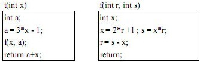

#### 编译与解释

以下关于高级程序设计语言实现的编译和解释方式的叙述中，正确的是（  ）。

A.编译程序不参与用户程序的运行控制，而解释程序则参与

B.编译程序可以用高级语言编写，而解释程序只能用汇编语言编写

C.编译方式处理源程序时不进行优化，而解释方式则进行优化

D.编译方式不生成源程序的目标程序，而解释方式则生成

> - 编译程序的功能是把用高级语言书写的源程序翻译成与之等价的目标程序。编译过程划分成以下六个阶段：
>   1. 词法分析
>   2. 语法分析
>   3. 语义分析
>   4. 中间代码生成代码优化
>   5. 目标代码生成（目标程序可以独立于源程序运行）
>
> - 解释程序是一种语言处理程序，在词法、语法和语义分析方面与编译程序的工作原理基本相同，但在运行用户程序时，它是直接执行源程序或源程序的内部形式（中间代码）。因此，解释程序并不产生目标程序，这是它和编译程序的主要区别。


#### 编译器工作过程

**符号表**在编译程序工作的过程中需要不断收集、记录和使用源程序中一些语法符号的类型和特征等相关信息。这些信息一般以表格形式存储于系统中。

**哈希表**是根据关键码值(Key value)而直接进行访问的数据结构。

**堆栈**是一种只能在一端进行插入和删除操作的特殊线性表，它按照后进先出的原则存储数据的数据结构。

**队列**允许在表的前端（front）进行删除操作，而在表的后端（rear）进行插入操作，和栈一样，队列是一种操作受限制的线性表。 


#### 后缀表达式（逆波兰表达式Reverse Polish Notation，RPN）

与逆波兰式ab+ -c*d-对应的中缀表达式是（ B ）。

A.a-b-c*d

B.-(a+b)*c-d

C.-a+b*c-d

D.(a+b)*(-c-d)

>逆波兰表达式（Reverse Polish Notation，RPN），也叫后缀表达式，是一种数学表达式的表示方法。在逆波兰表达式中，操作符位于操作数之后，因此不需要使用括号来指示操作次序。
>
>逆波兰表达式具有以下特点：
>
>- 操作数排列在前，操作符排列在后。
>- 操作符不需要括号来指定优先级，因为每个操作符只影响最近的操作数。
>- 操作符与操作数之间没有歧义。
>
>为了计算逆波兰表达式的值，可以使用栈来辅助计算。从左到右扫描表达式，遇到操作数就将其入栈，遇到操作符就从栈中弹出相应数量的操作数，进行计算，并将结果压入栈中。
>
>以下是一个简单的逆波兰表达式的例子：
>
>```
>3 4 + 5 *
>```
>
>这个表达式的意思是：(3 + 4) * 5，计算过程如下：
>
>1. 遇到操作数 3，入栈 [3]。
>2. 遇到操作数 4，入栈 [3, 4]。
>3. 遇到操作符 +，从栈中弹出操作数 4 和 3，计算 3 + 4 = 7，将结果 7 入栈 [7]。
>4. 遇到操作数 5，入栈 [7, 5]。
>5. 遇到操作符 *，从栈中弹出操作数 5 和 7，计算 7 * 5 = 35，将结果 35 入栈 [35]。
>
>逆波兰表达式在计算器和编译器中常常用来简化表达式的计算和解析。避免了括号带来的优先级歧义，并且计算过程比较直观。

“X＝（A＋B）× (C - D/E)”的后缀式表示为（ A ）。

A.XAB+CDE/-×=

B.XAB+C-DE/×=

C.XAB+CDE-/×=

D.XAB+CD-E/×=


#### 中间代码

将高级语言源程序翻译成机器语言程序的过程中，常引入中间代码。以下关于中间代码的叙述中，不正确的是（ D ）。  

A.中间代码不依赖于具体的机器

B.使用中间代码可提高编译程序的可移植性

C.中间代码可以用树或图表示

D.中间代码可以用栈和队列表示

从原理上讲，对源程序进行语义分析之后就可以直接生成目标代码，但由于源程序与目标代码的逻辑结构往往差别很大，特别是考虑到具体机器指令系统的特点，要使翻译一次到位很困难，而且用语法制导方式机械生成的目标代码往往是繁琐和低效的，因此有必要设计一种中间代码，将源程序首先翻译成中间代码表示形式，以利于进行与机器无关的优化处理。由于中间代码实际上也起着编译器前端和后端分水岭的作用，所以使用中间代码也有助于提高编译程序的可移植性。常用的中间代码有**后缀式**、三元式、 **四元式**和**树（图）**等形式。


#### 传值与传址

函数t()、f()的定义如下所示，若调用函数t时传递给x的值为3，并且调用函数f()时，第一个参数采用传值（call by value）方式，第二个参数采用传引用（call by reference）方式，则函数t的返回值为（B）。



 A.35

B.24

C.22

D.11

- 采用传值方式时，是将实际参数的值传递给形式参数，对形式参数值的修改不会影响实际参数。
- 采用引用方式时，是将实际参数的地址传递给形式参数，对形式参数进行修改，等同于是对实际参数进行修改。


#### 多种程序语言特点

标记语言用一系列约定好的标记来对电子文档进行标记，以实现对电子文档的语义、结构及格式的定义。（ D ）不是标记语言。

A.HTML

B.XML

C.WML

D.PHP

- **HTML （Hypertext Marked Language超文本标记语言）**，用于互联网的信息表示。用HTML编写的超文本文档称为HTML文档，它能独立于各种操作系统平台（如UNIX Windows等）。HTML文档是纯文本文档，可以使用记事本、写字板等编辑工具来编写HTML文件，其文件（文档）的扩展名是.html或.htm，它们需要通过WWW浏览器进行解释并显示出效果。
- **XML（Extensible Markup Language可扩展的标记语言）**1.0标准于1998年2月10日发布，被认为是继HTML和Java编程语言之后的又一个里程碑式的Internet技术。XML丰富了HTML的描述功能，可以描述非常复杂的Web页面，如复杂的数字表达式、化学方程式等。XML的特点是结构化、自描述、可扩展和浏览器自适应等。
- 用于WAP的标记语言就是**WML （Wireless Markup Language）**，其语法跟XML一样，是XML的子集。
- PHP（Hypertext Preprocessor）是一种在服务器端执行的、嵌入HTML文档的脚本语言，其语言风格类似于C语言，被网站编程人员广泛运用。


#### 文法

已知文法G: S—>A0|B1，A —> S1|1, B —> S0|0,其中S是开始符号。从S出发可以推导出（ C ）。

A.所有由0构成的字符串

B.所有由1构成的字符串

C.某些0和1个数相等的字符串

D.所有0和1个数不同的字符串

可以产生的字符串包括：

- 10，推导过程：S→A0；A→1。
- 01，推导过程：S→B1；B→0。
- 1010，推导过程：S→A0；A→S1：S→A0，A→1。


