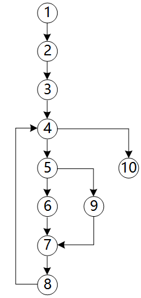
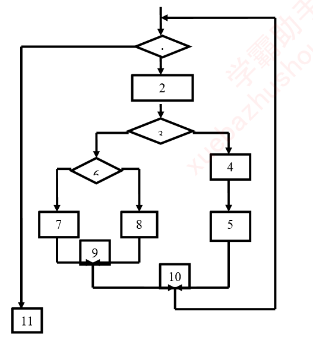
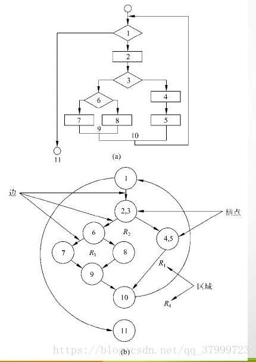
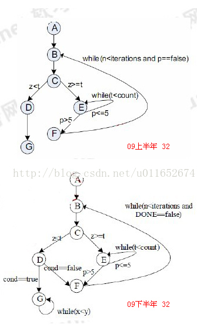
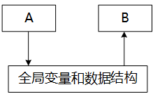

#### 数据流图与数据字典

对基本加工的说明有三种描述方式：**结构化语言**、**判断表（决策表）**、**判断树（决策树）**。基本加工逻辑描述的基本原则为：

1. 对数据流图的每一个基本加工，必须有一个基本加工逻辑说明。
2. 基本加工逻辑说明必须描述基本加工如何把输入数据流变换为输出数据流的加工规则。
3. 加工逻辑说明必须描述实现**加工的策略**而不是实现加工的细节。
4. 加工逻辑说明中包含的信息应是充足的，完备的，有用的，无冗余的。

某医院预约系统的部分需求为：患者可以查看医院发布的专家特长介绍及其就诊时间；系统记录患者信息，患者预约特定时间就诊。用DFD对其进行功能建模时，患者是（ A ）；用ERD对其进行数据建模时，患者是（ A ）。

A.外部实体

B.加工

C.数据流

D.数据存储

A.实体

B.属性

C.联系

D.弱实体

1. 患者不涉及加工，为外部实体。
2. 患者有其信息，所以为实体。

#### McCabe复杂度计算

采用McCabe度量法计算下图所示程序的环路复杂性为（ C ）。

A.1

 B.2

 C.3

 D.4

环形复杂度 `V(G)=E-N+2`，其中，E是流图中边的条数，N是结点数。
V（G）=E-N+2=11-10+2=3。

程序复杂度的计算

1. 首先要画出程序流程图
2. 然后将程序流程图转换为流图
3. 利用三个方法来计算环形复杂度

程序流程图就是三种结构：

- 顺序
- 选择
- 循环

流程图转换为流图

- 流图的实质是弱化的程序流程图
- 流图中的一个节点可以表示程序流程图中的一个顺序处理序列和一个菱形判定框
- 流图的每一条边必须终止于一个节点。
- 选择结构 结尾处都加了一个节点，表示选择结构结束。

在图中节点9，10就表示选择结构结束。为新添加的节点。

流图计算复杂度

1. 流图中线性无关的区域数等于环形复杂度
2. 流图G的环形复杂度=`E-N+2`
   E：表示边数
   N：表示节点数

3. 环形复杂度等于图中判定节点数目+1
   判定节点定义：包含条件的节点成为判定节点。从每个判定节点引出两条或多条边。

方法1：
图中可以分为四个区域R1，R2，R3，R4 所以复杂度为4
方法2：
图有9个节点，这边的节点是指流图的节点而不是流程图中的节点。流图的节点是小于等于流程图的节点的，因为流图中可以将判定节点和顺序处理节点合并为一个节点。 其次图中有11条边 所以 11-9+2=4。
方法3：
计算判定节点的个数，判定节点是有判定条件且边数大于等于2的节点。图中有3个分别是1 3 6 所以复杂度为3+1 =4。

接下来进行特殊情况分析：

McCabe方法的定义是根据**程序控制流的复杂程度**定量度量程序的复杂程度。这样度量出来的结果成为程序的环形复杂度。即条件选择的分支复杂程度

第一张图的复杂度为3。
节点数7 边数8 8-7+2=3；
区域数 为三个；
判断节点为2个 2+1；
第二张图的复杂度为4

- 节点数为7 边数为10 10-7+2=5；
  但是根据McCabe的定义，G节点的自闭环并没有增加选择分支的复杂度。所以应该减少G的边 9-7+2=4；
- 区域的判定方法类似
- 图中有三个判定节点所以 3+1=4。

#### 耦合性

如下图所示，模块A和模块B都访问相同的全局变量和数据结构，则这两个模块之间的耦合类型为（ A ）耦合。

 A.公共

 B.控制

 C.标记

 D.数据

- 公共耦合：指通过一个公共数据环境相互作用的那些模块间的耦合。
- 控制耦合：两个模块彼此间传递的信息中有控制信息。
- 数据耦合：两个模块彼此间通过数据参数交换信息。
- 标记耦合：一组模块通过参数表传递记录信息，这个记录是某一个数据结构的子结构，而不是简单变量。

#### 测试分类与阶段任务划分

在软件开发过程中，系统测试阶段的测试目标来自于（ A ）阶段。

 A.需求分析

 B.概要设计

 C.详细设计

 D.软件实现

测试的目标是需求分析开始。**从需求开始时就已经确定了产品的功能，在那些的用户场景、用户使用的功能**。

>软件文档
>
>- **概要设计说明书**主要说明系统的功能分配、模块划分、程序的总体结构、I/O及接口设计、运行设计、数据结构设计和错误处理设计等内容；
>- **详细设计说明书**着重描述每个模块是如何实现的；
>- **用户手册**帮助用户了解软件的使用，需要描述软件的功能、性能和用户界面；
>- **用户需求说明书**是开发人员和用户经过充分沟通后对软件需求的共同理解，主要说明软件的功能、性能和运行环境等内容。

#### 开发模型

为了有效地捕获系统需求，应采用（ C ）。

A.瀑布模型

 B.V模型

 C.原型模型

 D.螺旋模型

- **瀑布模型**严格遵循软件生命周期各阶段的固定顺序进行软件开发，其优点是可强迫开发人员采用规范的方法；严格规定了各阶段必须提交的文档；要求每个阶段结束后，都要进行严格的评审；而其缺点是过于理想化，缺乏灵活性，无法在开发过程中逐渐明确用户难以确切表达或一时难以想到的需求。
- **V模型**是一种典型的**测试模型**，该模型强调开发过程中测试贯穿始终。
- **原型模型**基于这样一种客观事实：并非所有的需求在系统开发之前都能准确地说明和定义。因此，它不追求也不可能要求对需求的严格定义，而是采用了动态定义需求的方法。原型模型适用于需求不够明确的项目，它能有效地捕获系统需求。
- **螺旋模型**综合了瀑布模型和演化模型的优点，还增加了**风险分析**。采用螺旋模型时，软件开发沿着螺旋线自内向外旋转，每转一圈都要对风险进行识别和分析，并采取相应的对策。（迭代次数会增加开发成本）
- **增量模型**（演化模型）也是一种原型化开发方法，但与原型模型略有不同。演化模型的开发过程，是从初始模型逐步演化为最终软件产品的渐进过程。

#### 软件质量度量模型

按照`ISO/IEC 9126`软件质量度量模型定义，一个软件的可靠性的子特性包括（ C ）。

A.容错性和安全性

B.容错性和适应性

C.容错性和易恢复性

D.易恢复性和安全性

目前已有多种关于软件质量的度量模型，它们都把软件质量特性定义为**分层模型**，其中最基本的称作基本**质量特性**，每个质量特性包括多项质量子特性。在最初的ISO模型中，包括8个基本特性。而1991年发布的ISO/IEC 9126模型中，基本特性减少为6个：功能性、可靠性、易使用性、效率、可维护性和可移植性。其中**可靠性**包括三个子特性，即**成熟性、容错性和易恢复性**。而安全性是功能性的子特性，适应性是可移植性的子特性。

#### 需求分析相关概念及需求的分类

结构化分析的输出不包括（ D ）。

 A.数据流图

B.数据字典

C.加工逻辑

D.结构图

结构化方法的分析结果由以下几部分组成：

- 一套分层的数据流图
- 一本数据词典
- 一组小说明（也称加工逻辑说明）
- 补充材料

#### 架构设计

管道过滤器风格具有许多很好的特点：

1. 使得软件构件具有良好的隐蔽性和高内聚、低耦合的特点；
2. 允许设计者将整个系统的输入/输出行为看成是多个过滤器的行为的简单合成；
3. 支持软件重用；
4. 支持并行执行；
5. 允许对一些如吞吐量、死锁等属性的分析。

#### 概要设计与详细设计

软件设计的任务是基于需求分析的结果建立各种设计模型，给出问题的解决方案。

从工程管理的角度，可以将软件设计分为两个阶段：

1. 概要设计阶段
2. 详细设计阶段

- 结构化设计方法中，概要设计阶段进行软件体系结构的设计、数据设计和接口设计；详细设计阶段进行数据结构和算法的设计。
- 面对对象设计方法中，概要设计阶段进行体系结构设计、初步的类设计/数据设计、结构设计；详细设计阶段进行构件设计。

结构化设计和面向对象设计是两种不通过的设计方法，结构化设计根据系统的数据流图进行设计，模块体现为函数、过程及子程序；面向对象设计基于面向对象的基本概念进行，模块体现为类、对象和构件等。

#### 其他

结构化设计方法中使用结构图来描述构成软件系统的模块以及这些模块之间的调用关系。结构图的基本成分不包括（ D ）。

A.模块

B.调用

C.数据

D.控制

模块结构图由模块、调用、数据、控制信息和转接符号5种基本符号组成。

- 模块：这里所说的模块通常是指用一个名字就可以调用的一段程序语句。在模块结构图中用矩形表示。
- 调用：模块结构图中箭头总是由调用模块指向被调用模块。
- 数据：当一个模块调用另一个模块时，调用模块可以把数据传送到被调用模块供处理，而被调用模块又可以将处理的结果送回到调用模块。在模块之间传送的数据，使用与调用箭头平行的带空心圆的箭头表示，并在旁边标上数据名。
- 控制信息：在模块间有时必须传送某些控制信息。控制信息与数据的主要区别是前者只反映数据的某种状态，不必进行处理。**控制信息与控制成分并不等价**。软设在程序设计语言中提到的语言控制成分。控制成分指明语言允许表述的控制结构，程序员使用控制成分来构造程序中的控制逻辑。理论上已经证明，可计算问题的程序都可以用顺序、选择和循环这3种控制结构来描述。
- 转接符号：当模块结构图在一张纸上画不下，需要转接到另一张纸上，或者为了避免图上线条交叉时，都可以使用转接符号，圆圈内加上标号。

#### 软件过程改进

能力成熟度模型集成（CMMI）是若干过程模型的综合和改进。连续式模型和阶段式模型是CMMI提供的两种表示方法，而连续式模型包括6个过程域能力等级，其中（ D ）使用量化（统计学）手段改变和优化过程域，以应对客户要求的改变和持续改进计划中的过程域的功效。

A.CL2（已管理的）

B.CL3（已定义级的）

C.CL4（定量管理的）

D.CL5（优化的）

>- CL0（未完成的）：过程域未执行或未得到CL1中定义的所有目标。
>- CL1（已执行的）：其共性目标是过程将可标识的输入工作产品转换成可标识的输出工作产品，以实现支持过程域的特定目标。
>- CL2（已管理的）：其共性目标是集中于已管理的过程的制度化。根据组织级政策规定过程的运作将使用哪个过程，项目遵循已文档化的计划和过程描述，所有正在工作的人都有权使用足够的资源，所有工作任务和工作产品都被监控、控制和评审。
>- CL3（已定义级的）：其共性目标集中于已定义的过程的制度化。过程是按照组织的裁剪指南从组织的标准过程中裁剪得到的，还必须收集过程资产和过程的度量，并用于将来对过程的改进。
>- CL4（定量管理的）：其共性目标集中于可定量管理的过程的制度化。使用测量和质量保证来控制和改进过程域，建立和使用关于质量和过程执行的质量目标作为管理准则。
>- CL5（优化的）：使用量化（统计学）手段改变和优化过程域，以满足客户的改变和持续改进计划中的过程域的功效。

#### 结构化设计任务

结构化开发方法中，（ D ）主要包含对数据结构和算法的设计。

A.体系结构设计

B.数据设计

C.接口设计

D.过程设计

>- **体系结构设计**：定义软件系统各主要部件之间的关系。
>- **数据设计**：基于E-R图确定软件涉及的文件系统的结构及数据库的表结构。
>- **接口设计（人机界面设计）**：软件内部，软件和操作系统间以及软件和人之间如何通信。
>- **过程设计**：系统结构部件转换成软件的过程描述。确定软件各个组成部分内的算法及内部数据结构，并选定某种过程的表达形式来描述各种算法。

#### 测试分类与阶段任务划分

>**测试任务的分类：**
>
>在系统开发中，测试任务可以按照不同的标准进行分类，以下是一些常见的分类方式：
>
>1. **功能测试 vs. 非功能测试：** 
>   - **功能测试：** 确保软件系统的各项功能按照规格说明正常工作，包括用户输入、系统响应、数据处理等功能。
>   - **非功能测试：** 关注系统的性能、安全性、可用性等方面，如性能测试、安全性测试、可用性测试等。
>2. **白盒测试 vs. 黑盒测试：**
>   - **白盒测试：** 基于对代码内部结构的了解，设计测试用例，旨在验证代码逻辑的正确性。
>   - **黑盒测试：** 不考虑代码实现，基于需求和规格说明设计测试用例，重点在于系统的功能和输入输出。
>3. **单元测试 vs. 集成测试 vs. 系统测试：**
>   - **单元测试：** 针对软件中的最小功能单元进行测试，通常是对单个函数或模块的测试。
>   - **集成测试：** 测试不同模块之间的交互，验证它们能否协同工作。
>   - **系统测试：** 针对整个系统进行测试，确保整个系统的各个部分正常协作。
>

>**测试任务的阶段划分：**
>
>在系统开发的不同阶段，测试也会分为不同的阶段来进行：
>
>1. **单元测试阶段：** 在开发的早期阶段，开发人员会进行单元测试，验证每个代码单元的功能和逻辑是否正确。
>
>2. **集成测试阶段：** 当各个单元模块开发完毕后，会进行集成测试，验证模块之间的协作是否正常。
>
>3. **系统测试阶段：** 在所有模块集成完成后，进行整体的系统测试，以确保整个系统的功能和性能满足规格要求。
>
>4. **验收测试阶段：** 在系统开发完成后，进行验收测试，由客户或最终用户参与，确认系统是否符合需求并且可以交付使用。
>
>5. **回归测试阶段：** 在系统开发过程中，如果进行了修改或添加新功能，需要进行回归测试，以确保已有功能没有受到影响。
>

#### 敏捷方法

在采用面向对象技术构建软件系统时， 很多敏捷方法都建议的一种重要的设计活动是（ C ），它是一种重新组织的技术，可以简化构件的设计而无需改变其功能或行为。

A.精化

B.设计类

C.重构

D.抽象

敏捷方法中，重构是一种重新组织技术，重新审视需求和设计，重新明确地描述它们以符合新的和现有的需求，可以简化构件的设计而无需改变其功能或行为。

#### 黑盒测试

在某班级管理系统中，班级的班委有班长、副班长、学习委员和生活委员，且学生年龄在15～25岁。若用等价类划分来进行相关测试，则（ D ）不是好的测试用例。

A.（队长，15）

B.（班长，20）

C.（班长，15）

D.（队长，12）

所谓等价类就是某个输入域的集合，对于一个等价类中的输入值来说，它们揭示程序中错误的作用是等效的。也就是说，如果等价类中的一个输入数据能检测出一个错误，那么等价类中的其他输入数据也能检测出同一个错误。
在本题中一个设计用例包含两个输入条件，一个是班委，另一个是年龄，从四个选项来看，D选项中的两个输入都不是有效数据，如果用这个用例检测出了一个错误，那么也不能确定是由哪个输入条件引起的，因此其不是一个好的测试用例。

#### 软件维护相关概念

辅助软件维护过程中的活动的软件称为“软件维护工具”，它辅助维护人员对软件代码及其文档进行各种维护活动。

软件维护工具主要有：

1. 版本控制工具；
2. 文档分析工具；
3. 开发信息库工具；
4. 逆向工程工具；
5. 再工程工具；
6. 配置管理支持工具。

#### 软件维护类型

某银行为了使其网上银行系统能够支持信用卡多币种付款功能而进行扩充升级，这需要对数据类型稍微进行一些改变，这一状况需要对网上银行系统进行（ B ）维护。 

A.正确性

B.适应性

C.完善性

D.预防性

在系统运行过程中，软件需要维护的原因是多样的，根据维护的原因不同，可以将软件维护分为以下四种：

1. 改正性维护。为了识别和纠正软件错误、改正软件性能上的缺陷、排除实施中的误使用，应当进行的诊断和改正错误的过程就称为改正性维护。
2. 适应性维护。在使用过程中，外部环境（新的硬、软件配置）、数据环境（数据库、数据格式、数据输入/输出方式、数据存储介质）可能发生变化。为使软件适应这种变化，而去修改软件的过程就称为适应性维护。
3. 完善性维护。在软件的使用过程中，用户往往会对软件提出新的功能与性能要求。为了满足这些要求，需要修改或再开发软件，以扩充软件功能、增强软件性能、改进加工效率、提高软件的可维护性。这种情况下进行的维护活动称为完善性维护。
4. 预防性维护。这是指预先提高软件的可维护性、可靠性等，为以后进一步改进软件打下良好基础。

#### 统一过程模型（UP）

统一过程（UP）定义了初启阶段、精化阶段、构建阶段、移交阶段和产生阶段，每个阶段以达到某个里程碑时结束，其中（ B ）的里程碑是生命周期架构。

A.初启阶段

B.精化阶段

C.构建阶段

D.移交阶段

统一过程（UP）定义了初启阶段、精化阶段、构建阶段、移交阶段和产生阶段，每个阶段达到某个里程碑时结束。其中初启阶段的里程碑是**生命周期目标**，精化阶段的里程碑是**生命周期架构**，构建阶段的里程碑是**初始运作功能**，移交阶段的里程碑是**产品发布**。

#### 软件质量保证

系统可维护性的评价指标不包括（ C ）。

A.可理解性

B.可测试性

C.可移植性

D.可修改性

系统的可维护性的评价指标包括：可理解性、可测试性、可修改性。

- **可理解性**：指别人能理解系统的结构、界面、功能和内部过程的难易程度。模块化、详细设计文档、结构化设计和良好的高级程序设计语言等，都有助于提高可理解性。
- **可测试性**：诊断和测试的容易程度取决于易理解的程度。
- **可修改性**：诊断和测试的容易程度与系统设计所制定的设计原则有直接关系。模块的耦合、内聚、作用范围与控制范围的关系等，都对可修改性有影响。

