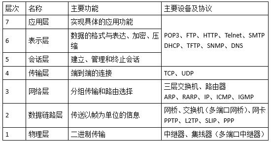

#### 常用命令

| 命令（windows系统）                               | 描述                                         |
| ------------------------------------------------- | -------------------------------------------- |
| ipconfig /release                                 | 释放IP地址租约                               |
| ipconfig /flushdns                                | 清除本地DNS缓存                              |
| ipconfig /displaydns                              | 显示本地DNS内容                              |
| ipconfig /registerdns                             | DNS客户端手工向服务器进行注册                |
| ipconfig /all                                     | 显示本机TCP/IP配置的详细信息                 |
| ipconfig /renew                                   | DHCP客户端手工向服务器刷新请求               |
| ipconfig /showclassid                             | 显示网络适配器的DHCP类别信息                 |
| ipconfig /setclassid                              | 更新”本地连接“适配器的由DHCP分配IP地址的配置 |
| ipconfig /renew "Local Area Connection"           | 显示名称以Local开头的所有适配器的DHCP类别ID  |
| ipconfig /setclassid "Local Area Connection" TEST | 将”本地连接“适配器的DHCP类别 ID设置为TEST    |

> DHCP（Dynamic Host Configuration Protocol，动态主机配置协议）


#### 其他

网络的可用性是指（ D ）。

A.网络通信能力的大小

B.用户用于网络维修的时间

C.网络的可靠性

D.用户可利用网络时间的百分比

- 可用性（Availability）是关于系统可供使用时间的描述，以丢失的时间为驱动。
- 可靠性（Reliability）是关于系统无失效时间间隔的描述，以发生的失效个数为驱动。

两者都用百分数的形式来表示。


#### 协议应用提升

> **DNS**
>
> DNS域名系统为Internet上的主机分配域名地址和IP地址。用户使用域名地址，该系统就会**自动把域名地址转为IP地址**。
>
> 域名服务是运行域名系统的Internet工具。
>
> 执行域名服务的服务器称之为DNS服务器，通过DNS服务器来应答域名服务的查询。DNS服务器中通常保持有一个HOSTS文件，该文件中登记了一些常用的域名及其对应的IP地址。


#### HTML语言

HTML文档中`<table>`标记的align属性用于定义（  ）。

 A.对齐方式

B.背景颜色

C.边线粗细

D.单元格边距

>在HTML中，`<table>` 元素用于创建表格，而 `align` 属性用于指定表格在其容器中的对齐方式。然而，需要注意的是，`align` 属性在 HTML4 中已经被废弃，不再推荐使用。在 XHTML 1.0 中，应该使用 CSS 来控制元素的样式和对齐。
>
>在 HTML4 中，`<table>` 元素的 `align` 属性可以设置为以下值：
>
>1. `left`：将表格左对齐。
>2. `center`：将表格居中对齐。
>3. `right`：将表格右对齐。
>
>```html
><table align="center">
>  <!-- 表格内容 -->
></table>
>```
>
>推荐的方法是使用 CSS 来控制表格的样式和对齐。例如，使用内联样式或在外部样式表中定义样式规则：
>
>```html
><style>
>  .centered-table {
>    margin: 0 auto;
>  }
></style>
><table class="centered-table">
>  <thead>
>    <tr>
>      <th>列标题1</th>
>      <th>列标题2</th>
>      <th>列标题3</th>
>    </tr>
>  </thead>
>  <tbody>
>    <tr>
>      <td>行2，列1</td>
>      <td>行2，列2</td>
>      <td>行2，列3</td>
>    </tr>
>  </tbody>
></table>
>```
>
>这将会把表格水平居中对齐。
>
>`margin` 是用于设置元素外边距的 CSS 属性，它影响元素与其周围元素之间的空间。`margin` 属性可以设置为以下不同类型的值：
>
>1. 长度值（像素、厘米、em 等）： 指定固定的外边距。例如：`margin: 10px;` 表示元素的外边距为 10 像素。
>2. 百分比值： 相对于包含块的宽度计算的外边距。例如：`margin: 5%;` 表示元素宽度的 5% 作为外边距。
>3. **自动（auto）：** 浏览器会根据布局自动计算外边距。通常用于水平居中元素，将左右外边距都设置为 `auto`。
>4. **多个值：** 可以设置上、右、下、左四个方向的外边距。例如：`margin: 10px 20px 10px 20px;` 表示分别为上、右、下、左方向设置了 10px、20px、10px、20px 的外边距。
>5. **全局值：** `inherit` 表示继承父元素的外边距值，`initial` 表示使用默认外边距值。
>6. **`calc()` 函数：** 可以进行计算，用于在不同值之间执行加法、减法、乘法和除法运算。例如：`margin: calc(50% - 30px);` 表示外边距为包含块宽度的一半减去 30 像素。
>
>示例：
>
>```css
>/* 设置固定外边距 */
>margin: 10px;
>
>/* 设置百分比外边距 */
>margin: 5%;
>
>/* 自动外边距（水平居中） */
>margin: 0 auto;
>
>/* 设置多个方向的外边距 */
>margin: 10px 20px 10px 20px;
>
>/* 使用 calc() 函数计算外边距 */
>margin: calc(50% - 30px);
>```


#### 开放系统互连参考模型

以下关于网络层次与主要设备对应关系的叙述中，配对正确的是（ B ）。

A.网络层——集线器

B.数据链路层——网桥

C.传输层——路由器

D.会话层——防火墙




#### URL

在地址栏输入www.abc.com，浏览器默认的应用层协议是（ A ）。

A.HTTP

B.DNS

C.TCP

D.FTP

- 在没有录入协议的情况下，URL默认是HTTP协议。
- DNS协议是用来将域名转换为IP地址。
- TCP协议是传输层协议，不属于应用层。
- FTP协议是在两个相连的计算机之间进行文件传输时使用的协议。


#### 路由策略

如果路由器收到了多个路由协议转发的关于某个目标的多条路由，那么决定采用哪条路由的策略是（ C ）。

A.选择与自己路由协议相同的

B.选择路由费用最小的

C.比较各个路由的管理距离

D.比较各个路由协议的版本

对于多种不同的路由协议到一个目的地的路由信息，路由器首先根据管理距离决定相信哪一个协议。


