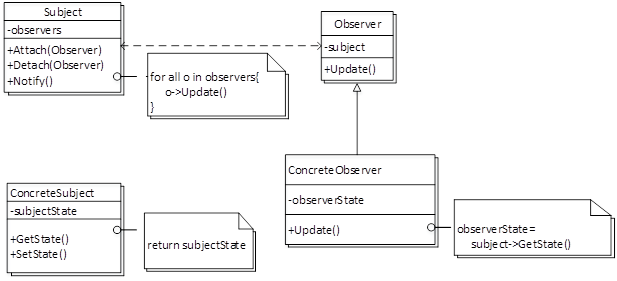
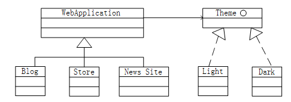
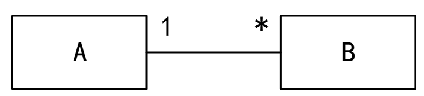
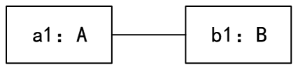
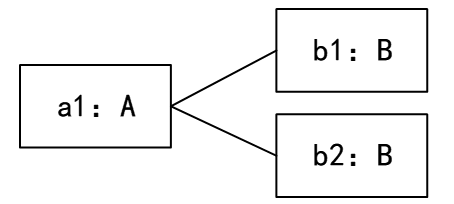
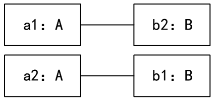
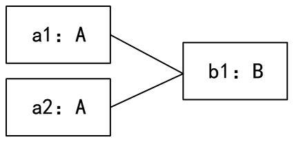

#### 面向对象的基本概念

类的静态成员与一般的类成员不同， 静态成员与对象的实例无关，只与类本身有关。它们一般用来实现类要封装的功能和数据，但不包括特定对象的功能和数据。静态成员和普通数据成员区别较大，体现在下面几点： 　　

1. 普通数据成员属于类的一个具体的对象，只有对象被创建了，普通数据成员才会被分配内存。而**静态数据成员属于整个类，即使没有任何对象创建，类的静态数据成员变量也存在**。
2. 外部访问类的静态成员只能通过类名来访问。
3. 类的静态成员函数无法直接访问普通数据成员（可以通过类的指针等作为参数间接访问），而类的任何成员函数都可以访问类的静态数据成员。
4. 类的静态方法只能访问该类的静态数据成员。　　

另外，静态成员和类的普通成员一样，也具有public、protected、private3种访问级别，也**可以具有返回值及被修改等性质**。

继承是父类和子类之间**共享数据和方法**的机制。

覆盖是子类的方法覆盖了基类的方法，以实现不同的功能，或者对父类的功能进行扩充。

多态有不同的形式，（ C ）的多态是指同一个名字在不同上下文中所代表的含义不同。

A.参数

B.包含

C.过载

D.强制

- 参数多态（静态多态性）：应用广泛、最纯的多态。
- 包含多态（运行时多态）：同样的操作可用于一个类型及其子类型。包含多态一般需要进行运行时的类型检查。包含多态在许多语言中都存在，最常见的例子就是子类型化，即一个类型是另外一个类型的子类型。
- 过载多态（Overloading）：同一个名（操作符﹑函数名）在不同的上下文中有不同的类型。 目前软设考查比较多的是过载多态。
- 强制多态：编译程序通过语义操作，把操作对象的类型强行加以变换，以符合函数或操作符的要求。

采用面向对象方法进行系统开发时，以下与新冠病毒有关的对象中，存在“一般-特殊“关系的是（ ）。

A.确诊病人和治愈病人

B.确诊病人和疑似病人

C.医生和病人

D.发热病人和确诊病人

特殊/一般关系也叫作泛化（Generalization）关系。特殊元素（子元素）的对象可替代一般元素（父元素）的对象，父元素是子元素的泛化（一般表示），子元素是父元素的特殊化。用这种方法，子元素共享了父元素的结构和行为。

在一般-特殊关系中，可以理解为特殊元素（即子类对象）是一般元素（即父类对象）的一种特殊体现。

A选项“确诊病人”与“治愈病人”（“治愈病人”是一种特殊的“确诊病人”）存在一般-特殊的关系。本题选择A选项。

B选项“确诊病人”不一定是“疑似病人”并且 “疑似病人” 不一定成为“确诊病人”，不满足一般-特殊的关系 。

C选项“医生”不一定是“病人”并且“病人”  不一定是 “医生” ，不满足一般-特殊的关系。

D选项“发热病人”不一定是“确诊病人”并且“确诊病人”也不一定是“发热病人”，不满足一般-特殊的关系

对象的（ A ）标识了该对象的所有属性（通常是静态的）以及每个属性的当前值（通常是动态的）。

A.状态

B.唯一ID

C.行为

D.语义

- **对象的状态**包括这个对象的所有属性（通常是静态的）以及每个属性当前的值（通常是动态的）；
- **ID**是为了将一个对象与其他所有对象区分开来，我们通常会给它起一个“标识”；
- **行为**是对象根据它的状态改变和消息传递所采取的行动和所作出的反应；
- **对象的行为**代表了其外部可见的活动；操作代表了一个类提供给它的对象的一种服务；
- **对象语义**也叫指针语义，引用语义等。通常是指一个目标对象由源对象拷贝生成，但生成后与源对象之间依然共享底层资源，对任何一个的改变都将随之改变另一个。

#### 设计模式的图

下面的UML类图描绘的是（ D ）设计模式。关于该设计模式的叙述中，错误的是（ B ）。

A.桥接

 B.策略

 C.抽象工厂

 D.观察者

A.该设计模式中的Observer需要维护至少一个Subject对象

B.该设计模式中的ConcreteObserver可以绕过Subject及其子类的封装

C.该设计模式中一个Subject对象需要维护多个Observer对象

D.该设计模式中Subject需要通知Observer对象其自身的状态变化

假设现在要创建一个Web应用框架，基于此框架能够创建不同的具体Web应用，比如博客、新闻网站和网上商店等；并可以为每个Web应用创建不同的主题样式，如浅色或深色等。这一业务需求的类图设计适合采用（ D ）模式（如下图所示）。其中（ A ）是客户程序使用的主要接口，维护对主题类型的引用。此模式为（ B ），体现的最主要的意图是（ A ）。

A.观察者（Observer）

B.访问者（Ⅴisitor）

C.策略（Strategy）

D.桥接（Bridge）

A.WebApplication

B.Blog

C.Theme

D.Light

A.创建型对象模式

B.结构型对象模式

C.行为型类模式

D.行为型对象模式

A.将抽象部分与其实现部分分离，使它们都可以独立地变化

B.动态地给一个对象添加一些额外的职责

C.为其他对象提供一种代理以控制对这个对象的访问

D.将一个类的接口转换成客户希望的另外一个接口

桥接模式是一种结构型软件设计模式。Bridge模式基于类的最小设计原则，通过使用封装、聚合及继承等行为让不同的类承担不同的职责。将类的抽象部分和它的实现部分分离开来，使它们可以独立地变化。

观察者模式属于行为型模式，它定义了一种一对多的依赖关系，让多个观察者对象同时监听某一个主题对象。这个主题对象在状态上发生变化时，会通知所有观察者对象，使它们能够自动更新自己。

访问者模式属于行为型模式，表示一个作用于某对象结构中的各元素的操作,它使我们可以在不改变各元素的类的前提下定义作用于这些元素的新操作。

策略模式属于行为型模式，定义一系列的算法，把它们一个个封装起来，并且使它们可以相互替换。

桥接模式属于结构型模式，它将抽象部分与它的实现部分分离，使它们都可以独立地变化。

#### UML图的图示

UML图中，对象图展现了（ C ），（ D ）所示对象图与下图所示类图不一致。

A.一组对象、接口、协作和它们之间的关系

B.一组用例、参与者以及它们之间的关系

C.某一时刻一组对象以及它们之间的关系

D.以时间顺序组织的对象之间的交互活动

A.

B.

C.

D.

- **对象图**：展现了某一个时刻一组对象以及它们之间的关系。
- **类图**：展现了一组对象、接口、协作和它们之间的关系。
- **用例图**：展现了一组用例、参与者以及它们之间的关系。
- **序列图**：是场景的图形化表示，描述了以时间顺序组织的对象之间的交互活动。
- 多重度：图示表示的是1个A可以对应多个B，1个B只能对应1个A 。

#### 设计模式的应用场景

- 观察者模式（有时又被称为发布-订阅Subscribe>模式、模型-视图View>模式、源-收听者Listener>模式或从属者模式）：定义对象间的一种一对多的依赖关系，当一个对象的状态发生改变时，所有依赖于它的对象都得到通知并自动更新。本题应该选择观察者模式。
- 适配器模式（Adapter）：将一个类的接口转换成用户希望得到的另一种接口。它使原本不相容的接口得以协同工作。
- 状态模式（State）：允许一个对象在其内部状态改变时改变它的行为。
- 单例模式（Singleton）：确保某个类只有一个实例，且能自行实例化，并向整个系统提供这个实例。

